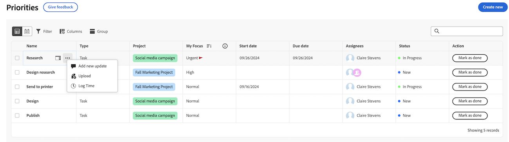
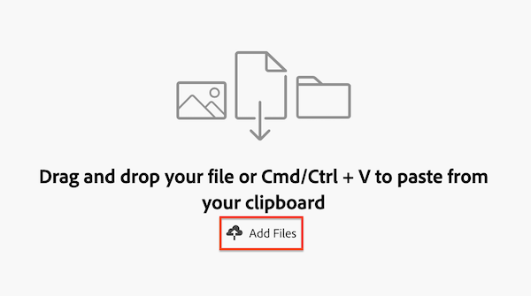
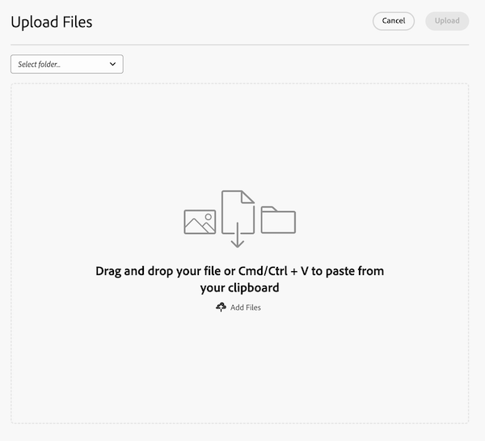

# Upload files in Priorities

You can upload files from the Priorities worklist or from individual work items. Files uploaded from Priorities appear in the Documents tab of the work item. 

Priorities displays work items assigned to you. You cannot see work items assigned to your team.

## Access requirements

+++ Expand to view access requirements for the functionality in this article.

You must have the following:

<table style="table-layout:auto"> 
 <col> 
 <col> 
 <tbody> 
  <tr> 
   <td role="rowheader">Adobe Workfront plan*</td> 
   <td> 
 Any
 </td> 
  </tr> 
  <tr> 
   <td role="rowheader">Adobe Workfront licenses*</td> 
   <td> 
   
New: Contributor or higher
 
   
Current: Request or higher
 </td> 
  </tr> 
  <tr> 
   <td role="rowheader">Access level configurations*</td> 
   <td> 
Edit access to Documents
 
Note: If you still don't have access, ask your Workfront administrator if they set additional restrictions in your access level. For information on how a Workfront administrator can modify your access level, see <a href="../../administration-and-setup/add-users/configure-and-grant-access/create-modify-access-levels.md" class="MCXref xref">Create or modify custom access levels</a>.
 </td> 
  </tr> 
 </tbody> 
</table>

To find out what plan, license type, or access you have, contact your Workfront administrator.

+++

## Upload a file from the worklist

{{step1-to-priorities}}

1. Hover over the name, then click **Upload**.

1. (Optional) Select a folder.
1. Drag and drop your file or Cmd/Ctrl + V to paste from your clipboard
or
Click **Add files** to browse files or import files from a Document Cloud provider.

1. (Optional) Add a comment.
1. (Optional) Add more files.

    >[!NOTE]
    >
    >Additional files are uploaded as separate documents. 
1. Click **Upload**. 

## Upload a file in a work item

{{step1-to-priorities}}

1. Click on a work item name to open the Overview page.
1. In the **Quick actions** section, click **Upload**. 
1. (Optional) Select a folder.
1. Drag and drop your file or Cmd/Ctrl + V to paste from your clipboard
or
Click **Add files** to browse files or import files from a Document Cloud provider.

1. (Optional) Add a comment.
1. (Optional) Add more files.

    >[!NOTE]
    >
    >Additional files are uploaded as separate documents. 
1. Click **Upload**. 

