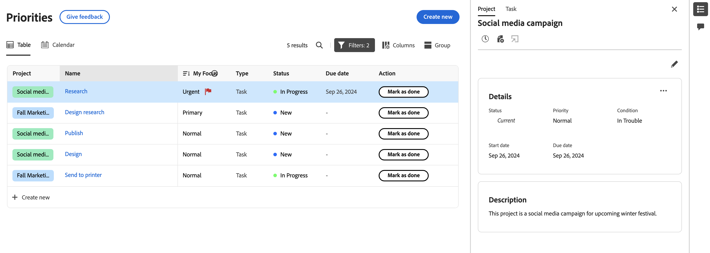
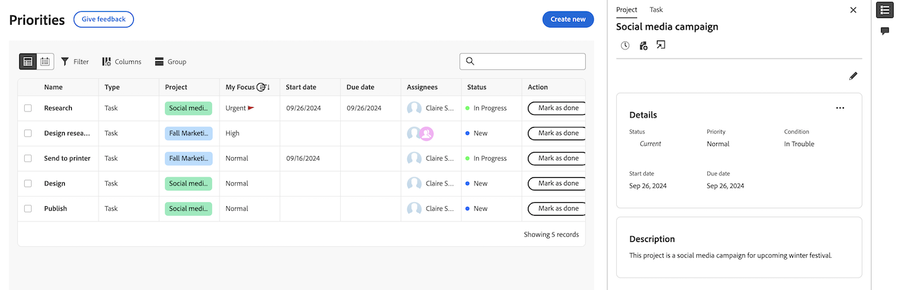
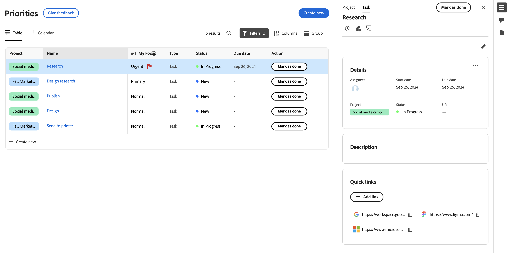
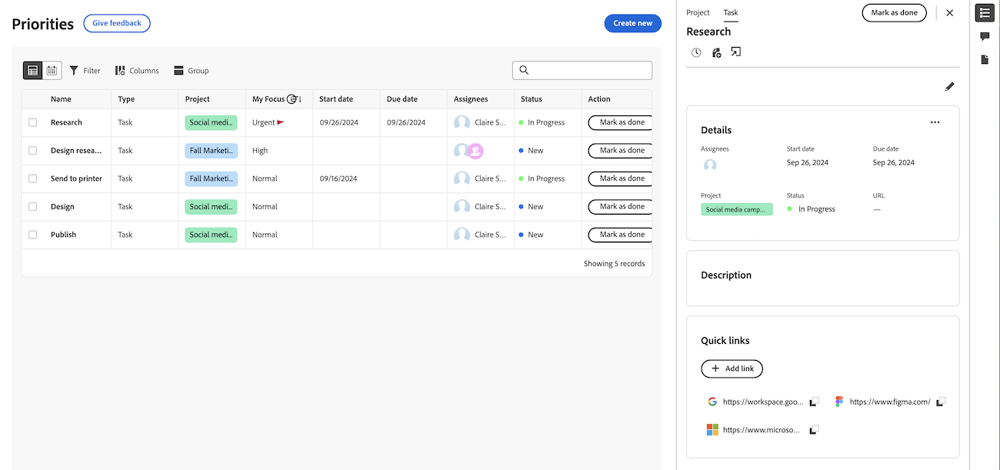

# View project and task details in the Priorities worklist

The highlighted information on this page refers to functionality not yet generally available. It is available only in the Preview Sandbox environment.

You can view real-time updates on the Details page of a task or issue. You can also see if others are viewing the page at the same time as you with real-time presence indicators.

## Access requirements

+++ Expand to view access requirements for the functionality in this article.

You must have the following access to perform the steps in this article:

<table style="table-layout:auto"> 
 <col> 
 </col> 
 <col> 
 </col> 
 <tbody> 
  <tr> 
   <td role="rowheader"><strong>Adobe Workfront plan</strong></td> 
   <td> 
Any
 </td> 
  </tr> 
  <tr> 
   <td role="rowheader"><strong>Adobe Workfront license*</strong></td> 
   <td> 
   
Current: Reviewer or higher

   
New: Light or higher
 
   </td> 
  </tr> 
  <tr> 
   <td role="rowheader"><strong>Access level configurations</strong></td> 
   <td> 
View or Edit access for the object the update is on
</td> 
  </tr> 
  <tr> 
   <td role="rowheader"><strong>Object permissions</strong></td> 
   <td> 
View access to the object
</td> 
  </tr> 
 </tbody> 
</table>

*For more information, see [Access requirements in Workfront documentation](/help/quicksilver/administration-and-setup/add-users/access-levels-and-object-permissions/access-level-requirements-in-documentation.md).

+++

## View project details

{{step1-to-priorities}}

1. In the worklist, hover over the work item name, then click **Summary** icon .
1. Click **Project** at the top of the Summary panel. Here you can
    * View and edit project details and description
    * View and add comments on the project
    * Log time
    * Add a file
    * Go directly to the project

    
    <!--new screen for prod -->

## View task details 

{{step1-to-priorities}}

1. In the worklist, hover over the work name, then click **Summary** icon .
1. Task is selected by default. Here you can
    * View and edit project details and description
    * View and add comments on the project
    * View and add documents
    * Log time
    * Add a file
    * Add quick links

    
    <!--new screen for prod -->
