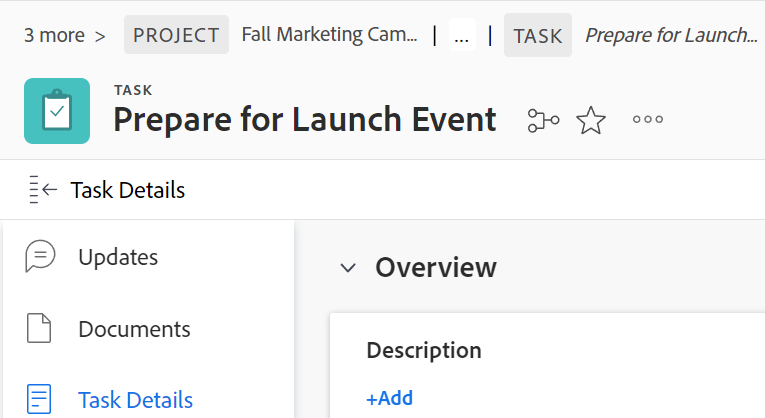
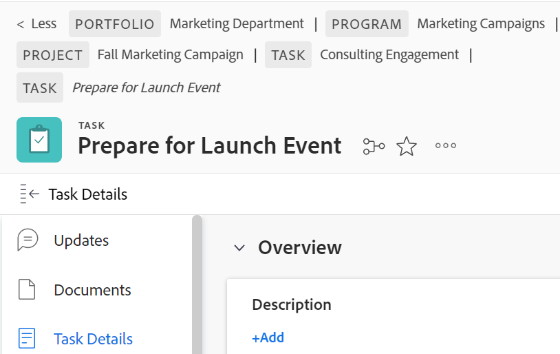

# Breadcrumbs overview

Breadcrumbs display the full navigational hierarchy for all object types. Each object in the breadcrumb path has a label that displays the object type. The page that you are currently on displays both in the page header and at the end of the breadcrumb path in italics. In the example below, this is the "[!UICONTROL Share with Brand Team]" task.

When there are too many objects in the breadcrumb path or the screen width prohibits the full navigational hierarchy from displaying, the path collapses some of the breadcrumbs and groups these objects at the beginning of the breadcrumb path. Both the project and the current object page are always visible in the breadcrumb path.

For example, "3 more" in the image above indicates that 3 objects are not displaying. These items could be located above the project level or between the project and the current page.

Clicking "[!UICONTROL more]" allows you to expand the full hierarchy. You can click "[!UICONTROL Less]" to collapse the breadcrumb path again.

You can also use the following keys to navigate the breadcrumbs:

<table style="table-layout:auto"> 
 <col> 
 <col> 
 <tbody> 
  <tr> 
   <td role="rowheader"><strong>Tab</strong> </td> 
   <td> 
Navigate to each item in the breadcrumbs
 </td> 
  </tr> 
  <tr> 
   <td role="rowheader"><strong>Enter</strong> </td> 
   <td> 
Expand a collapsed breadcrumb path, collapse an expanded breadcrumb path, and open a new page when on an object link
 </td> 
  </tr> 
 </tbody> 
</table>

<!--drafted: this is no longer possible, since we removed Campaigns, but it might come back as part of Maestro: 

## Multi-object breadcrumbs

>[!NOTE]
>
>The information in this article is available only in the Preview environment when you participate in the [!UICONTROL Campaigns] beta program. The functionality described here might not be fully available yet. For more information about current available features and how to enroll, see [Campaigns beta].

Some objects can belong to multiple parent objects. For example, a project can belong to multiple campaigns. In this case, all the campaigns that the project belongs to display in the breadcrumb.

The multi-object listing in the breadcrumb (for example, the campaigns) displays the number of parent objects which expands into a list to display all the campaigns that the project is associated with. For more information, see [Add objects to a campaign](../../manage-work/campaigns/add-objects-to-a-campaign.md).

-->

## Access a parent object from the breadcrumbs

For information about parent objects in [!DNL Workfront], see [Understand objects in [!DNL Adobe Workfront]](../../workfront-basics/navigate-workfront/workfront-navigation/understand-objects.md).

1. (Conditional) If you don't see the object you want to navigate to in a collapsed breadcrumb path, click **[!UICONTROL more]**, then locate the object.

   >[!NOTE]
   >
   >If you don't have permission to an object, it's not visible in the breadcrumbs.

1. Click any object in the breadcrumb path to access that object.

   The object page opens.
