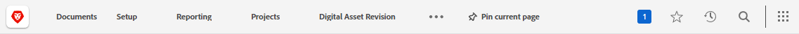
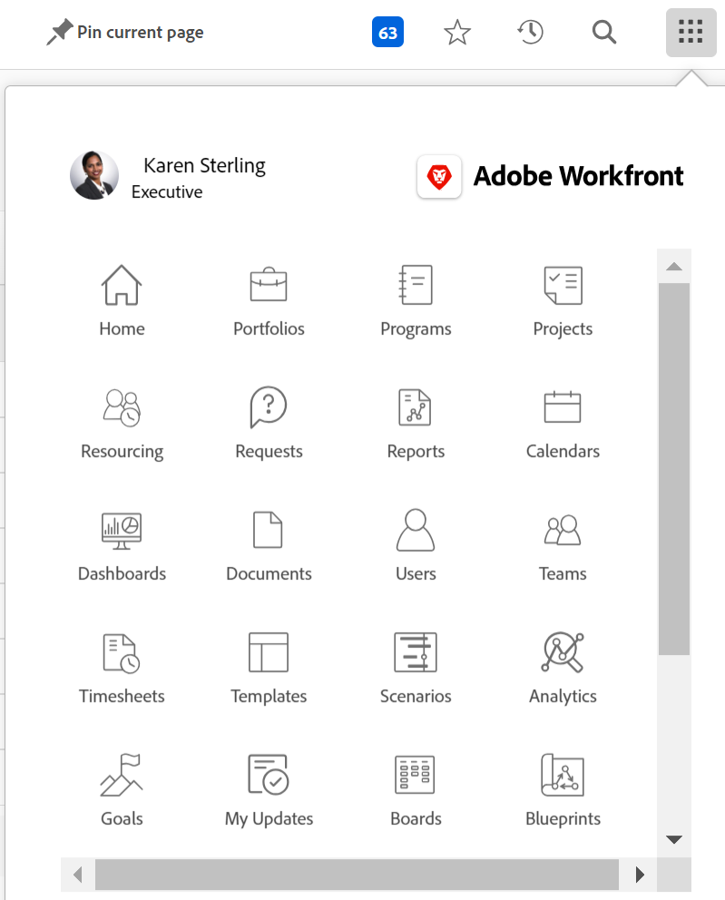

# Top navigation bar overview

The top navigation bar—which appears at the top of your screen in [!DNL Adobe Workfront] allows you to easily find and navigate to other areas of the platform.

## [!UICONTROL Home] icon

The **[!UICONTROL Home]** icon  takes you to the [!UICONTROL Home] page, which is the default landing page. To learn more about Home, see [Use the [!UICONTROL Home] area](../../workfront-basics/using-home/using-the-home-area/use-the-home-area.md).

## Pinned pages

You can pin pages that you visit frequently so that they display within the top navigation bar. To learn more about pinned pages, see [Pin pages to customize your workspace](../../workfront-basics/the-new-workfront-experience/pin-pages.md).

## [!UICONTROL Help] menu

The **[!UICONTROL Help]** menu allows you to search for help with a specific task, find more information on using [!DNL Workfront], view content related to the page you are currently on, or submit feedback about your experience.

To learn more about the Help menu, see [Access [!DNL Adobe Workfront] help](../../workfront-basics/navigate-workfront/workfront-navigation/access-workfront-help.md).

## [!UICONTROL Notifications] menu

The blue numbered box  in the top-right corner of the screen opens a list of notifications.

To learn more about notifications, see [View and manage in-app notifications](../../workfront-basics/using-notifications/view-and-manage-in-app-notifications.md).

## [!UICONTROL Favorites] menu

The **[!UICONTROL Favorites]** icon  opens a list of pages in the system that you have favorited. You can add the page that you're currently on from within this menu.

To learn more about favorites, see [View and manage favorites](../../workfront-basics/navigate-workfront/recent-and-favorites/view-and-manage-favorites.md).

## [!UICONTROL Recents] menu

The **[!UICONTROL Recents]** icon ![[!UICONTROL Recents]](assets/recents-icon-40x43.png) opens a list of pages you have visited recently.

To learn more about recents, see [View recent items](../../workfront-basics/navigate-workfront/recent-and-favorites/view-recent-items.md).

## [!UICONTROL Search] menu

The **[!UICONTROL Search]** icon  in the top-right corner of [!DNL Workfront] allows you to perform a basic search, restrict your search to a specific object, or use [!UICONTROL Advanced Search] to search for a keyword for a specific object and use filters to limit your search to specific fields.

To learn more about search, see [Search [!DNL Adobe Workfront]](../../workfront-basics/navigate-workfront/search/search-workfront.md).

## [!UICONTROL Main Menu]

>[!IMPORTANT]
>
>The Main Menu described on this page applies only to organizations that are not yet onboarded to [!DNL Adobe Experience Cloud].
>
> If your organization has been onboarded to [!DNL Adobe Experience Cloud], see [[!DNL Adobe Unified Experience] for [!DNL Workfront]](/help/quicksilver/workfront-basics/navigate-workfront/workfront-navigation/adobe-unified-experience.md).

The **[!UICONTROL Main Menu]** icon  opens the [!UICONTROL Main Menu], which allows you to navigate to a different area of Workfront.

The options that are available in the [!UICONTROL Main Menu] are dependent on:

* **Layout template configurations**: To learn how a [!DNL Workfront] administrator can modify the [!UICONTROL Main Menu] from a layout template, see [Customize the [!UICONTROL Main Menu] using a layout template](../../administration-and-setup/customize-workfront/use-layout-templates/customize-main-menu.md).

* **License type**: To learn the default configurations for different license types, see [Understand the navigation for a Review-license user](../../workfront-basics/navigate-workfront/workfront-navigation/reviewer-global-navigation-bar.md) or [Understand the navigation for a [!UICONTROL Work]-license user](../../workfront-basics/navigate-workfront/workfront-navigation/worker-global-navigation-bar.md).

Each icon takes you to a different area of the new [!DNL Adobe Workfront] experience. To learn more about each area, see:

<!--

(NOTE: Update screenshot and add icons for new products/features.)

-->

<table style="table-layout:auto"> 
 <col> 
 <col> 
 <tbody> 
  <tr> 
   <td> 
    <ul> 
     <li>[!UICONTROL Home]: <a href="../../workfront-basics/using-home/using-the-home-area/use-the-home-area.md" class="MCXref xref">Use the [!UICONTROL Home] area</a></li> 
     <li>[!UICONTROL Portfolios]: <a href="../../manage-work/portfolios/portfolio-management-overview.md" class="MCXref xref">Portfolio Management</a></li> 
     <li>[!UICONTROL Programs]: <a href="../../manage-work/portfolios/create-and-manage-programs/create-and-manage-programs.md" class="MCXref xref">Create and manage programs </a></li> 
     <li>[!UICONTROL Projects]: <a href="../../manage-work/projects/projects-overview.md" class="MCXref xref">Projects: article index</a></li> 
     <li>[!UICONTROL Reports]: <a href="../../reports-and-dashboards/reports/reports-overview.md" class="MCXref xref">Reports</a></li> 
     <li>[!UICONTROL Dashboards]: <a href="../../reports-and-dashboards/dashboards/dashboards-overview.md" class="MCXref xref">Dashboards</a></li> 
     <li>[!UICONTROL Calendars]: <a href="../../reports-and-dashboards/reports/calendars/calendars.md" class="MCXref xref">Calendars: article index</a></li> 
     <li>[!UICONTROL Resourcing]: <a href="../../resource-mgmt/resource-mgmt-overview/resource-management-overview.md" class="MCXref xref">Resource Management </a></li> 
     <li>[!UICONTROL Teams]: <a href="../../people-teams-and-groups/create-and-manage-teams/create-and-mange-teams.md" class="MCXref xref">Create and manage teams</a></li> 
     <li>[!UICONTROL Users]: <a href="../../administration-and-setup/add-users/create-and-manage-users/create-and-manage-users.md" class="MCXref xref">Create and manage users</a></li> 
    </ul> </td> 
   <td> 
    <ul> 
     <li>[!UICONTROL Requests]: <a href="../../manage-work/requests/create-requests/create-requests.md" class="MCXref xref">Create requests</a></li> 
     <li>[!UICONTROL Timesheets]: <a href="../../timesheets/timesheets-all.md" class="MCXref xref">Timesheets: article index</a></li> 
     <li>[!UICONTROL Documents]: <a href="../../documents/documents-overview.md" class="MCXref xref">Documents</a></li> 
     <li>[!UICONTROL Templates]: <a href="../../manage-work/projects/create-and-manage-templates/create-manage-templates.md" class="MCXref xref">Create and manage project templates: article index</a></li> 
     <li>[!UICONTROL Analytics]: <a href="../../enhanced-analytics/enhanced-analytics-overview.md" class="MCXref xref">Enhanced analytics overview</a></li> 
     <li>[!UICONTROL Goals]: <a href="../../workfront-goals/goal-management/wf-goals-overview.md" class="MCXref xref">[!DNL Adobe Workfront Goals] overview</a></li> 
     <li>[!UICONTROL Scenarios]: <a href="../../scenario-planner/scenario-planner-overview.md" class="MCXref xref">The Scenario Planner overview</a></li> 
     <li>[!UICONTROL Proofing]: <a href="../../workfront-proof/workfront-proof.md" class="MCXref xref">[!DNL Workfront] Proof: article index</a></li> 
    </ul> </td> 
  </tr> 
 </tbody> 
</table>

Below these options in the [!UICONTROL Main Menu], you can access:

<table style="table-layout:auto"> 
 <col> 
 <col> 
 <tbody> 
  <tr> 
   <td> 
[!UICONTROL Setup]
 </td> 
   <td> 
Clicking <b>[!UICONTROL Setup]</b> takes you to the [!UICONTROL Setup] area where you can configure different aspects of your [!DNL Workfront] account. Depending on your access settings, what you can configure may be limited.
 
For more information on the [!UICONTROL Setup] area, see <a href="../../administration-and-setup/administration-and-setup.md" class="MCXref xref">Administration and setup: article index</a>.
 </td> 
  </tr> 
  <tr> 
   <td> 
[!UICONTROL Help]
 </td> 
   <td> 
Clicking <b>[!UICONTROL Help]</b> takes you to [!DNL Adobe Experience League] where you can access help articles, find training, submit a customer support ticket, and so on.
 
For more information on [!DNL Experience League] or other methods of getting help, see <a href="../../workfront-basics/tips-tricks-and-troubleshooting/guide-for-help-in-workfront.md" class="MCXref xref">Your quick guide to finding help in Adobe Workfront</a>.
 </td> 
  </tr>

<tr> 
   <td> 
[!UICONTROL Logout]
 </td> 
   <td>Clicking <b>[!UICONTROL Logout]</b> logs you out of [!DNL Workfront].</td> 
  </tr> 
 </tbody> 
</table>
