# Object headers overview

You can view information at a glance about objects in [!DNL Adobe Workfront] when you review their header.

In addition to the name of the object, the header can include the owner of the object, the status, or the percent complete.

[!DNL Workfront] gives priority to the name of the object, allocating as much space to it in the header as possible. When an object name is too long, it is truncated. To display the full name of an object, you can hover over it.

## Access the header of an object

Accessing the header for an object in [!DNL Workfront] is identical for all the objects that have it.

For example, to access the header of a project:

1. Go to a project.\
   The header displays at the top of the page and contains the name of the project.

   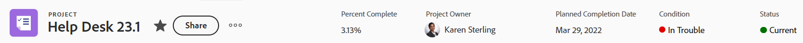

## [!UICONTROL Home] header overview 

The following headers are available in Home:

* Task: For more information on how you can use this header, see the [Task header overview](#task-header-overview) in this article.
* Issue: For more information on how you can use this header, see the [Issue header overview](#issue-header-overview) in this article.

## Customizable headers

Your [!DNL Workfront]  or group administrator  can customize the header of projects, tasks, and issues by using a layout template.

This article describes the default headers for all objects, including projects and tasks and issues.

For information about customizing information on the header of an object, see [Customize object headers using a layout template](../../administration-and-setup/customize-workfront/use-layout-templates/customize-object-headers.md).

## Project header overview 

The project header displays the following information, by default:

<table style="table-layout:auto"> 
 <col> 
 <col> 
 <thead> 
  <tr> 
   <th>Header Information</th> 
   <th>Notes</th> 
  </tr> 
 </thead> 
 <tbody> 
  <tr> 
   <td role="rowheader">Breadcrumb with parent objects</td> 
   <td>If the project is associated with a program or a portfolio, they display in the breadcrumb in the upper-left corner of the header. Clicking the name of the parent opens that parent object.</td> 
  </tr> 
  <tr data-mc-conditions=""> 
   <td role="rowheader">Object icon </td> 
   <td> 
The purple [!UICONTROL Project] icon  displays to the left of the project name.
 </td> 
  </tr> 
  <tr> 
   <td role="rowheader">Name of the project</td> 
   <td>You can edit the project name in the header.</td> 
  </tr> 
  <tr> 
   <td role="rowheader">Name of the object type</td> 
   <td> 
The text "[!UICONTROL PROJECT]" displays above the project name in the header.
 </td> 
  </tr> 
  <tr> 
   <td role="rowheader">The actions area of the task</td> 
   <td> 
Next to the name of the project, the actions area displays.
 
  
  </td> 
  </tr> 
  <tr> 
   <td role="rowheader">[!UICONTROL Percent Complete]</td> 
   <td>You cannot edit the project percent complete in the header.</td> 
  </tr> 
  <tr> 
   <td role="rowheader">[!UICONTROL Project Owner]</td> 
   <td> 
You can edit the [!UICONTROL Project Owner] in the header.
 </td> 
  </tr> 
  <tr> 
   <td role="rowheader">[!UICONTROL Planned Completion Date] </td> 
   <td> 
You can edit the project [!UICONTROL Planned Completion Date] and time in the header if the project is scheduled from [!UICONTROL Completion Date]. If the project is scheduled from [!UICONTROL Start Date], this information is updated from the tasks in the project.
 </td> 
  </tr> 
  <tr> 
   <td role="rowheader">[!UICONTROL Condition] </td> 
   <td> 
When you set the [!UICONTROL Condition Type] of the project to Manual, you can update the project [!UICONTROL Condition] in the header.
</td> 
  </tr> 
  <tr> 
   <td role="rowheader">[!UICONTROL Status]</td> 
   <td>You can edit the project [!UICONTROL Status] in the header.</td> 
  </tr> 
  <tr> 
   <td role="rowheader">The [!UICONTROL Approvals] area</td> 
   <td> 
When you are one of the approvers, use the following icons to manage the approvals for the project:
 
  </img> [!UICONTROL Approve]
 
  </img> [!UICONTROL Reject]
 
  </img> [!UICONTROL Recall]
 
If you are not an approver, click the [!UICONTROL More] icon  to view information about the current approval step.
 
To learn more about approvals, see <a href="../../review-and-approve-work/manage-approvals/approval-process-in-workfront.md" class="MCXref xref">Approval process overview</a>.
 </td> 
  </tr> 
 </tbody> 
</table>

## Task header overview 

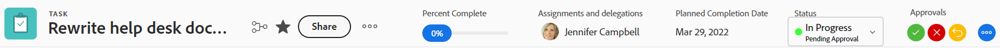

The task header includes the following information, by default:

<table style="table-layout:auto"> 
 <col> 
 <col> 
 <thead> 
  <tr> 
   <th>Header Information</th> 
   <th>Notes</th> 
  </tr> 
 </thead> 
 <tbody> 
  <tr> 
   <td role="rowheader">Breadcrumb with parent objects</td> 
   <td> 
The parent objects of the task display in the breadcrumb. Clicking the name of the parent opens that parent object.
 
For more information, see <a href="../../workfront-basics/the-new-workfront-experience/breadcrumb-overview.md" class="MCXref xref">Breadcrumbs overview</a>.
 </td> 
  </tr> 
  <tr data-mc-conditions=""> 
   <td role="rowheader">Object icon </td> 
   <td> 
The green [!UICONTROL Task] icon  displays to the left of the task name.
 </td> 
  </tr> 
  <tr> 
   <td role="rowheader">Name of the task</td> 
   <td>You can edit the task name in the header.</td> 
  </tr> 
  <tr> 
   <td role="rowheader">Name of the object type</td> 
   <td> 
The text "[!UICONTROL TASK]" displays above the task name in the header.
 </td> 
  </tr> 
  <tr> 
   <td role="rowheader">The actions area of the task</td> 
   <td> 
Next to the name of the task, the [!UICONTROL actions] area displays.
 
  
 
If the Dependency icon displays, you can click the icon to see any predecessors or successors for the task.
 </td> 
  </tr> 
  <tr> 
   <td role="rowheader">[!UICONTROL Percent Complete]</td> 
   <td>You can edit the task percent complete in the header.</td> 
  </tr> 
  <tr> 
   <td role="rowheader">[!UICONTROL Assignments]</td> 
   <td>You can edit the assignees of a task from the header.</td> 
  </tr> 
  <tr> 
   <td role="rowheader"> 
[!UICONTROL Work on It], [!UICONTROL Done], or [!UICONTROL Start Task] button
 </td> 
   <td> 
If the task is assigned to you, you can click the [!UICONTROL Work on It] or [!UICONTROL Start Task] button to indicate that you are now working on the task, or the [!UICONTROL Done] button to indicate that you completed the task.
 
For information about replacing the [!UICONTROL Work On It] button with a [!UICONTROL Start Task] button, see <a href="../../people-teams-and-groups/create-and-manage-teams/work-on-it-button-to-start-button.md" class="MCXref xref">Replace the [!UICONTROL Work On It] button with a [!UICONTROL Start] button</a>.
 </td> 
  </tr> 
  <tr> 
   <td role="rowheader">[!UICONTROL Planned Completion Date]</td> 
   <td> 
You can edit the task [!UICONTROL Planned Completion Date] and time in the header.
 
Tip: Notice that the [!UICONTROL Commit Date] is not visible in the header. You can view it on the [!UICONTROL Details] page.
 </td> 
  </tr> 
  <tr> 
   <td role="rowheader">[!UICONTROL Status]</td> 
   <td>You can edit the task [!UICONTROL Status] in the header.</td> 
  </tr> 
  <tr> 
   <td role="rowheader">The [!UICONTROL Approvals] area</td> 
   <td> 
When you are one of the approvers, use the following icons to manage the approvals for the task:
 
  </img> [!UICONTROL Approve]
 
  </img> [!UICONTROL Reject]
 
  </img> [!UICONTROL Recall]
 
If you are not an approver, click the [!UICONTROL More] icon  to view information about the current approval step.
 
To learn more about approvals, see <a href="../../review-and-approve-work/manage-approvals/approval-process-in-workfront.md" class="MCXref xref">Approval process overview</a>.
 </td> 
  </tr> 
 </tbody> 
</table>

## Issue header overview 

The issue header includes the following information, by default:

<table style="table-layout:auto"> 
 <col> 
 <col> 
 <thead> 
  <tr> 
   <th>Header Information</th> 
   <th>Notes</th> 
  </tr> 
 </thead> 
 <tbody> 
  <tr> 
   <td role="rowheader">Breadcrumb with parent objects</td> 
   <td> 
The parent objects of the issue display in the breadcrumb. Clicking the name of the parent opens that parent object.
 
For more information, see <a href="../../workfront-basics/the-new-workfront-experience/breadcrumb-overview.md" class="MCXref xref">Breadcrumbs overview</a>.
 </td> 
  </tr> 
  <tr> 
   <td role="rowheader">Object icon </td> 
   <td> 
The pink [!UICONTROL Issue] icon  displays to the left of the issue name.
 </td> 
  </tr> 
  <tr> 
   <td role="rowheader">Name of the issue</td> 
   <td>You can edit the issue name in the header.</td> 
  </tr> 
  <tr> 
   <td role="rowheader">Name of the object type</td> 
   <td> 
The text "[!UICONTROL ISSUE]" displays above the issue name in the header.
 </td> 
  </tr> 
  <tr> 
   <td role="rowheader">The actions area of the issue</td> 
   <td> 
Next to the name of the issue, the [!UICONTROL actions] area displays.
 
  
 
If the [!UICONTROL Dependency] icon displays, you can click the icon to see any predecessors or successors for the issue.
  </td> 
  </tr> 
  <tr> 
   <td role="rowheader">[!UICONTROL Percent Complete]</td> 
   <td> 
You can edit the percent complete of the issue from the header.
 </td> 
  </tr> 
  <tr> 
   <td role="rowheader">[!UICONTROL Assignments]</td> 
   <td>You can edit the assignees of a issue from the header.</td> 
  </tr> 
  <tr> 
   <td role="rowheader">[!UICONTROL Work on It], [!UICONTROL Done], or [!UICONTROL Start Issue] button</td> 
   <td>If the issue is assigned to you, you can click the [!UICONTROL Work on It] or [!UICONTROL Start Issue] button to indicate that you are now working on the issue, or the [!UICONTROL Done] button to indicate that you completed the issue.For information about replacing the [!UICONTROL Work On It] button with a [!UICONTROL Start Task] button, see <a href="../../people-teams-and-groups/create-and-manage-teams/work-on-it-button-to-start-button.md" class="MCXref xref">Replace the [!UICONTROL Work On It] button with a [!UICONTROL Start] button</a>.</td> 
  </tr> 
  <tr> 
   <td role="rowheader">[!UICONTROL Planned Completion Date]</td> 
   <td> 
You can edit the issue [!UICONTROL Planned Completion Date] and time in the header.
 
Tip: Notice that the [!UICONTROL Commit Date] is not visible in the header. You can view it on the [!UICONTROL Details] page.
 </td> 
  </tr> 
  <tr> 
   <td role="rowheader">[!UICONTROL Status]</td> 
   <td>You can edit the issue [!UICONTROL Status] in the header.</td> 
  </tr> 
  <tr> 
   <td role="rowheader">The [!UICONTROL Approvals] area</td> 
   <td> 
When you are one of the approvers, use the following icons to manage the approvals for the issue:
 
  [!UICONTROL Approve]
 
  [!UICONTROL Reject]
 
  [!UICONTROL Recall]
 
If you are not an approver, click the [!UICONTROL More] icon  to view information about the current approval step.
 
To learn more about approvals, see <a href="../../review-and-approve-work/manage-approvals/approval-process-in-workfront.md" class="MCXref xref">Approval process overview</a>.
 </td> 
  </tr> 
 </tbody> 
</table>

## Program header overview 

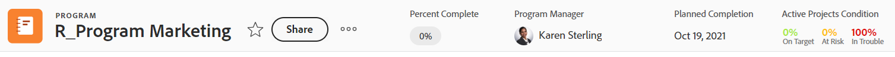

The program header displays the following information:

<table style="table-layout:auto"> 
 <col> 
 <col> 
 <thead> 
  <tr> 
   <th>Header Information</th> 
   <th>Notes</th> 
  </tr> 
 </thead> 
 <tbody> 
  <tr> 
   <td role="rowheader">Breadcrumb with the name of the Portfolio</td> 
   <td> 
You can access the [!UICONTROL Portfolio] from the header of the [!UICONTROL Program]. Clicking the name of the parent opens that parent object.
 
For more information, see <a href="../../workfront-basics/the-new-workfront-experience/breadcrumb-overview.md" class="MCXref xref">Breadcrumbs overview</a>.
 </td> 
  </tr> 
  <tr> 
   <td role="rowheader">Object icon </td> 
   <td> 
The orange [!UICONTROL Program] icon  displays to the left of the program name.
 </td> 
  </tr> 
  <tr> 
   <td role="rowheader">Name of the program</td> 
   <td>You can edit the program name in the header.</td> 
  </tr> 
  <tr> 
   <td role="rowheader">Name of the object type</td> 
   <td> 
If the program is marked as [!UICONTROL Active], the text "[!UICONTROL PROGRAM]" displays above the program name in the header.
 </td> 
  </tr> 
  <tr> 
   <td role="rowheader">Activation status</td> 
   <td> 
If the program is deactivated, the text "[!UICONTROL PROGRAM DEACTIVATED]" displays above the program name in the header.
 </td> 
  </tr> 
  <tr> 
   <td role="rowheader">The actions area of the program</td> 
   <td> 
Next to the name of the program, the [!UICONTROL actions] area displays.
 
  
 </td> 
  </tr> 
  <tr> 
   <td role="rowheader">[!UICONTROL Percent Complete]</td> 
   <td> 
You cannot edit the [!UICONTROL Percent Complete] of the program in the header. This information is updated from the projects in the program.
 
Tip: By default, the percent complete of the program is an average of the percent complete values of the projects in a [!UICONTROL Current] or [!UICONTROL Approved Status] that belong to the program.
 </td> 
  </tr> 
  <tr> 
   <td role="rowheader">[!UICONTROL Program Manager]</td> 
   <td> 
You can edit the [!UICONTROL Program Manager] in the header. This is the same as the [!UICONTROL Program Owner].
 </td> 
  </tr> 
  <tr> 
   <td role="rowheader">[!UICONTROL Planned Completion Date]</td> 
   <td>You cannot edit the program [!UICONTROL Planned Completion Date] in the header. This information is updated from the [!UICONTROL Planned Completion Date] of the projects in the program.</td> 
  </tr> 
  <tr> 
   <td role="rowheader">[!UICONTROL Active Projects Condition]</td> 
   <td>This is a calculation of what percentage of active projects in the program have the [!UICONTROL Condition] set as [!UICONTROL On Target], [!UICONTROL At Risk], or [!UICONTROL In Trouble].</td> 
  </tr> 
 </tbody> 
</table>

## Portfolio header overview {#portfolio-header-overview}

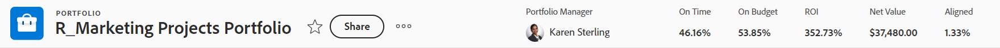

The portfolio header includes the following information:

<table style="table-layout:auto"> 
 <col> 
 <col> 
 <thead> 
  <tr> 
   <th>Header Information</th> 
   <th>Notes</th> 
  </tr> 
 </thead> 
 <tbody> 
  <tr> 
   <td role="rowheader">Object icon </td> 
   <td> 
The blue [!UICONTROL Portfolio] icon displays to the left of the portfolio name.
 </td> 
  </tr> 
  <tr> 
   <td role="rowheader">Name of the portfolio</td> 
   <td>You can edit the portfolio name in the header.</td> 
  </tr> 
  <tr> 
   <td role="rowheader">Name of the object type</td> 
   <td> 
If the portfolio is marked as active, the text "[!UICONTROL PORTFOLIO]" displays above the portfolio name in the header.
 </td> 
  </tr> 
  <tr> 
   <td role="rowheader">Activation status</td> 
   <td> 
If the portfolio is deactivated, the text "[!UICONTROL PORTFOLIO DEACTIVATED]" displays above the portfolio name in the header.
 </td> 
  </tr> 
  <tr> 
   <td role="rowheader">The [!UICONTROL actions] area of the portfolio</td> 
   <td> 
Next to the name of the portfolio, the [!UICONTROL actions] area displays.
 
  
</td> 
  </tr> 
  <tr> 
   <td role="rowheader">[!UICONTROL Portfolio Manager]</td> 
   <td>You can edit the [!UICONTROL Portfolio Manager] in the header. This is the same as the [!UICONTROL Portfolio Owner].</td> 
  </tr> 
  <tr> 
   <td role="rowheader">[!UICONTROL On Time]</td> 
   <td>This is a calculation of what percentage of projects in the portfolio are currently on time.</td> 
  </tr> 
  <tr> 
   <td role="rowheader">[!UICONTROL On Budget]</td> 
   <td>This is a calculation of what percentage of projects in the portfolio are currently on budget.</td> 
  </tr> 
  <tr> 
   <td role="rowheader">[!UICONTROL Aligned]</td> 
   <td>This is a calculation of what percentage of projects in the portfolio are aligned with the portfolio.</td> 
  </tr> 
  <tr> 
   <td role="rowheader">[!UICONTROL ROI]</td> 
   <td>This is the [!UICONTROL Return on Investment] calculation for all projects in the portfolio.</td> 
  </tr> 
  <tr> 
   <td role="rowheader">[!UICONTROL Net Value]</td> 
   <td>This is the [!UICONTROL Net Value] calculation for all projects in the portfolio.</td> 
  </tr> 
 </tbody> 
</table>

## Template header overview {#template-header-overview}

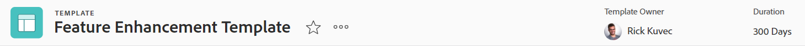

The template header displays the following information:

<table style="table-layout:auto"> 
 <col> 
 <col> 
 <thead> 
  <tr> 
   <th>Header Information</th> 
   <th>Notes</th> 
  </tr> 
 </thead> 
 <tbody> 
  <tr> 
   <td role="rowheader">Object icon </td> 
   <td> 
The green [!UICONTROL Template] icon displays to the left of the template name.
 </td> 
  </tr> 
  <tr> 
   <td role="rowheader">Name of the template</td> 
   <td>You can edit the template name in the header.</td> 
  </tr> 
  <tr> 
   <td role="rowheader">Name of the object type</td> 
   <td> 
If the template is marked as active, the text "[!UICONTROL TEMPLATE]" displays above the Template name in the header.
 </td> 
  </tr> 
  <tr> 
   <td role="rowheader">Activation status</td> 
   <td> 
If the template is deactivated, the text "[!UICONTROL TEMPLATE DEACTIVATED]" displays above the template name in the header.
 </td> 
  </tr> 
  <tr> 
   <td role="rowheader">The actions area of the template</td> 
   <td> 
Next to the name of the template, the actions area displays.
 
  
 </td> 
  </tr> 
  <tr> 
   <td role="rowheader">[!UICONTROL Template Owner]</td> 
   <td>You can edit the [!UICONTROL Template Owner] field in the header.</td> 
  </tr> 
  <tr> 
   <td role="rowheader">[!UICONTROL Duration]</td> 
   <td>The duration of the template. You cannot edit this field in the header.</td> 
  </tr> 
 </tbody> 
</table>

## Template Task header overview 

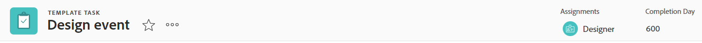

The template task header displays the following information:

<table style="table-layout:auto"> 
 <col> 
 <col> 
 <thead> 
  <tr> 
   <th>Header Information</th> 
   <th>Notes</th> 
  </tr> 
 </thead> 
 <tbody> 
  <tr> 
   <td role="rowheader">Breadcrumb to parent objects</td> 
   <td> 
The parent objects of the template task display in the breadcrumb. Clicking the name of a parent object opens that parent object.
 
For more information, see <a href="../../workfront-basics/the-new-workfront-experience/breadcrumb-overview.md" class="MCXref xref">Breadcrumbs overview</a>.
 </td> 
  </tr> 
  <tr> 
   <td role="rowheader">Object icon </td> 
   <td> 
The green [!UICONTROL Task] icon displays to the left of the template task name.
 </td> 
  </tr> 
  <tr> 
   <td role="rowheader">Name of the template task</td> 
   <td>You can edit the template task name in the header.</td> 
  </tr> 
  <tr> 
   <td role="rowheader">Name of the object type</td> 
   <td> 
The text "[!UICONTROL TEMPLATE TASK]" displays above the template task name in the header.
 </td> 
  </tr> 
  <tr> 
   <td role="rowheader">The actions area of the template task</td> 
   <td> 
Next to the name of the template task, the actions area displays.
 
  
 </td> 
  </tr> 
  <tr> 
   <td role="rowheader">[!UICONTROL Assignments]</td> 
   <td>You can edit the [!UICONTROL Assignments] of the template task in the header.</td> 
  </tr> 
  <tr> 
   <td role="rowheader">[!UICONTROL Completion Day]</td> 
   <td>This is the day in the duration of the template when the template task should complete.</td> 
  </tr> 
 </tbody> 
</table>

## Billing Record header overview 

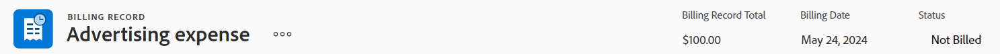

The billing record header displays the following information:

<table style="table-layout:auto"> 
 <col> 
 <col> 
 <thead> 
  <tr> 
   <th>Header Information</th> 
   <th>Notes</th> 
  </tr> 
 </thead> 
 <tbody> 
  <tr> 
   <td role="rowheader">Breadcrumb to parent objects</td> 
   <td> 
The parent objects of the billing record display in the breadcrumb. Clicking the name of a parent object opens that parent object.
 
For more information, see <a href="../../workfront-basics/the-new-workfront-experience/breadcrumb-overview.md" class="MCXref xref">Breadcrumbs overview</a>.
 </td> 
  </tr> 
  <tr> 
   <td role="rowheader">Object icon </td> 
   <td> 
The blue [!UICONTROL Billing Record] icon  displays to the left of the billing record name.
 </td> 
  </tr> 
  <tr> 
   <td role="rowheader">Name of the billing record</td> 
   <td>You can edit the name of the billing record in the header.</td> 
  </tr> 
  <tr> 
   <td role="rowheader">Name of the object type</td> 
   <td> 
The text "[!UICONTROL BILLING RECORD]" displays above the billing record name in the header.
 </td> 
  </tr> 
  <tr> 
   <td role="rowheader">The actions area of the billing record</td> 
   <td> 
Next to the name of the billing record, the [!UICONTROL More] menu  displays, which allows you to select the following options:
 
    <ul> 
     <li> 
[!UICONTROL Edit]
 </li> 
     <li> 
 
 </li> 
    </ul> </td> 
  </tr> 
  <tr> 
   <td role="rowheader">[!UICONTROL Billing Record Total]</td> 
   <td>This is the total amount of the billing record. You cannot edit this field.</td> 
  </tr> 
  <tr> 
   <td role="rowheader">[!UICONTROL Billing Date]</td> 
   <td>This is the date when the billing record was created, unless it was manually changed when the billing record was created. You can edit the [!UICONTROL Billing Date] in the header.</td> 
  </tr> 
  <tr> 
   <td role="rowheader">[!UICONTROL Status]</td> 
   <td> 
When the billing record has a status of [!UICONTROL Billed], you can no longer edit it.
 
You can edit the Status of the billing record in the header.
 </td> 
  </tr> 
 </tbody> 
</table>

## User header overview

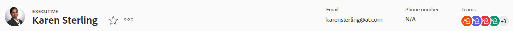

The user header displays the following information:

<table style="table-layout:auto"> 
 <col> 
 <col> 
 <thead> 
  <tr> 
   <th>Header Information</th> 
   <th>Notes</th> 
  </tr> 
 </thead> 
 <tbody> 
  <tr> 
   <td role="rowheader">User's profile picture</td> 
   <td>You cannot update the profile picture in the header.</td> 
  </tr> 
  <tr> 
   <td role="rowheader">Name of the user and title</td> 
   <td> 
 The title of the user displays in all capital letters above their name. You cannot edit the name of the user in the header.
 </td> 
  </tr> <!--
   <tr> 
    <td role="rowheader">Name of the object type</td> 
    <td> 
The name of the object type does not display.
 </td> 
   </tr>
  --> 
  <tr> 
   <td role="rowheader">Activation status</td> 
   <td> 
If the user has been deactivated, all text and the profile picture in the header is dimmed.
 </td> 
  </tr> 
  <tr> 
   <td role="rowheader">The actions area of the user</td> 
   <td> 
Next to the name of the user, the actions area displays.
 
  
</td> 
  </tr> 
  <tr> 
   <td role="rowheader">Email address</td> 
   <td>You cannot edit the email address in the header. This is usually also the username.</td> 
  </tr> 
  <tr> 
   <td role="rowheader">Phone number</td> 
   <td>You cannot edit the phone number in the header.</td> 
  </tr> 
  <tr> 
   <td role="rowheader">Teams</td> 
   <td> 
You can view the teams that the user belongs to. Mouse over a team avatar to display the team's name. You cannot edit the teams in the header.
 </td> 
  </tr> 
 </tbody> 
</table>

## Team header overview 

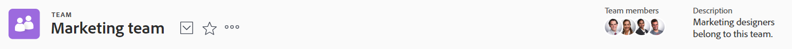

The team header displays the following information:

<table style="table-layout:auto"> 
 <col> 
 <col> 
 <thead> 
  <tr> 
   <th>Header Information</th> 
   <th>Notes</th> 
  </tr> 
 </thead> 
 <tbody> 
  <tr> 
   <td role="rowheader">Object icon </td> 
   <td> 
The purple [!UICONTROL Team] icon  displays to the left of the team name.
 </td> 
  </tr> 
  <tr> 
   <td role="rowheader">Name of the team</td> 
   <td>You can edit the team name in the header.</td> 
  </tr> 
  <tr> 
   <td role="rowheader">Name of the object type</td> 
   <td> 
The text "[!UICONTROL TEAM]" displays above the team name in the header.
 </td> 
  </tr> 
  <tr> 
   <td role="rowheader">The actions area of the team</td> 
   <td> 
Next to the name of the team, the [!UICONTROL actions] area displays.
 
  
</td> 
  </tr> 
  <tr> 
   <td role="rowheader">Team member profile pictures</td> 
   <td>The profile pictures of the team members. Mouse over a picture to display the user's name.</td> 
  </tr> 
  <tr> 
   <td role="rowheader">Description</td> 
   <td>This is a brief description about the members of the team. You cannot edit the description of the team in the header.</td> 
  </tr> 
 </tbody> 
</table>

## Iteration header overview

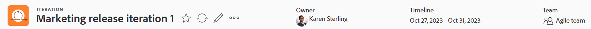

The iteration header displays the following information:

<table style="table-layout:auto"> 
 <col> 
 <col> 
 <thead> 
  <tr> 
   <th>Header Information</th> 
   <th>Notes</th> 
  </tr> 
 </thead> 
 <tbody> 
  <tr> 
   <td role="rowheader">Object icon </td> 
   <td> 
The orange [!UICONTROL Iteration] icon  displays to the left of the iteration name.
 </td> 
  </tr> 
  <tr> 
   <td role="rowheader">Name of the iteration</td> 
   <td>You can edit the iteration name in the header.</td> 
  </tr> 
  <tr> 
   <td role="rowheader">Name of the object type</td> 
   <td> 
The text "[!UICONTROL ITERATION]" displays above the iteration name in the header.
 </td> 
  </tr> 
  <tr> 
   <td role="rowheader">The actions area of the iteration</td> 
   <td> 
In the upper-right corner of the header, the actions area displays.
 
  
</td> 
  </tr> 
  <tr> 
   <td role="rowheader">Owner</td> 
   <td>This is the [!UICONTROL Owner] of the iteration. You cannot edit the [!UICONTROL Owner] in the header.</td> 
  </tr> 
  <tr> 
   <td role="rowheader">[!UICONTROL Timeline]</td> 
   <td>The [!UICONTROL Timeline] shows the start and end dates of the iteration. You cannot edit the [!UICONTROL Timeline] in the header.</td> 
  </tr> 
  <tr> 
   <td role="rowheader">[!UICONTROL Team]</td> 
   <td>You cannot edit the team of the iteration in the header. Clicking the team name takes you to the team page.</td> 
  </tr> 
 </tbody> 
</table>

## Group header overview 

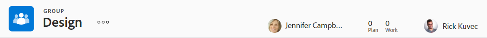

The group header displays the following information:

<table style="table-layout:auto"> 
 <col> 
 <col> 
 <thead> 
  <tr> 
   <th>Header Information</th> 
   <th>Notes</th> 
  </tr> 
 </thead> 
 <tbody> 
  <tr> 
   <td role="rowheader">Object icon </td> 
   <td> 
The orange [!UICONTROL Group] icon  displays to the left of the group name.
 </td> 
  </tr> 
  <tr> 
   <td role="rowheader">Name of the group</td> 
   <td>You can edit the group name in the header.</td> 
  </tr> 
  <tr> 
   <td role="rowheader">Name of the object type</td> 
   <td> 
The text "[!UICONTROL GROUP]" displays above the group name in the header.
 </td> 
  </tr> 
  <tr> 
   <td role="rowheader">The [!UICONTROL actions] area of the group</td> 
   <td> 
Next to the name of the group, the [!UICONTROL More] menu  displays, which allows you to select the following options:
 
    <ul> 
     <li> 
[!UICONTROL Edit]
 </li> 
     <li> 
[!UICONTROL Copy]
 </li> 
     <li> 
[!UICONTROL Delete]
 </li> 
    </ul> </td> 
  </tr> 
  <tr> 
   <td role="rowheader">[!UICONTROL Business Leader]</td> 
   <td>You can edit the [!UICONTROL Business Leader] in the header.</td> 
  </tr> 
  <tr> 
   <td role="rowheader">[!UICONTROL Licenses in use] </td> 
   <td> 
The [!UICONTROL Licenses in use] box displays the number of [!UICONTROL Plan] and [!UICONTROL Work] license users in the group and its subgroups. You can click the numbers to see this information for all 5 license types.
 
For more information, see <a href="../../administration-and-setup/manage-groups/create-and-manage-groups/view-number-licenses-allocated-used-group.md" class="MCXref xref">View the number of licenses allocated and used in a group in the new [!DNL Adobe Workfront] experience</a>.
 </td> 
  </tr> 
  <tr> 
   <td role="rowheader">[!UICONTROL Group Administrators]</td> 
   <td>You can edit the Group Administrators in the header.</td> 
  </tr> 
 </tbody> 
</table>

## Document header overview

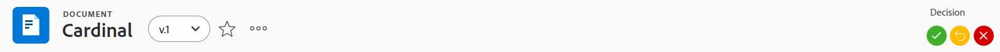

The document header displays the following information:

<table style="table-layout:auto"> 
 <col> 
 <col> 
 <thead> 
  <tr> 
   <th>Header Information</th> 
   <th>Notes</th> 
  </tr> 
 </thead> 
 <tbody> 
  <tr> 
   <td role="rowheader">Breadcrumb with parent objects</td> 
   <td> 
The parent objects of the document display in the breadcrumb. Clicking the name of a parent object opens that parent object.
 
For more information, see <a href="../../workfront-basics/the-new-workfront-experience/breadcrumb-overview.md" class="MCXref xref">Breadcrumbs overview</a>.
 </td> 
  </tr> 
  <tr> 
   <td role="rowheader">Object icon </td> 
   <td> 
The blue [!UICONTROL Document] icon  displays to the left of the document name.
 </td> 
  </tr> 
  <tr> 
   <td role="rowheader">Name of the document</td> 
   <td>You can edit the document name in the header.</td> 
  </tr> 
  <tr> 
   <td role="rowheader">Name of the object type</td> 
   <td> 
The text "[!UICONTROL DOCUMENT]" displays above the document name in the header.
 </td> 
  </tr> 
  <tr> 
   <td role="rowheader">The actions area of the document</td> 
   <td> 
Next to the name of the document, the actions area displays.
 
 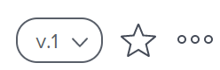 
</td> 
  </tr> 
  <tr> 
   <td role="rowheader">The approval [!UICONTROL Decision] area</td> 
   <td> The [!UICONTROL Decisions] area displays in the upper-right corner of the Document header.This area differs based on the approval phase and whether you are an approver, reviewer, or neither. <ul><li> 
If you are an approver, you can use the following icons to manage the approvals for the document:
 
  [!UICONTROL Approve]
 
  [!UICONTROL Recall]
 
  [!UICONTROL Reject]
 
For more information on approval decisions, see <a href="../../review-and-approve-work/manage-approvals/approving-work.md" class="MCXref xref">Approving work</a>.</li><li>
If you are a reviewer, you can click the Complete my review button to indicate that you have reviewed the document.

For more information on reviewing a document, see <a href="../../review-and-approve-work/document-reviews-and-approvals/review-and-approve-documents/review-a-document.md" class="MCXref xref">Review a document</a>.
</li><li>Otherwise, this area shows the current review and approval status for the document.</li><ul>
 </td> 
  </tr> 
 </tbody> 
</table>

## Company header overview {#company-header-overview}

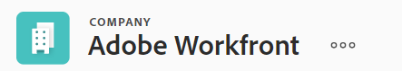

The company header displays the following information:

<table style="table-layout:auto"> 
 <col> 
 <col> 
 <thead> 
  <tr> 
   <th>Header Information</th> 
   <th>Notes</th> 
  </tr> 
 </thead> 
 <tbody> 
  <tr> 
   <td role="rowheader">Object icon </td> 
   <td> 
The blue [!UICONTROL Company] icon  displays to the left of the company name.
 </td> 
  </tr> 
  <tr> 
   <td role="rowheader">Name of the company</td> 
   <td>You can edit the name of the company in the header.</td> 
  </tr> 
  <tr> 
   <td role="rowheader">Name of the object type</td> 
   <td> 
The text "[!UICONTROL COMPANY]" displays above the company name in the header.
 </td> 
  </tr> 
  <tr> 
   <td role="rowheader">The actions area of the company</td> 
   <td> 
Next to the name of the company, the [!UICONTROL More] menu  displays, which allows you to select the following options:
 
    <ul> 
     <li> 
[!UICONTROL Edit]
 </li> 
     <li> 
[!UICONTROL Delete Company]
 </li> 
    </ul> </td> 
  </tr> 
 </tbody> 
</table>

## Plan header overview 

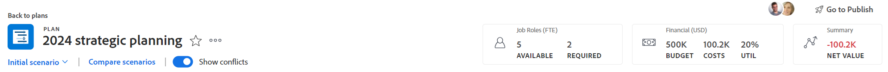

Plans are the objects of the [!DNL Workfront Scenario Planner]. For information about the [!DNL Scenario Planner], see [The [!DNL Scenario Planner] overview](../../scenario-planner/scenario-planner-overview.md).

The plan header displays the following information:

<table style="table-layout:auto"> 
 <col> 
 <col> 
 <thead> 
  <tr> 
   <th>Header Information</th> 
   <th>Notes</th> 
  </tr> 
 </thead> 
 <tbody> 
  <tr> 
   <td role="rowheader">Back to plans</td> 
   <td>Clicking this link takes you to the [!UICONTROL Plans] list.</td> 
  </tr> 
  <tr> 
   <td role="rowheader">Object icon </td> 
   <td> 
The blue [!UICONTROL Plan] icon displays to the left of the plan name.
 </td> 
  </tr> 
  <tr> 
   <td role="rowheader">Name of the plan</td> 
   <td>You can edit the plan name in the header.</td> 
  </tr> 
  <tr> 
   <td role="rowheader">Name of the object type</td> 
   <td> 
The text "[!UICONTROL PLAN]" displays above the plan name in the header.
 </td> 
  </tr> 
  <tr> 
   <td role="rowheader">The actions area of the plan</td> 
   <td> 
Next to the name of the plan, the actions area displays.
 
  
</td> 
  </tr> 
  <tr> 
   <td role="rowheader">Additional plan actions</td> 
   <td> 
Below the plan name and actions area, you can complete the following actions:
 
    <ul> 
     <li> 
<strong>[!UICONTROL Show conflicts]</strong>: Clicking this toggle shows or hides conflicts in the initiatives.
 </li> 
     <li> 
<strong>[!UICONTROL Compare scenarios]</strong>: Clicking this link shows you a side-by-side comparison of the scenarios you have created.
 </li> 
     <li> 
<strong>[!UICONTROL Scenario selection]</strong>: In this drop-down menu, you can copy a scenario or select to view a different scenario.
 </li> 
    </ul> </td> 
  </tr> 
  <tr> 
   <td role="rowheader">Job role information</td> 
   <td>In the [!UICONTROL Job Role] box, you can see how many job roles are available for the plan compared to how many are required. Clicking the box allows you to adjust the available job roles.</td> 
  </tr> 
  <tr> 
   <td role="rowheader">[!UICONTROL Financial] information</td> 
   <td>In the [!UICONTROL Financial] box, you can see the budget, cost, and utilization percentage for the plan. Clicking the box allows you to adjust the budget amount and determine if people costs are included in the plan.</td> 
  </tr> 
  <tr> 
   <td role="rowheader">[!UICONTROL Net Value]</td> 
   <td>In the [!UICONTROL Net Value] box, you can see the net value of the plan based on the budget and costs you have entered for the plan.</td> 
  </tr> 
  <tr> 
   <td role="rowheader">[!UICONTROL Shared with] information</td> 
   <td>The users that have access to view or manage the plan display in the upper-right corner of the header. Hovering over their profile pictures displays their names.</td> 
  </tr> 
  <tr> 
   <td role="rowheader">[!UICONTROL Go to Publish]</td> 
   <td>When you click [!UICONTROL Go to Publish], you can create or update a project linked to an initiative in the scenario you are viewing.</td> 
  </tr> 
 </tbody> 
</table>

## Goal header overview 

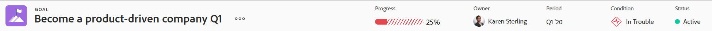

You can create strategic goals when your company has access to Workfront Goals. For more information about [!DNL Workfront Goals], see [Get started with [!DNL Adobe Workfront Goals]](../../workfront-goals/goal-management/getting-started-with-wf-goals.md). 

The goal header displays the following information:

<table style="table-layout:auto"> 
 <col> 
 <col> 
 <thead> 
  <tr> 
   <th>Header Information</th> 
   <th>Notes</th> 
  </tr> 
 </thead> 
 <tbody> 
  <tr> 
   <td role="rowheader">Object icon </td> 
   <td> 
The purple [!UICONTROL Goal] icon  displays to the left of the goal name.
 </td> 
  </tr> 
  <tr> 
   <td role="rowheader">Name of the goal</td> 
   <td>You can edit the goal name in the header.</td> 
  </tr> 
  <tr> 
   <td role="rowheader">Name of the object type</td> 
   <td> 
The text "[!UICONTROL GOAL]" displays above the goal name in the header.
 </td> 
  </tr> 
  <tr> 
   <td role="rowheader">The actions area of the goal</td> 
   <td> 
Next to the name of the goal, the actions area displays.
 
  

   You can perform the following actions from the actions area of the goal:
   <ul><li>[!UICONTROL Edit]</li>
   <li>[!UICONTROL Copy goal]</li>
   <li>[!UICONTROL Delete goal]</li>
   <li>[!UICONTROL Share]</li>
   <li>[!UICONTROL Activate] or [!UICONTROL Deactivate]</li>
   <li>[!UICONTROL Close] or [!UICONTROL Reopen]</li>
   </td> 
  </tr> 
  <tr> 
   <td role="rowheader">[!UICONTROL Progress]</td> 
   <td>The percentage of the progress goal, indicating how much of the goal has been completed. You cannot update the goal progress. Workfront calculates it based on the progress of each progress indicator on the goal.</td> 
  </tr> 
  <tr> 
   <td role="rowheader">[!UICONTROL Owner]</td> 
   <td>This is the owner of the goal. You can manually update the goal owner. Users, teams, grooups, or your organization can be goal owners.</td> 
  </tr> 
  <tr> 
   <td role="rowheader">[!UICONTROL Period]</td> 
   <td>The time frame during which the goal must be completed. </td> 
  </tr> 
  <tr> 
   <td role="rowheader">[!UICONTROL Condition]</td> 
   <td>The goal condition indicates whether the goal is on target to complete on time, or it's lagging behind </td> 
  </tr> 
  <tr> 
   <td role="rowheader">[!UICONTROL Status]</td> 
   <td>Indicates whether the goal is active, new, or closed. You cannot manually update the goal Status. For more information, see <a href="../../workfront-goals/goal-management/goal-status-overview.md" class="MCXref xref">Goal Status overview in [!DNL Adobe Workfront Goals]</a></td> 
  </tr> 
 </tbody> 
</table>