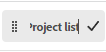

# Pin pages to customize your workspace

You can pin your most important work in [!DNL Adobe Workfront] for increased visibility, better organization, and quicker access. Pinned pages are always accessible from the top of any page in Workfront.

You might be assigned to a layout template that has pages already pinned (as described in [Customize pinned pages using a layout template](../../administration-and-setup/customize-workfront/use-layout-templates/customize-pinned-pages.md)). These predefined pins cannot be renamed or removed. Any pages you pin display to the right of the predefined pins.

## Access requirements

You must have the following access to perform the steps in this article:

<table style="table-layout:auto"> 
 <col> 
 </col> 
 <col> 
 </col> 
 <tbody> 
  <tr> 
   <td role="rowheader"><strong>[!DNL Adobe Workfront] plan*</strong></td> 
   <td> 
Any
 </td> 
  </tr> 
  <tr> 
   <td role="rowheader"><strong>[!DNL Adobe Workfront] license*</strong></td> 
   <td> 
[!UICONTROL Request] or higher
 </td> 
  </tr> 
 </tbody> 
</table>

&#42;To find out what plan or license type you have, contact your [!DNL Workfront] administrator.

## Pin a page

1. Go to the page you want to pin.

   This can be any work item, such as a project, task, request queue, etc.

1. Click **[!UICONTROL Pin current page]** at the top of the page.

   The pinned page is now accessible from the top of any page in [!DNL Workfront].

## Access a pinned page

1. At the top of any page, click the pinned page you want to view.

   >[!TIP]
   >
   >Hover over a pinned page to view the full name and the description.

   Or

   If you have many pages pinned, you might need to click the **[!UICONTROL More] menu**  to view additional pinned pages.

   The pinned page displays.

## Rename pinned pages

You can change the name of a pinned page to be more meaningful to you.

1. Hover over the pinned page in the top navigation or **[!UICONTROL More menu]**.
1. Click the arrow next to the pin name and select **[!UICONTROL Rename pin]**.

   

1. Type the new pin name, and click the check mark icon or press Enter.

   

   A small pop-up window appears for several seconds after you click the check mark or press Enter, allowing you to undo the pin name change before it is saved.

## Reorder pinned pages

You can rearrange the order that pinned pages appear.

1. Hover over the pinned page in the top navigation or **[!UICONTROL More menu]**. When you see the hand cursor, click and drag the pin to the desired order.

   Your changes automatically save and are remembered the next time you access Workfront.

## Remove a pinned page

1. Click on the pinned page that you want to unpin.
1. Click **[!UICONTROL Unpin current page]** at the top of the screen.

   Or

   Click the arrow next to the pin name and select **[!UICONTROL Remove pin]**.

   

   The page is no longer accessible from the top of any page in [!DNL Workfront].
