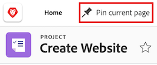
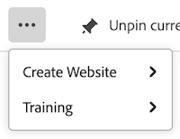
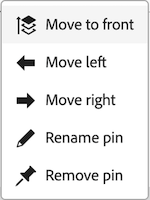
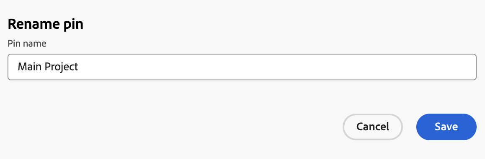

# Pin pages to customize your workspace

<!-- Audited: 4/2025 -->

You can pin your most important work in [!DNL Adobe Workfront] for increased visibility, better organization, and quicker access. Pinned pages are always accessible from the top of any page in Workfront.

You might be assigned to a layout template that has pages already pinned (as described in [Customize pinned pages using a layout template](../../administration-and-setup/customize-workfront/use-layout-templates/customize-pinned-pages.md)). These predefined pins cannot be renamed or removed. Any pages you pin display to the right of the predefined pins.

## Access requirements 

+++ Expand to view access requirements for the functionality in this article.

You must have the following access to perform the steps in this article:

<table style="table-layout:auto"> 
 <col> 
 </col> 
 <col> 
 </col> 
 <tbody> 
  <tr> 
   <td role="rowheader"><strong>[!DNL Adobe Workfront] plan</strong></td> 
   <td> 
Any
 </td> 
  </tr> 
  <tr> 
   <td role="rowheader"><strong>[!DNL Adobe Workfront] license</strong></td> 
   <td> 
New: Contributor
 
   
Or

     
Current: Request

   </td> 
  </tr> 
 </tbody> 
</table>

For more detail about the information in this table, see [Access requirements in Workfront documentation](/help/quicksilver/administration-and-setup/add-users/access-levels-and-object-permissions/access-level-requirements-in-documentation.md).

 +++

## Pin a page

1. Navigate to the page you want to pin. This can be any work item, such as a project, task, request queue, etc.

1. In the upper-left corner of the page, click **[!UICONTROL Pin current page]**. The pinned page is now accessible from the top of any page in [!DNL Workfront].

   

## Access a pinned page

1. At the top of any page, click the pinned page you want to view.

   >[!TIP]
   >
   >Hover over a pinned page to view the full name and the description.

   Or

   If you have many pages pinned, click the **[!UICONTROL More]**  icon  to view additional pinned pages. 

   
   
   The pinned page displays.

## Rename a pinned page

1. Hover over the pinned page in the top navigation.
1. Click the **More** icon  that appears next to the pin name and select **[!UICONTROL Rename pin]**.

   

1. Type the new pin name, then click **Save**.

   

## Reorder pinned pages

You can rearrange the order that pinned pages appear.

1. Hover over the pinned page you want to move, then click the **More** icon .
1. Choose **Move left** or **Move right** to move your pin. 
1. (Optional) Choose **Move to front** to move your pin to the far-left position of the pin bar. 

   

   Your changes automatically save and are remembered the next time you access Workfront.

## Remove a pinned page

1. Click the **More** icon  next to the pin you want to remove.
1. Click **Remove pin**. The page is no longer accessible from the top of any page in [!DNL Workfront].

   

   
