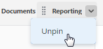

# Pin pages to customize your workspace

You can pin your most important work in Adobe Workfront for increased visibility, better organization, and quicker access. Pinned pages are always accessible from the top of any page in the new Adobe Workfront experience.

You might be assigned to a Layout Template that has pages already pinned (as described in [Customize pinned pages using a layout template](../../administration-and-setup/customize-workfront/use-layout-templates/customize-pinned-pages.md)). Any pages you pin display to the right of any existing pins.

## Access requirements

You must have the following access to perform the steps in this article:

<table style="table-layout:auto"> 
 <col> 
 </col> 
 <col> 
 </col> 
 <tbody> 
  <tr> 
   <td role="rowheader">Adobe Workfront plan*</td> 
   <td> 
Any
 </td> 
  </tr> 
  <tr> 
   <td role="rowheader">Adobe Workfront license*</td> 
   <td> 
Request or higher
 </td> 
  </tr> 
 </tbody> 
</table>

&#42;To find out what plan or license type you have, contact your Workfront administrator.

## Pin a page

1. Go to the page you want to pin.

   This can be any work item, such as a project, task, request queue, etc.

1. Click **Pin current page** at the top of the page.

   The pinned page is now accessible from the top of any page in Workfront.

## Access a pinned page

1. At the top of any page, click the pinned page you want to view.

   >[!TIP]
   >
   >Hover over a pinned page to view the type of object (such as Project or Dashboard), the full name, and the description.

   Or

   If you have many pages pinned, you might need to click the **More menu**  to view additional pinned pages.

   The pinned page displays.

## Reorder pinned pages

You can rearrange the order that pinned pages appear.

1. Hover over the pinned page in the top navigation. When you see the hand cursor, then click and drag the pin to the desired order.

   >[!NOTE]
   >
   >You can't reorder pinned pages that are in the **More menu** .

   Your changes automatically save and are remembered the next time you access Workfront.

## Remove a pinned page

1. Click on the pinned page that you want to unpin.
1. Click **Unpin current page** at the top of the screen.

   Or

   Hover over the pinned page that you want to unpin, and click the X next to the pin name.

   

   The page is no longer accessible from the top of any page in Workfront.

   <!--
   <li value="3" data-mc-conditions="QuicksilverOrClassic.Draft mode"> 
Click the arrow next to the pin name and select <strong>Unpin</strong>.
 
  
 
The page is no longer accessible from the top of any page in Workfront.
 </li>
   -->

