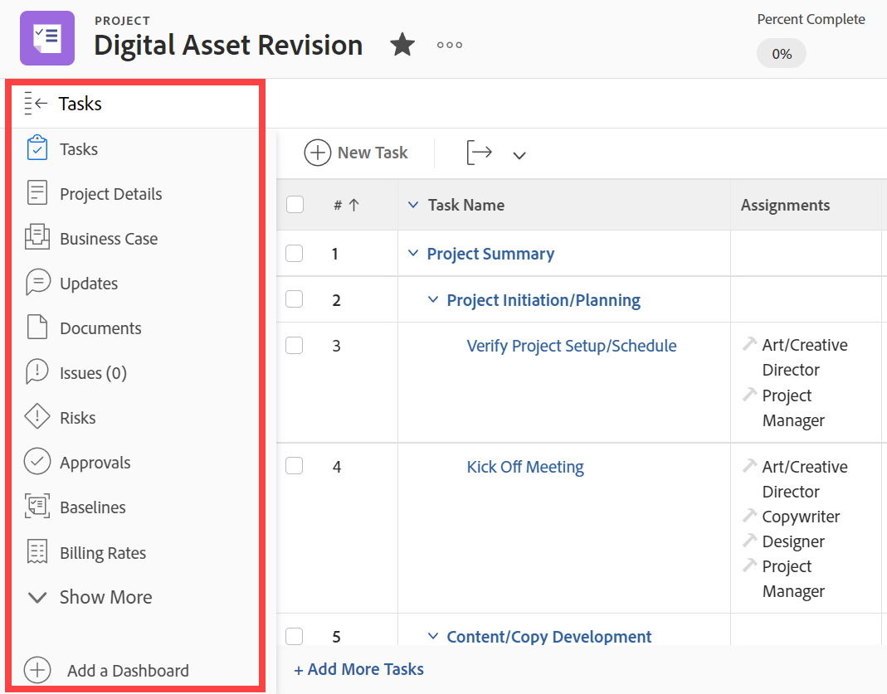
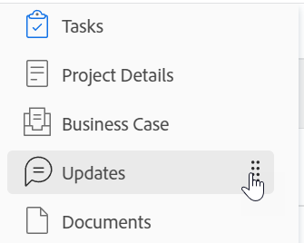

# Left navigation in [!DNL Adobe Workfront]

Most areas and objects in WF use a simple navigation panel on the left side of the screen. The following are benefits of left panel navigation:

* It allows better management of screen space.
* Your [!DNL Workfront] administrator can hide any section in the left panel except for the object's details using layout templates.

   For information about using layout templates, see the article [Create and manage layout templates](../../administration-and-setup/customize-workfront/use-layout-templates/create-and-manage-layout-templates.md).

* You can easily change the order of the sections in the left navigation without opening additional screens by dragging and dropping them in the order that you desire.

   For more information, see the following section in this article: [Use the left navigation panel](#use-the-left-navigation-panel).

* You can customize the left panel by adding a dashboard.

## Access requirements

You must have the following access to perform the steps in this article:

<table style="table-layout:auto"> 
 <col> 
 </col> 
 <col> 
 </col> 
 <tbody> 
  <tr> 
   <td role="rowheader"><strong>[!DNL Adobe Workfront] plan*</strong></td> 
   <td> 
Any
 </td> 
  </tr> 
  <tr> 
   <td role="rowheader"><strong>[!DNL Adobe Workfront] license*</strong></td> 
   <td> 
[!UICONTROL Request] or higher
 </td> 
  </tr> 
 </tbody> 
</table>

&#42;To find out what plan or license type you have, contact your [!DNL Workfront] administrator.

## Default sections in the left navigation panel 

You can access more information about objects or areas from the left panel for various objects or areas in Adobe Workfront.

Depending on the object or the area you've navigated to, the sections that appear in the left panel are different.

The left panel is available for the following objects:

* Project
* Task
* Issue
* Portfolio
* Program
* Template
* Template Task
* Iteration
* User
* Team
* Group
* Goal

>[!IMPORTANT]
>
>If the left panel displays only one section by default—such as **[!UICONTROL All Projects]** in the **[!UICONTROL Projects]** area—a [!DNL Workfront] administrator must add at least one custom section to this area when building a Layout Template and assign you to that template before the left panel displays in that area.\
>For information about how a [!DNL Workfront] administrator customizes the left panel in a layout template, see [Customize the left panel using a layout template](../../administration-and-setup/customize-workfront/use-layout-templates/customize-left-panel.md).

The left panel is available for the following areas:

* [Default sections in the [!UICONTROL Dashboards] area](#default-sections-in-the-dashboards-area)
* [Default sections in the [!UICONTROL Requests] area](#default-sections-in-the-requests-area)
* [Default sections in the [!UICONTROL Resourcing] area](#default-sections-in-the-resourcing-area)
* [Default sections in the [!UICONTROL Projects] area](#default-sections-in-the-projects-area)
* [Default sections in the [!UICONTROL Timesheets] area](#default-sections-in-the-timesheets-area)
* [Default sections in the [!DNL Goals] area](#default-sections-in-the-goals-area)

### Default sections in the [!UICONTROL Dashboards] area 

The following sections display in the left panel for the **[!UICONTROL Dashboards]** area:

<table style="table-layout:auto">
    <tr>
        <td><strong>[!UICONTROL My Dashboards]</strong></td>
        <td>Displays the dashboards that you have built.</td>
    </tr>
    <tr>
        <td><strong>[!UICONTROL Shared Dashboards]</strong></td>
        <td>Displays the dashboards that have been created by other users and shared with you.</td>
    </tr>
    <tr>
        <td><strong>[!UICONTROL All Dashboards]</strong></td>
        <td>Displays the dashboards that you or other users have created, and which you have permissions to at least View.</td>
    </tr>
</table>

To learn how to use the left panel in the Dashboards area, see the section [Use the left navigation panel](#use-the-left-navigation-panel) in this article.

### Default sections in the [!UICONTROL Requests] area 

<table style="table-layout:auto">
    <tr>
        <td><strong>[!UICONTROL Submitted]</strong></td>
        <td>Displays requests that you or other users have submitted, and which you have permissions to at least View. Use the filters in the upper-right corner of the request list to view your requests or requests others have submitted and you have access to view.</td>
    </tr>
    <tr>
        <td><strong>[!UICONTROL Drafts]</strong></td>
        <td>Displays requests that you have started but you have not submitted them yet. [!DNL Workfront] automatically saves any new request in the Drafts folder, after you have selected your queue topic.</td>
    </tr>
</table>

To learn how to use the left panel in the [!UICONTROL Requests] area, see the section [Use the left navigation panel](#use-the-left-navigation-panel) in this article.

### Default sections in the [!UICONTROL Resourcing] area 

The following sections display in the left panel for the **[!UICONTROL Resourcing]** area:

<table style="table-layout:auto"> 
 <col> 
 <col> 
 <tbody> 
  <tr> 
   <td role="rowheader"><strong>Planner</strong></td> 
   <td>Displays the Resource Planner. Use this area to plan your resources across multiple projects. For information about using the Resource Planner, see <a href="../../resource-mgmt/resource-planning/get-started-resource-planning.md" class="MCXref xref">Get started with Resource Planning</a>.</td> 
  </tr> 
  <tr> 
   <td role="rowheader"><strong>[!IUCONTROL Workload Balancer]</strong></td> 
   <td>Displays the Workload Balancer. Use this area to assign actual work to your resources.  
   For information about using scheduling resources, see <a href="../../resource-mgmt/workload-balancer/assign-work-in-workload-balancer.md" class="MCXref xref">Overview of assigning work in the Workload Balancer</a>.</td> 
  </tr> 
  <tr> 
   <td role="rowheader"><strong>Utilization</strong></td> 
   <td>Displays the Utilization Report. For information about how to read the Utilization Report, see <a href="../../reports-and-dashboards/reports/using-built-in-reports/resource-utilization-report.md" class="MCXref xref">Overview of the Resource Utilization report</a>.</td> 
  </tr> 
  <tr> 
   <td role="rowheader"><strong>Resource Pools</strong></td> 
   <td>Displays all Resource Pools in Workfront. For information about Resource Pools, see <a href="../../resource-mgmt/resource-planning/resource-pools/work-with-resource-pools.md" class="MCXref xref"> Resource pools overview </a>.</td>
  </tr> 
 </tbody> 
</table>

To learn how to use the left panel in the [!UICONTROL Resourcing] area, see the section [Use the left navigation panel](#use-the-left-navigation-panel) in this article.

### Default sections in the [!UICONTROL Projects] area 

The following sections display in the left panel for the **[!UICONTROL Projects]** area:

<table style="table-layout:auto">
    <tr>
        <td><strong>[!UICONTROL All Projects]</strong></td>
        <td>Displays all projects that you have access to view. Use the [!UICONTROL Filter] drop-down menu to change what projects you want to view</td>
    </tr>
    <tr>
        <td><strong>[!UICONTROL Custom sections]</strong></td>
        <td>You can view all the custom sections that your [!DNL Workfront] administrator has added to the left panel for the [!UICONTROL Projects] area in your Layout Template. Custom sections have names that have been customized for your environment.</td>
    </tr>
</table>

To learn how to use the left panel in the [!UICONTROL Projects] area, see the section [Use the left navigation panel](#use-the-left-navigation-panel) in this article.

### Default sections in the [!UICONTROL Timesheets] area 

The following sections display in the left panel for the **[!UICONTROL Timesheets]** area:

<table style="table-layout:auto">
    <tr>
        <td><strong>[!UICONTROL My Timesheets]</strong></td>
        <td>Displays all your active timesheets by default. To display submitted or closed timesheets, select [!UICONTROL Submitted] or [!UICONTROL All] from the [!UICONTROL Filter] drop-down menu.</td>
    </tr>
    <tr>
        <td><strong>[!UICONTROL Timesheets I Approve]</strong></td>
        <td>Displays timesheets that have been submitted for your approval, by default. To display active or all timesheets where you are the approver, select [!UICONTROL Active] or App from the Filter drop-down menu.</td>
    </tr>
    <tr>
        <td><strong>[!UICONTROL All Timesheets]</strong></td>
        <td>Displays all timesheets that you have access to view, based on the filters selected in the left Filter area.</td>
    </tr>
</table>

To learn how to use the left panel in the [!UICONTROL Timesheets] area, see the section [Use the left navigation panel](#use-the-left-navigation-panel) in this article.

### Default sections in the [!DNL Goals] area 

>[!NOTE]
>
>Accessing goals requires an additional license. For information about [!DNL Workfront Goals], see [[!DNL Adobe Workfront Goals] overview](../../workfront-goals/goal-management/wf-goals-overview.md).

The following sections display in the left panel for the **[!UICONTROL Goals]** area:

<table style="table-layout:auto">
    <tr>
        <td><strong>[!UICONTROL Goal List]</strong></td>
        <td>Displays all the goals that you have access to view. For more information, see <a href="../../workfront-goals/goal-review-and-workfront-goals-sections/manage-goals-in-goal-list.md">Manage goals in the [!UICONTROL Goal List] of [!DNL Adobe Workfront Goals]</a>.</td>
    </tr>
    <tr>
        <td><strong>[!UICONTROL Graphs]</strong></td>
        <td>Displays the performance of your goals in charts. For more information, see <a href="../../workfront-goals/goal-review-and-workfront-goals-sections/review-goal-graphs.md">Review graphs to understand goal progress trends in [!DNL Adobe Workfront] Goals</a>.</td>
    </tr>
    <tr>
        <td><strong>[!UICONTROL Goal Alignment]</strong></td>
        <td>Displays the alignment of goals with each other in a hierarchy. For more information, see <a href="../../workfront-goals/goal-alignment/goal-alignment-overview.md">Goal alignment overview in [!DNL Adobe Workfront Goals]</a>.</td>
    </tr>
    </table>
   
   <!--
   Drafted - removed from UI 
   <table>
    <tr>
        <td><strong>[!UICONTROL Pulse]</strong></td>
        <td>Displays a quick overview of all active goals and their progress. For more information, see <a href="../../workfront-goals/goal-review-and-workfront-goals-sections/review-goals-in-pulse.md">Review goals in the [!UICONTROL [!DNL Adobe Workfront Goals] Pulse] section</a>.
        
This section has been removed from the Preview environment.

        </td>
    </tr>
    <tr>
        <td><strong>[!UICONTROL Check-in]</strong></td>
        <td>Displays a quick overview of your active goals and their progress. For more information, see <a href="../../workfront-goals/goal-review-and-workfront-goals-sections/check-in-goals.md">Update goal progress in [!DNL Adobe Workfront Goals]</a>.
        
This section has been removed from the Preview environment.

        </td>
    </tr>
</table>
-->
To learn how to use the left panel in the [!UICONTROL Goals] area, see the section [Use the left navigation panel](#use-the-left-navigation-panel) in this article.

## Use the left navigation panel 

Finding and editing information in the left panel is similar for these objects. The options available in the left panel are different depending on what object you access.

To learn what sections are available for specific areas, see [[!UICONTROL Default sections] in the left navigation panel](#default-sections-in-the-left-navigation-panel).

1. Click the **[!UICONTROL Main menu]** icon , then click the name of an object to access it.

   The object page displays.

1. (Conditional) If you selected an area that contains a list of objects—such as **[!UICONTROL Projects]** or **[!UICONTROL Portfolios]**—you must do the following to access the left panel navigation:

   1. Click an object in the list.
   1. (Optional) In the left panel navigation, you can select another object—such as **[!UICONTROL Tasks]** or **[!UICONTROL Issues]** within a project—in the left panel to access a list of objects, then click the name of the specific object.\

      The object page displays.

1. From the object page, click any of the sections in the left panel to view or edit the information in that section.

   You must have permissions to edit the object before you can edit the information.

   

1. (Optional) Click **[!UICONTROL Show More]** at the bottom of the left panel to display more sections.

   >[!NOTE]
   >
   >This option is not available if all sections display in the left panel by default.

1. (Optional) To add a dashboard quick link, click **[!UICONTROL Add Dashboard]** at the bottom of the left panel, then do the following:

   1. Type a name for the dashboard in the **[!UICONTROL Quick link name]** field.
   1. Start typing the name of an existing dashboard in the **[!UICONTROL Choose a Dashboard]** field, then click the dashboard when it displays in the list.

      >[!TIP]
      >
      >You must build the dashboard before it appears in the list.

   1. Click **[!UICONTROL Add]**.

      The dashboard link appears at the bottom of the left panel.

1. (Optional) To change the order of a section in the left panel, click the **[!UICONTROL Drag]** icon  to the right of a section and drag it up or down.

   

1. (Optional) To close the left panel, click the **[!UICONTROL Collapse]** icon .

   >[!NOTE]
   >
   >When you collapse the left panel, [!DNL Workfront] retains your preference even when you navigate to another [!DNL Workfront] object. To expand the left panel again, click the **[!UICONTROL Expand]** icon .
