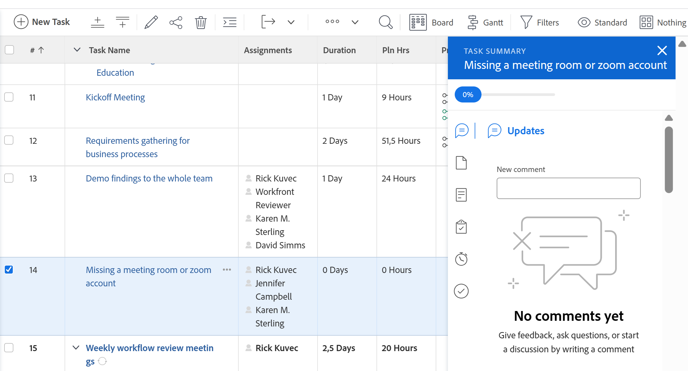
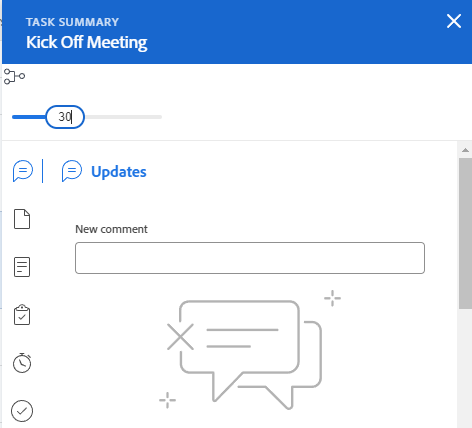
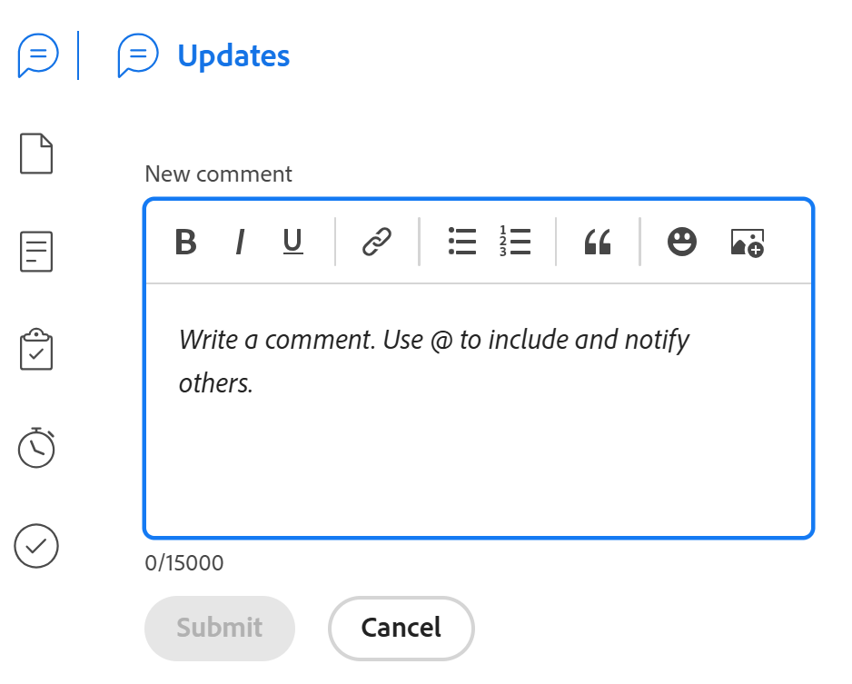
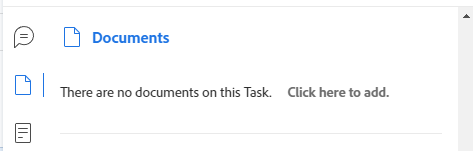
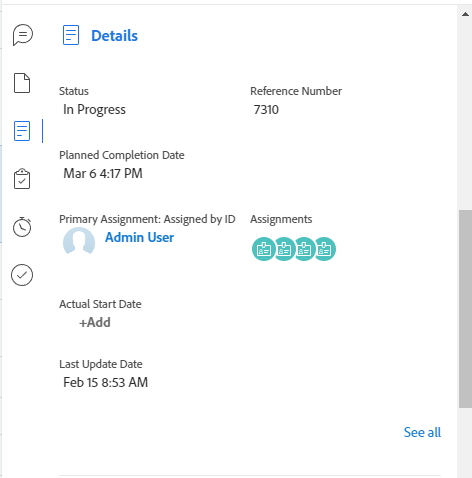
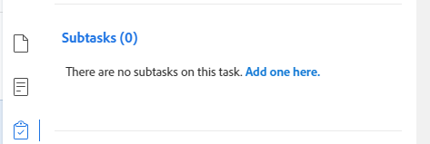
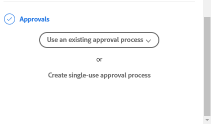

# [!UICONTROL Summary] overview

The highlighted information on this page refers to functionality not yet generally available. It is available only in the Preview environment for all customers or in Production for customers who enabled fast releases. 

For information about fast releases, see [Enable or disable fast releases for your organization](/help/quicksilver/administration-and-setup/set-up-workfront/configure-system-defaults/enable-fast-release-process.md).

For information about the current release schedule, see [Second Quarter 2024 release overview](/help/quicksilver/product-announcements/product-releases/24-q2-release-activity/24-q2-release-overview.md).

You can use the [!UICONTROL Summary] panel to review and update work item information directly from a list of tasks issues, documents, or from other areas of [!DNL Adobe Workfront] that display tasks and issues.

The following table displays the areas where you can locate and use the [!UICONTROL Summary] panel:

<table style="table-layout:auto"> 
 <col data-mc-conditions=""> 
 <tbody> 
  <tr> 
   <td>Tasks</td> 
  </tr> 
  <tr> 
   <td> 
Task lists within a
 
    <ul> 
     <li>Project</li> 
     <li>Subtask</li> 
    </ul> </td> 
  </tr> 
  <tr> 
   <td>Tasks in the [!UICONTROL Unassigned] and [!UICONTROL Assigned] Work areas of the [!UICONTROL Workload Balancer]</td> 
  </tr> 
   <tr> 
   <td>Tasks in a [!UICONTROL Timesheet]</td> 
  </tr> 
  <tr data-mc-conditions=""> 
   <td>Issues</td> 
  </tr> 
  <tr data-mc-conditions=""> 
   <td> 
Issue lists within a
 
    <ul> 
     <li>Project</li> 
     <li>Task</li> 
     <li>Subtask</li> 
    </ul> </td> 
  </tr> 
  <tr data-mc-conditions=""> 
   <td>Issues in the [!UICONTROL Assigned Work] area of the [!UICONTROL Workload Balancer]</td> 
  </tr> 
  <tr data-mc-conditions=""> 
   <td>Issues in the [!UICONTROL Submitted] section of the [!UICONTROL Requests] area</td> 
  </tr> 
</tr> 
   <tr> 
   <td>Issues in a [!UICONTROL Timesheet]</td> 
  </tr>

  <tr data-mc-conditions=""> 
   <td>Documents</td> 
  </tr> 
  <tr data-mc-conditions=""> 
   <td>[!UICONTROL Documents] area</td> 
  </tr> 
  <tr data-mc-conditions=""> 
   <td>[!UICONTROL Documents] section of any object (project, task, issue, program, portfolio, template, template task, user)</td> 
  </tr> 
 </tbody> 
</table>

<!--

Workfront administrators can customize the Summary in the Layout Template. For more information, see <a href="../../administration-and-setup/customize-workfront/use-layout-templates/create-and-manage-layout-templates.md" class="MCXref xref">Create and manage layout templates</a>.

-->

This article describes how to access and use the [!UICONTROL Summary] panel for tasks and issues in lists.

For information about accessing the [!UICONTROL Summary] in the [!UICONTROL Workload Balancer], see [Update work items in the [!UICONTROL Workload Balancer] using the [!UICONTROL Summary]](../../resource-mgmt/workload-balancer/update-items-in-summary-panel-in-workload-balancer.md).

For information about accessing the [!UICONTROL Summary] for documents, see [[!UICONTROL Summary] for documents overview](../../documents/managing-documents/summary-for-documents.md).

## Access requirements

You must have the following access to perform the steps in this article:

<table style="table-layout:auto"> 
 <col> 
 <col> 
 <tbody> 
  <tr> 
   <td role="rowheader"><strong>[!DNL Adobe Workfront] plan*</strong></td> 
   <td> 
Any
 </td> 
  </tr> 
  <tr> 
   <td role="rowheader"><strong>[!DNL Adobe Workfront] license*</strong></td> 
   <td> 
[!UICONTROL Request] or higher
 </td> 
  </tr> 
  <tr> 
   <td role="rowheader"><strong>Access level configurations*</strong></td> 
   <td> 
[!UICONTROL View] or higher access to Tasks, Issues, Documents
 
[!UICONTROL View] or higher access to any objects for which you want to view documents' [!UICONTROL Summary]
 
Note: If you still don't have access, ask your [!DNL Workfront] administrator if they set additional restrictions in your access level. For information on how a [!DNL Workfront] administrator can modify your access level, see <a href="../../administration-and-setup/add-users/configure-and-grant-access/create-modify-access-levels.md" class="MCXref xref">Create or modify custom access levels</a>.
 </td> 
  </tr> 
  <tr> 
   <td role="rowheader"><strong>Object permissions</strong></td> 
   <td> 
[!UICONTROL View] or higher permissions to a task, issue, or document
 
For information on requesting additional access, see <a href="../../workfront-basics/grant-and-request-access-to-objects/request-access.md" class="MCXref xref">Request access to objects </a>.
 </td> 
  </tr> 
 </tbody> 
</table>

&#42;To find out what plan, license type, or access you have, contact your [!DNL Workfront] administrator.

## View the [!UICONTROL Summary] panel in a list of tasks or issues

1. Go to a task or issue and select an item in the list.
1. Click the **[!UICONTROL Summary]** icon 

   or

   Click the **[!UICONTROL Open Summary]** icon  in the [!UICONTROL Submitted] section of the [!UICONTROL Requests] area.

   After you open the Summary, it stays open as you click or select other tasks or issues and remains open until you manually close it.

   >[!TIP]
   >
   >You can only select one task or one issue at a time to view their details in the [!UICONTROL Summary] panel.

   

   

   

1. (Optional) To close the [!UICONTROL Summary] panel, do one of the following:

   * In a task or issue list, click the **[!UICONTROL Open Summary]** icon 

      Or

      Click the **X** icon in the upper-right corner of the [!UICONTROL Summary] panel.

   * In the [!UICONTROL Submitted] section of the [!UICONTROL Requests] area, click the **[!UICONTROL Close Summary]** icon 

      Or

      Click the **X** icon in the upper-right corner of the Summary panel.

## [!UICONTROL Percent Complete]

Use the progress bar at the top of the [!UICONTROL Summary] to update the percent complete for the task or issue that you've selected. Enter a number or drag the bar to the correct percentage.

## [!UICONTROL Updates]

Use the [!UICONTROL Updates] section of the [!UICONTROL Summary] to view recent updates and make updates on the task or issue you selected. Click **[!UICONTROL See all]** to go directly to the [!UICONTROL Updates] tab on the task.

## [!UICONTROL Documents]

Use the [!UICONTROL Documents] section of the [!UICONTROL Summary] to see documents attached to the task or issue you selected. Click the thumbnail to open a document preview. To go directly to the [!UICONTROL Documents] tab on the task or issue, click the **[!UICONTROL Documents]** title.

## [!UICONTROL Details]

Use the [!UICONTROL Details] section of the [!UICONTROL Summary] to view high-level work item details, make assignments, or add start dates. Click **[!UICONTROL See all]** to go directly to the [!UICONTROL Details] tab on the task or issue.

>[!NOTE]
>
>The fields that appear in this section are the same fields that appear in the right panel in Home. You can customize these fields [Customize [!UICONTROL Home] and [!UICONTROL Summary] using a layout template](../../administration-and-setup/customize-workfront/use-layout-templates/customize-home-summary-layout-template.md).

## [!UICONTROL Subtasks]

This section is only available for tasks. Use the [!UICONTROL Subtasks] section of the [!UICONTROL Summary] to view [!UICONTROL New], [!UICONTROL In Progress], and [!UICONTROL Closed] subtasks on the task you selected. Click the **[!UICONTROL Status]** drop-down menu to switch between statuses. To go directly to the [!UICONTROL Subtasks] tab on the task, click the **[!UICONTROL Subtasks]**&#x200B;title.

If you have not added any subtasks to the task, click **[!UICONTROL Add one here]** to go directly to the [!UICONTROL Subtasks] tab on the task.

## [!UICONTROL Hours]

Use the [!UICONTROL Hours] section of the [!UICONTROL Summary] to log hours on the task or issue you selected. Click **[!UICONTROL Log Time]** and enter your hours. To go directly to the Hours tab on the task or issue, click the **[!UICONTROL Hours]** title.

The hour count in the [!UICONTROL Summary] displays the hours you log. Other users will have different hour totals in the [!UICONTROL Summary] depending on the time they log on the task.

If there are no planned [!UICONTROL hours] on the task or issue and you have logged time, the hours bar displays red.

## Approvals

Use the [!UICONTROL Approvals] section of the [!UICONTROL Summary] to view approvals attached to the task or issue you selected. If you have not added any approvals, select an existing approval from the drop-down menu or click **[!UICONTROL Create single-use approval process]** to go directly to the [!UICONTROL Approvals] tab on the task or issue.

To go directly to the [!UICONTROL Approvals] tab on the task or issue, click the **[!UICONTROL Approvals]** title.

