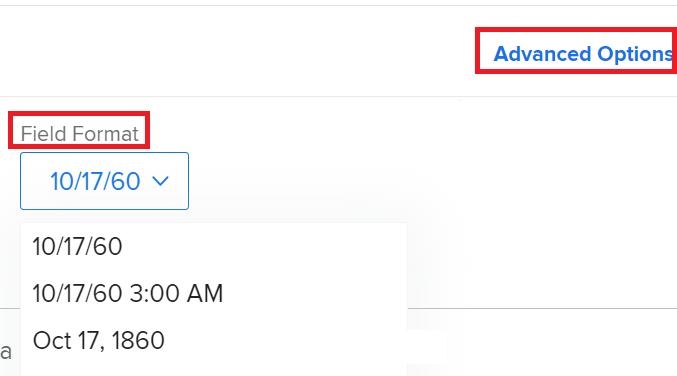
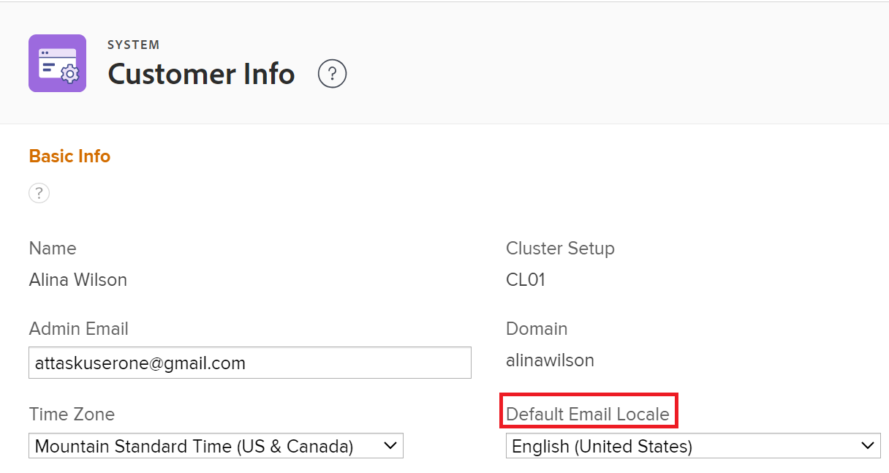
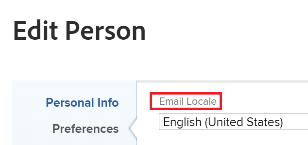

# Change the format for dates in [!DNL Adobe Workfront]

<!--this article used to be called "Change the date format in Adobe Workfront when using Chrome". The team decieded to make it more generic and hide the steps. Also see drafted content below-->

You can change the date format of dates in [!DNL Adobe Workfront], such as [!UICONTROL Planned Completion Date], [!UICONTROL Actual Completion Date], or [!UICONTROL Projected Completion Date].  

For example, you can change a date format from _DD/MM/YYYY_ to _MM/DD/YYYY_ or vice versa.
Or, you can change the date format from _MM/DD/YY_ to _Mon DD, YYYY_. 

You can change date formats in Workfront in the following ways, depending on what changes you want to see and where you would like to see the changes. 

* To change all date formats for all pages in [!DNL Workfront] according to your location and language, you must change the language settings in your browser.
   
   For example, if the default language in your browser is set to *[!UICONTROL English (United States)]*, the dates display in the following formats:

   * MM/DD/YYYY
   * Mon DD, YYY

   To change the language settings in [!DNL Chrome] or any other browser, you must modify the settings of that browser. The steps to modify a browser's settings vary from browser to browser. Refer to your browser's [!UICONTROL Help], [!UICONTROL Preferences], or [!UICONTROL Settings] areas to learn how to modify its settings.

* To change the format of dates only in reports and views, you must update the [!UICONTROL Field Format] setting in the [!UICONTROL Advanced Options] area of a column, when building the report or view. This does not modify the date format according to the location or language. It modifies the format of dates in the context of the same location or language. 

   

   For more information, see [Create a custom report](../../reports-and-dashboards/reports/creating-and-managing-reports/create-custom-report.md). 

* To change the format of dates in all outgoing email notifications for your entire organization, you must update the [!UICONTROL Default Email Locale] setting in the [!UICONTROL Customer Info] area in [!UICONTROL Setup]. 

   

   For more information, see [Configure basic information for your system](../../administration-and-setup/get-started-wf-administration/configure-basic-info.md). 

* To change the format of all dates in all outgoing email notifications for a single user, you must update the [!UICONTROL Email Locale] setting in the [!UICONTROL Edit Person] box, when editing a user's profile. 

   

   For more information, see [Edit a user's profile](../../administration-and-setup/add-users/create-and-manage-users/edit-a-users-profile.md). 

<!--drafted because we should not document steps for a third-party application

To change your language settings in Chrome:

1. Click the 3-dots in the top right corner of your Chrome interface, then click **Settings**.
1. On the left area of the Settings page, expand **Advanced**, then click **Languages**.  
   Or  
   Search for *language*&nbsp;at the top of the Settings page, then click **Languages**.

1. In the **Language** list, locate the language and region that use your preferred date format.

   **Example:** If you speak English and you want the date format to be MM/DD/YYYY, you would select **English (United States)**. If you speak English and you want the date format to be DD/MM/YYY, you would select **English (United Kingdom)**.

1. (Conditional) If the language and region you want to use are not visible in the list, click **Add languages** to add it to the list.
1. Click the 3-dot menu next to the language and region you want to use, then click **Move to the top**.
1. Return to the Workfront interface, then refresh the page.  
   The date format is now updated in projects and other areas of Workfront that use MM/DD/YYYY or DD/MM/YYYY format when displaying dates.

   -->
