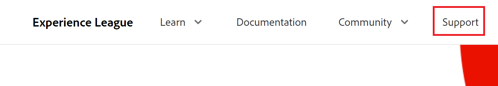
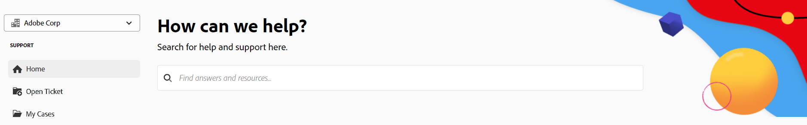
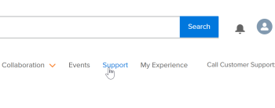
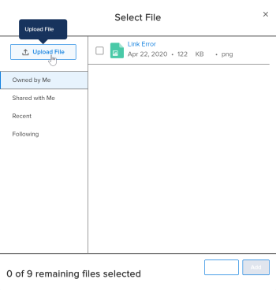

# Contact Customer Support

<!--

(We need to keep this as a standalone article. It is linked in multiple articles and FAQs.)

-->

As an [!DNL Adobe Workfront] customer, you can contact the [!DNL Workfront] Customer Support team by phone or by submitting a ticket online.

>[!NOTE]
>
>For critical issues, contact [!DNL Workfront] Customer Support by phone.

## Phone

You can contact [!DNL Workfront Customer Support] 7 days a week, 24 hours a day, through the following numbers:

* US: 844-306-HELP(4357)
* EMEA: +44 1256 274200
* Australia: +61 1800 849259

## Web

You can submit a support ticket from the self-serve [!DNL Experience League] portal.

>[!IMPORTANT]
>
>Only authorized support contacts (or support entitled users) can submit online support tickets.

1. From the [[!DNL Experience League]](https://experienceleague.adobe.com) website, click **[!UICONTROL Support]**  at the top of the page.

   

   The [!UICONTROL Support] page opens.

   From the [!UICONTROL Support] homepage, you can navigate to your open support cases, log a new case, view the top [!UICONTROL Support] articles, or access additional learning sources.

1. To submit a case, select the option **[!UICONTROL Open a support case]**, then click **[!UICONTROL Sign] In**.

1. Click **[!UICONTROL Open case]** in the left sidebar.

<!--
   
-->

   The [!UICONTROL case creation] page opens where you can enter your product name ([!DNL Adobe Workfront], [!DNL Adobe Workfront Fusion], etc.), case title, and case description.

   >[!TIP]
   >
   >Be as descriptive as possible when describing the issue you are facing to help us expedite the troubleshooting process.

1. Fill in the information for the following fields to provide us with more specific details:

   * **[!UICONTROL Case Priority]** ([!UICONTROL Low], [!UICONTROL Medium], [!UICONTROL High], [!UICONTROL Critical])
   * **[!UICONTROL Case Product]** ([!UICONTROL DAM], [!DNL Fusion], [!DNL Goals], etc.)
   * **[!UICONTROL Environment]** ([!UICONTROL Production], [!UICONTROL Preview], [!UICONTROL Sandbox], etc.)
   * **[!UICONTROL Customer Region]** (Americas, EMEA, APAC)

1. Upload any relevant files, then click **[!UICONTROL Submit case]**.

   The case is submmitted, and the [!UICONTROL My cases] page displays.

   <!--
   
   -->

If you have any questions or problems submitting a request, call the Customer Support team.

## View and manage your support cases

1. Navigate to the **[!UICONTROL My cases]** page. This page opens when you submit a case, or you can open it by clicking **[!UICONTROL My cases]** in the left navigation.

1. (Optional) Use the options at the top of the page to filter by **Product ([!DNL Experience Cloud] solution)** or case **[!UICONTROL Status]** ([!UICONTROL Open] or Cl[!UICONTROL ]osed). You can also use the [!UICONTROL search] box to search for any keywords pertaining to your support cases.

1. (Optional) To view more details on a case, click the **Case Number** to access it. 

   The case view opens.

1. (Optional) In the case view, review the latest comments with the assigned case owner and add any additional attachments or responses.

1. (Optional) To escalate the case, click **[!UICONTROL Escalate to management]** on the right side of the page under **[!UICONTROL Case Detail].

1. Click the **[!UICONTROL Close case]** button to close the case.

<!--drafted: I took the information above from this blog post by Jon Chen (on September 13, 2022): https://experienceleaguecommunities.adobe.com/t5/workfront-blogs/how-to-submit-a-support-ticket-on-experience-league/ba-p/461737)

- this is the information that was there before - pointing to WorkfrontOne: 

If you are logged in as an Authorized Support Contact, you can contact Workfront Customer Support through the Workfront One site and create a case, formally called a ticket.

1. Log in to [**one.workfront.com**](https://one.workfront.com/) as an Authorized Support Contact.
1. On the **Home** page, click **Support**.

   

   The Customer Support page displays.

   >[!NOTE]
   >
   >If you don't see the Support option on the Home page, you are not an Authorized Support Contact. Your Workfront administrator can contact Workfront Customer Support and request you be added an Authorized Support Contact. If you are the only Workfront administrator for your organization, contact the Workfront Support team by phone.

1. Complete the fields in the **Create a Support Case** form. All fields are required.  

   <table style="table-layout:auto">
    <tr>
        <td><strong>Subject</strong></td>
        <td>Type a brief question or explanation of the issue you are experiencing.</td>
    </tr>
    <tr>
        <td><strong>Description</strong></td>
        <td>Type a detailed description of the issue. Include as much information as possible.</td>
    </tr>
    <tr>
        <td><strong>Priority</strong></td>
        <td> </td>
    </tr>
    <tr>
        <td><strong>Case Product</strong></td>
        <td>Select the product in which you are experiencing the issue. If the issue is not related to a specific product, select None.</td>
    </tr>
    <tr>
        <td><strong>Product Area</strong></td>
        <td>Select the area of the product that best relates to the issue. If the related area is not listed in the drop-down menu, select Not Listed.</td>
    </tr>
    <tr>
        <td><strong>Environment</strong></td>
        <td>Select the environment in which the issue occurs. If you are seeing the issue in both the Production and Sandbox environments, please select Production.</td>
    </tr>
    <tr>
        <td><strong>Customer Region</strong></td>
        <td> </td>
    </tr>
   </table>

1. (Optional) Attach a file, such as an image or video file.

   1. At the bottom of the form, click **Upload File**.
   1. Click **Upload File**, then browse for and select the desired file.

      

   1. Click **Done** to upload the file to the case.

1. Click **Submit** to submit the case to Workfront Customer Support.

-->

