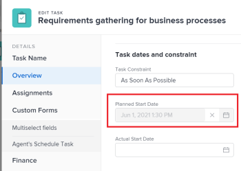
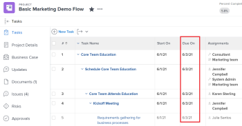
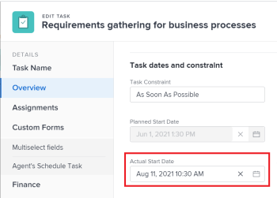
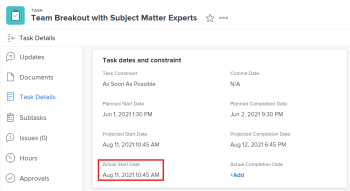
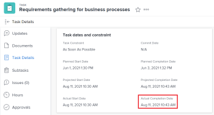
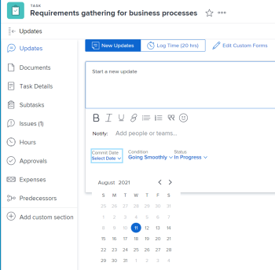
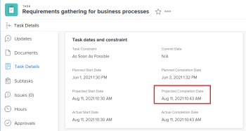

# Overview of the Project, Task, and Issue dates in Adobe Workfront

This article provides definitions to the most common dates associated with projects, tasks, and issues in Workfront. The images included here are examples of where the dates display in&nbsp;Workfront and they are not exhaustive. There are other areas that display the dates.&nbsp;All dates are also visible in project, task, and issue reports and lists.

For information about reports and lists, see the following articles:

* [Get started with lists in Adobe Workfront](../../workfront-basics/navigate-workfront/use-lists/view-items-in-a-list.md) 
* [Get started with reports in Adobe Workfront](../../reports-and-dashboards/reports/reporting/get-started-reports-workfront.md)

## Planned Start Date

The Planned Start Date is the date when a project, task, or issue is planned to start.

Depending on the Task Constraint, you might not be able to edit the Planned Start Date of a task. Depending on the Schedule Mode of the project, you might not be able to edit the Planned Start&nbsp;Date of a project.

For more information, see [Overview of the project Planned Start Date](../../manage-work/projects/planning-a-project/project-planned-start-date.md).

## Planned Completion Date

The Planned Completion Date or the Due On date is the date when a project, task, or issue is planned to complete.

Depending on the Task Constraint, you might not be able to edit the Planned Completion Date of a task. Depending on the Schedule Mode of the project, you might not be able to edit the Planned Completion Date of a project.

The Planned Completion Date displays as the Due On date in some areas of Workfront.

For more information, see the following articles:

* [Overview of the task Planned Completion Date](../../manage-work/tasks/task-information/task-planned-completion-date.md) 
* [Set the project Planned Completion Date](../../manage-work/projects/planning-a-project/project-planned-completion-date.md) 
* [Overview of the issue Planned Completion Date](../../manage-work/issues/issue-information/issue-planned-completion-date.md)

## Entry Date

The Entry Date is the date when a project, task, or issue was created in&nbsp;Workfront.

The Entry Date does not influence the timeline of projects, tasks, or issues, but it is important for tracking and reporting purposes.

## Actual Start Date

The Actual Start Date is the date a user actually starts working on a project, task, or issue. The Actual Start&nbsp;Date is empty when the project, task, or issue is created.

You can manually indicate when work started on a task or an issue, or the Actual Start Date automatically populates when the task or issue status changes from New to In Progress or Complete. The Actual Start&nbsp;Date of a project coincides with the date when the first task on the project starts.

>[!TIP]
>
>The Actual Start Date may not match a Planned Start Date of a project, task, or issue because the user may start work later or earlier than its planned date.

For more information, see [Overview of the project Actual Start Date](../../manage-work/projects/planning-a-project/project-actual-start-date.md).

>[!NOTE]
>
>The Must Start On task or the Fixed Dates constraints affect the Planned Start Date of a task, not the Actual Start Date. This updates the Planned Start Date to a date you specify. The Actual Start Date is updated independently of the Planned Start&nbsp;Date, as described above.

## Actual Completion Date

The Actual Completion Date is the date a user actually completes a project, task, or issue. The Actual Completion Date is empty when the project, task, or issue is created.

You can manually indicate when work completes on a task or an issue, or the Actual Complete Date automatically populates when any of the following occur:

* The project, task, or issue status changes to Complete, Closed, or Resolved. 
* The task or project percent complete is 100%.

The Actual Completion Date of a project coincides with the date when the first task on the project completes.

>[!TIP]
>
>The Actual Completion Date may not match the Planned Completion Date. &nbsp;

For more information, see [Overview of the project Actual Completion Date](../../manage-work/projects/planning-a-project/project-actual-completion-date.md).

## Commit Date

The Commit Date is the date by which an user assigned to task or an issue commits to complete the task or the issue. This is different than the Planned Completion Date, as it is a more realistic estimate of the completion date given only by the user in charge of the work. For more information, see [Commit Date overview](../../manage-work/projects/updating-work-in-a-project/overview-of-commit-dates.md).

>[!NOTE]
>
>Changing the Commit Date affects the Projected Completion Date but not the Planned Completion Date of a task or an issue. The project manager can use the changes an assignee makes on the Commit Date to update the Planned Completion Date of a task or an issue.

## Projected Start Date

The Projected Start Date is a real-time date of when the project, task, or issue and takes into account all the delays. This is a more accurate Start&nbsp;Date for the project, task, or issue than the Planned Start&nbsp;Date. The Planned Start Date does not take into account delays or past dates.

When you first plan a project, the Planned Start Date and the Projected Start Date of the tasks and of the project are identical. As delays may happen or tasks might be completed earlier, the Projected Start Date can become different than the Planned Start Date.&nbsp;

For a task, a Projected Start Date may also differ from its Planned Start Date when one of its predecessors is running behind the schedule.&nbsp;&nbsp;

>[!TIP]
>
>You can view the Projected Start Date of an issue only in a list or report.

For more information, see [Overview of the project Projected Start Date](../../manage-work/projects/planning-a-project/project-projected-start-date.md).

## Projected Completion Date

The Projected Completion Date is a real-time, calculated indicator of when the project, task, or issue will be completed. When&nbsp;the project, task, or issue is marked as Completed, the Projected Completion Date changes to&nbsp;the date of the&nbsp;Actual Completion Date.

If everything goes smoothly and as planned the Projected Completion date should match the Planned Completion Date.&nbsp;Otherwise due to the delays on the predecessor tasks the Projected Completion Date might become different from the Planned Completion Date.

For more information, see [Overview of the Projected Completion Date for projects, tasks, and issues](../../manage-work/projects/planning-a-project/project-projected-completion-date.md).

## Log Time

Use the Log Time option for projects, tasks, and issues to indicate how much actual time (in hours) you spend working on the project, task, or issue. The time you log becomes the Actual Hours of the project, task, or issue.

>[!TIP]
>
>We recommend logging time on working tasks and issues, rather than parent tasks or projects. Time logged on the working tasks rolls up to the parent tasks and the project as Actual Hours for the parent tasks and the project. Time logged on issues rolls up to the project as Actual Hours for the project.

The date when you log the time is the same as the Hour Entry Date field on the hour entry. You can log time in the project, task, or issue Updates section or in the Hours section . When logging time in the Hours section , you can manually specify the Hour Entry Date and the user the hours belong to.

For more information, see [Log time](../../timesheets/create-and-manage-timesheets/log-time.md).

