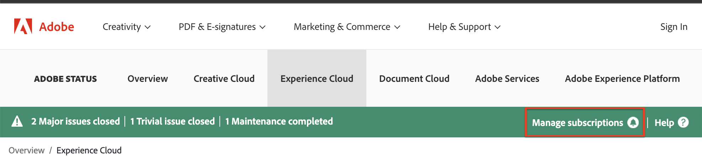

# The [!DNL Adobe Workfront] Status site

<!-- Audited: 1/2024 -->

## Overview of the Status site

You can view the health of the [!DNL Workfront] platform, including incidents, scheduled maintenance windows, and the current status of all [!DNL Workfront] clusters by accessing the [!DNL Workfront Status] site. 

You have access to the following information on the Status site:

* Real-time system performance stats
* Planned maintenance scheduling
* Information on safeguards employed by [!DNL Workfront] to protect user data
* Named vulnerability statuses

## View [!DNL Adobe Workfront] status updates

You can view status updates on the [!DNL Adobe] Status site.

1. Type [status.adobe.com](https://status.adobe.com/) in your browser to access the Status site.

1. Select **[!UICONTROL Experience Cloud]**.
1. Scroll down and select **[!UICONTROL Adobe Workfront]** from the list of solutions.

## Subscribe or Manage your subscription

To subscribe to the Status site or to manage your subscription after you have already subscribed: 

1. Go to [status.adobe.com](https://status.adobe.com/).
1. In the status bar, select **[!UICONTROL Manage subscriptions]**.
   
1. If you have an existing account, log in to the account; otherwise, create a new account.
1. Click the **[!UICONTROL Create subscriptions]** button.
1. Select **[!UICONTROL Adobe Workfront]** under the **[!UICONTROL Experience Cloud]** header, then click **[!UICONTROL Continue]**.
1. Select your regional and event type preferences, then click **[!UICONTROL Continue]**.
1. Click **[!UICONTROL Done]** to confirm your subscription.

## Understand named vulnerabilities

### What is a named vulnerability? {#what-is-a-named-vulnerability}

In computer security, a vulnerability is a weakness which allows an attacker to reduce the stability, the security, or the integrity of a system.

Vulnerability researchers and exploit creators name their projects internally to make it easy to reference them (for example, [!DNL ShellShock], [!DNL Heartbleed], [!DNL POODLE], and [!DNL WannaCry]/[!DNL Petya]). When a vulnerability has wide-spread impact these names become public when the vulnerabilities are disclosed.

### How do I view named vulnerabilities identified by [!DNL Workfront?] {#how-do-i-view-named-vulnerabilities-identified-by-workfront}

1. Go to  [status.adobe.com](https://status.adobe.com/), then click **[!UICONTROL Security]**.

## Why is this important? {#why-is-this-important}

Any security-aware network administrators should be familiar with the Status site and the named vulnerabilities identified by Workfront. 

When large impact vulnerabilities are disclosed it is imperative to ensure your vendors are aware and keep your data protected.

The Status site offers a current log of such vulnerabilities that you can reach at any time, where you can avoid the wait from logging a ticket or reaching out to your account manager to obtain this information.   
