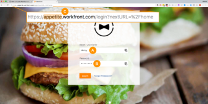

# The [!DNL Adobe Workfront] Community

TheAdobe [!DNL Workfront] Community is an online group of over 10,000 [!DNL Workfront] users. Through the community you can to stay up-to-date on product releases, learn about customer events, and talk to other users about [!DNL Workfront] products and services. You'll find answers to questions and establish connections with other [!DNL Workfront] customers.

<!--

-->

## Logging In

* [Authorized Support Contact](#authorized-support-contact)
* [Non-Authorized Support Contact without SSO Login](#non-authorized-support-contact-without-sso-login)
* [Non-Authorized Support Contact with SSO Login](#non-authorized-support-contact-with-sso-login)

### Authorized Support Contact {#authorized-support-contact}

If you are an Authorized Support Contact (ASC), you have login credentials for the [!UICONTROL Help Desk], and [!UICONTROL Innovation Lab]. You can use the same credentials to log into the [!DNL Workfront] Community. In this case, you will leave the subdomain blank.

### Non-Authorized Support Contact without SSO Login {#non-authorized-support-contact-without-sso-login}

If you are not an Authorized Support Contact, you can log in with your regular [!DNL Workfront] instance credentials. Use the same subdomain as your [!DNL Workfront] instance.

>[!NOTE]
>
>This option works only if your company does not use Single Sign-On (SSO) to log in to Workfront.

### Non-Authorized Support Contact with SSO Login {#non-authorized-support-contact-with-sso-login}

If your company does use SSO, you must reach out to [!DNL Workfront] Customer Support via phone to request an account. If you are unable to submit a ticket or engage in live chat, contact your Authorized [!DNL Workfront] Customer Support contact. 

If you do not remember your password for the Community site, reach out to [!DNL Workfront Customer Support] and they can assist you.

## FAQ

* [What's my subdomain?](#what-s-my-subdomain)
* [I forgot my username or password. How do I reset my username or password?](#i-forgot-my-username-or-password-how-do-i-reset-my-username-or-password)

### What's the URL for the [!DNL Workfront] Community?

The [!DNL Workfront] Community is available on the [!DNL Adobe Experience League] website at the following URL:  [[!DNL Workfront] Community](https://experienceleaguecommunities.adobe.com/t5/workfront/ct-p/workfront).

### What's my subdomain? {#what-s-my-subdomain}

If you are unfamiliar with your subdomain, there is an easy way to find it. If you're logged into [!DNL Workfront], your subdomain is the text string or word prior to *.workfront.com*  or *my.workfront.com* in the URL. For example, if your Workfront URL reads *appetite.workfront.com,* then *appetite* is your subdomain. See marker C in the diagram below.

### I forgot my username or password. How do I reset my username or password? {#i-forgot-my-username-or-password-how-do-i-reset-my-username-or-password}

If you forget your username or password, contact support and a representative will help reset your credentials.
