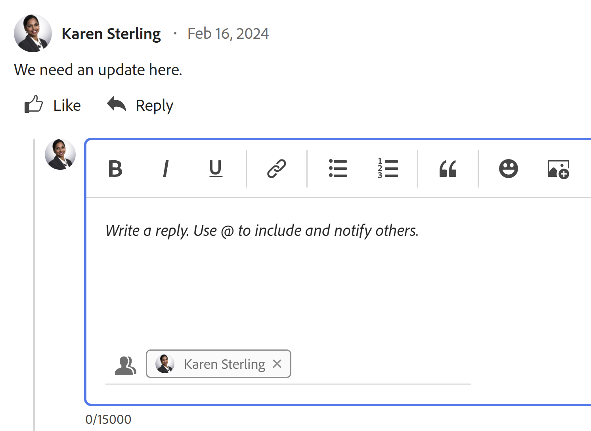
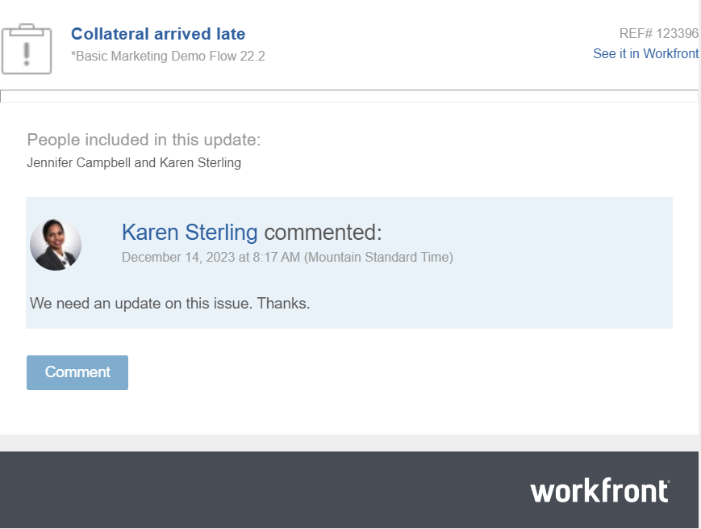

# Reply to updates

{{highlighted-preview}}

<!--remove legacy and new experience references when we remove the legacy updates in the UI - Jan 2024???-->

<!--
The highlighted information on this page refers to functionality not yet generally available. It is available only in the Preview environment for all customers. After the monthly releases to Production, the same features are also available in the Production environment for customers who enabled fast releases.   
For information about fast releases, see [Enable or disable fast releases for your organization](../../administration-and-setup/set-up-workfront/configure-system-defaults/enable-fast-release-process.md)  

For information about the current release schedule, see [Fourth Quarter 2023 release overview](../../product-announcements/product-releases/23-q4-release-activity/23-q4-release-overview.md) 

-->

>[!IMPORTANT]
>
>We are currently redesigning the commenting experience in Adobe Workfront.
>
>Depending on what objects you access the commenting experience for, you might see the following functionality for the Updates section:
>* The new experience
>* The legacy experience
>* The new and the legacy experience
>
>For more information about the new commenting experience and its availability, see [New commenting experience](../../product-announcements/betas/new-commenting-experience-beta/unified-commenting-experience.md). 
>
>The new commenting experience is available only for the Updates section of Workfront objects, and it is not available when you access the objects from the following areas:
>
> * Home
> * Summary panel in lists
> * Summary panel in timesheets 
> * Summary panel in the Workload Balancer
>
>The new commenting experience is available in the Summary panel in lists, timesheets, and the Workload Balancer in the Preview environment. <!--and in the Production environment for customers who have opted for the fast release process. For information about fast releases, see [Enable or disable fast releases for your organization](/help/quicksilver/administration-and-setup/set-up-workfront/configure-system-defaults/enable-fast-release-process.md). For information about the current release schedule, see [First Quarter 2024 release overview](/help/quicksilver/product-announcements/product-releases/24-q2-release-activity/24-q2-release-overview.md).-->

When someone replies to a comment or a system update on a work object, their reply appears in the communication thread in the Updates section for the object. 

>[!IMPORTANT]
>
>It is not possible to reply to system updates in the new commenting experience. For more information, see [New commenting experience](../../product-announcements/betas/new-commenting-experience-beta/unified-commenting-experience.md).

<!--adjust the sentence before the second IMPORTANT and remove this important note when we remove legacy from the system-->

## Access requirements

You must have the following access to perform the steps in this article:

<table style="table-layout:auto"> 
 <col> 
 <col> 
 <tbody> 
  <tr> 
   <td role="rowheader"><strong>Adobe Workfront plan*</strong></td> 
   <td> 
Any
 </td> 
  </tr> 
  <tr> 
   <td role="rowheader"><strong>Adobe Workfront license*</strong></td> 
   <td> 
Request or higher for issues and documents; Review or higher for all other objects
 </td> 
  </tr> 
  <tr> 
   <td role="rowheader"><strong>Access level configurations*</strong></td> 
   <td> 
Requestor or higher for issues and documents; Reviewer or higher for all other objects
 
<b>NOTE</b>
   
   If you still don't have access, ask your Workfront administrator if they set additional restrictions in your access level. For information on how a Workfront administrator can modify your access level, see <a href="../../administration-and-setup/add-users/configure-and-grant-access/create-modify-access-levels.md" class="MCXref xref">Create or modify custom access levels</a>.
 </td> 
  </tr> 
  <tr> 
   <td role="rowheader"><strong>Object permissions</strong></td> 
   <td> 
View access to the object
 
For information on requesting additional access, see <a href="../../workfront-basics/grant-and-request-access-to-objects/request-access.md" class="MCXref xref">Request access to objects </a>.
 </td> 
  </tr> 
 </tbody> 
</table>

&#42;To find out what plan, license type, or access you have, contact your Workfront administrator.

## Reply to an update or a reply in Workfront

You can reply to a comment in the thread of an object that you can view, or you can log in as a Workfront or group administrator and reply to a comment on behalf of another user. For more information, see [Log in as another user](../../administration-and-setup/add-users/create-and-manage-users/log-in-as-another-user.md). 

Replying to a comment or reply differs depending on which experience and which object you select.

### Reply to a comment when using the new commenting experience

For information about what features are available in the new commenting experience and for what objects, see [New commenting experience](../../product-announcements/betas/new-commenting-experience-beta/unified-commenting-experience.md). 

1. Go to the object to which you want to add a reply.
1. Click **Updates**, then click the **Comments** tab for the object and find the comment or reply to which you want to reply

   Or

   Click the **All** tab, then click **Reply in Comments** to open the comment in the Comments tab and reply to it. You cannot reply in the All tab.

1. (Optional) To include text from a previous update in your reply, click the **More** menu in the upper-right corner of the comment you want to reply to, then click **Quote reply**. Text from the previous update appears in the input area, marked with a vertical gray line.
1. Click **Reply**.

   

   You can see the users who are actively engaged in the conversation at the bottom of the **Add reply...** box and you can add more, or remove the ones that are no longer relevant. These users, along with any users subscribed to the object, receive a notification whenever an update or reply is made on the object. You can also tag more users to include them in your reply.  To tag more users, see [Tag others on updates](../../workfront-basics/updating-work-items-and-viewing-updates/tag-others-on-updates.md).

   >[!TIP]
   >
   >   To add additional replies to an existing reply, you can start typing in the **Add reply ...** box, or click **Reply** on the original comment. Your reply is added at the end of the thread.
   
1. Start typing your reply and use any additional options from the Rich Text toolbar. For information about using Rich Text or other updating capabilities, see [Update work](../updating-work-items-and-viewing-updates/update-work.md). 

1. Click **Submit** to save the reply.

1. (Optional) Click the **More** menu  in the upper-right corner of the comment you want to reply to for more options to manage the reply. For more information, see [Update work](../updating-work-items-and-viewing-updates/update-work.md). 

### Reply to an update or reply in the legacy Updates section

1. Go to the object to which you want to add a reply.
1. On the **Updates** tab for the object, find the update or reply to which you want to reply.

1. (Optional) To view an image in the existing update do one of the following:

   * Click the **Preview** icon  on the image thumbnail to open the full-size image in a new browser tab.
   * Click the **Download** icon  on the image thumbnail to download the image.

1. Click **Reply** on the update, then type a reply in the box that appears.

   You can see the users who are actively engaged in the conversation or tagged in each reply at the top of that update thread. These users, along with any users subscribed to the object, receive a notification whenever an update or reply is made on the object. You can also tag more users to include them in your reply.  To tag more users, see [Tag others on updates](../../workfront-basics/updating-work-items-and-viewing-updates/tag-others-on-updates.md).

   
   
1. (Optional) To include text from a previous update in your reply, click the **More** menu next to the update or reply you want to quote, then click **Quote Reply**. Text from the previous update appears in the input area, marked with a vertical gray line.
1. (Optional) Use formatting, emojis, include links, or images as explained in the section "Use Rich Text in a Workfront update" in the article [Update work](../../workfront-basics/updating-work-items-and-viewing-updates/update-work.md).
1. Click **Reply** to save the reply.

## Reply to an update from an email notification

Depending on how your email notifications are configured, you might receive an email notification when an update is made to certain objects to which you have access.

You can reply to an update from an email notification in the following ways:

* Reply to the email that you receive. Your reply email is added as a Workfront reply to the original comment.
* Use the Comment button inside the email to navigate back to Workfront and reply to the update in the Updates area. 

The following is an example of an email notification triggered as a result of an update made on the Updates tab of a task:

For information, see [Reply to email notifications](../updating-work-items-and-viewing-updates/reply-to-email-notifications.md). 

