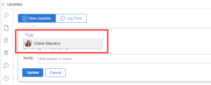

# Tag others on updates

When providing update comments on a Adobe Workfront object, all users on the project can see the information submitted. However, there may be times when users who are not on the project would benefit from viewing this information. Rather than include those users on the project, you can tag them on the update to share it with them. Tagged users receive an event notification.

>[!NOTE]
>
>An event notification must be enabled in order for a user to receive it. Administrators can enable notifications for the whole system or for a top-level group. A user can also enable and disable individual event notifications in their own user profile. For more information, see the following:
>
>* [Configure event notifications for everyone in the system](../../administration-and-setup/manage-workfront/emails/configure-event-notifications-for-everyone-in-the-system.md).
>* [View and configure event notifications for a group](../../administration-and-setup/manage-groups/create-and-manage-groups/view-and-configure-event-notifications-group.md) 
>* [Activate or deactivate your own event notifications](../../workfront-basics/using-notifications/activate-or-deactivate-your-own-event-notifications.md).&nbsp;
>

>[!NOTE]
>
>When an issue is converted to a project or task, the updates are copied to the new project or task, but the tagged users are not. To continue the conversation, you must tag the participants again.

For information about adding updates to Workfront objects, see [Update work](../../workfront-basics/updating-work-items-and-viewing-updates/update-work.md).

## Access requirements

You must have the following access to perform the steps in this article:

<table style="table-layout:auto"> 
 <col> 
 </col> 
 <col> 
 </col> 
 <tbody> 
  <tr> 
   <td role="rowheader">Adobe Workfront plan*</td> 
   <td> 
Any
 </td> 
  </tr> 
  <tr> 
   <td role="rowheader">Adobe Workfront license*</td> 
   <td> 
Request or higher for issues and documents; Review or higher for all other objects
 </td> 
  </tr> 
  <tr> 
   <td role="rowheader">Access level configurations*</td> 
   <td> 
Requestor or higher for issues and documents; Reviewer or higher for all other objects
 
Note: If you still don't have access, ask your Workfront administrator if they set additional restrictions in your access level. For information on how a Workfront administrator can modify your access level, see <a href="../../administration-and-setup/add-users/configure-and-grant-access/create-modify-access-levels.md" class="MCXref xref">Create or modify custom access levels</a>.
 </td> 
  </tr> 
  <tr> 
   <td role="rowheader">Object permissions</td> 
   <td> 
View access to the object
 
For information on requesting additional access, see <a href="../../workfront-basics/grant-and-request-access-to-objects/request-access.md" class="MCXref xref">Request access to objects </a>.
 </td> 
  </tr> 
 </tbody> 
</table>

&#42;To find out what plan, license type, or access you have, contact your Workfront administrator.

## Tag others on updates

1. Begin updating a work item, as described in [Update work](../../workfront-basics/updating-work-items-and-viewing-updates/update-work.md).
1. In the **Notify** field, begin typing the name of the user or team you want to include,&nbsp;then click the name when it appears in the drop-down list.

   Or

   Type the @ symbol in the **Start a new update** area, begin typing the name of the user or team you want to include on the update, then click the name when it appears in the drop-down list.

   

1. (Optional) To add multiple users and teams, repeat step 2.

   >[!NOTE]
   >
   >All users and team members listed in the Notify field receive an in-app notification for the update and might receive an&nbsp;email, depending on the configuration of their email notification settings. Users who tag themselves in a comment or reply receive a notification for that comment or reply and can see their name in the Notify field for the remainder of the thread, but they do not receive another notification unless they tag themselves again. For more information, see [Activate or deactivate your own event notifications](../../workfront-basics/using-notifications/activate-or-deactivate-your-own-event-notifications.md) and [Configure event notifications for everyone in the system](../../administration-and-setup/manage-workfront/emails/configure-event-notifications-for-everyone-in-the-system.md).&nbsp;

1. Click **Update**.  
   Users included in the update are automatically granted View permission to the object and can view and respond to updates made to the object.

   You can see who has been tagged in each reply at the top of the update thread. These users, along with any users subscribed to the object, receive a notification whenever an update or reply is made on the object.

   

   For information about the additional functionality that is available when updating a work item, see&nbsp; [Update work](../../workfront-basics/updating-work-items-and-viewing-updates/update-work.md).

