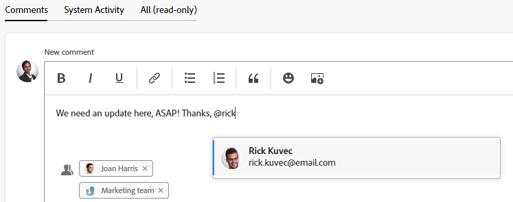
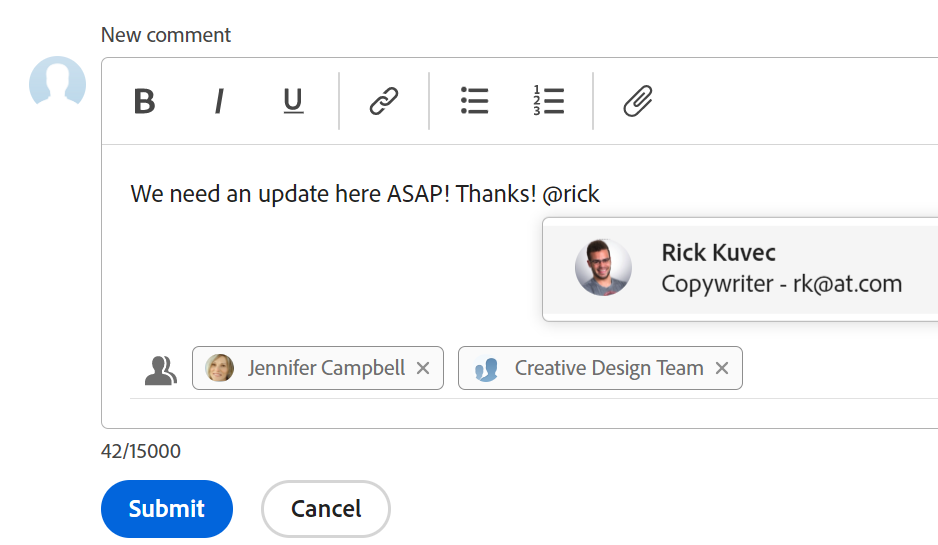
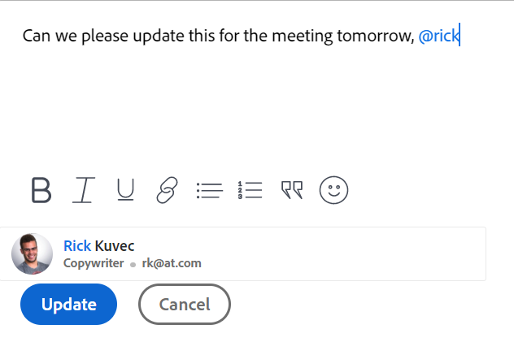

# Tag others on updates

{{highlighted-preview}}

<!--take new commenting and legacy commenting out when we remove the legacy commenting and the new one is the only experience-->

<!--

The highlighted information on this page refers to functionality not yet generally available. It is available only in the Preview environment for all customers. After the monthly releases to Production, the same features are also available in the Production environment for customers who enabled fast releases.   
For information about fast releases, see [Enable or disable fast releases for your organization](../../administration-and-setup/set-up-workfront/configure-system-defaults/enable-fast-release-process.md)  

For information about the current release schedule, see [Fourth Quarter 2023 release overview](../../product-announcements/product-releases/23-q4-release-activity/23-q4-release-overview.md) 
-->

>[!IMPORTANT]
>
>We are currently redesigning the commenting experience in Adobe Workfront.
>
>Depending on what objects you access the commenting experience for, you might see the following functionality for the Updates section:
>* The new experience
>* The legacy experience
>* The new and the legacy experience
>
>For more information about the new commenting experience and its availability, see [New commenting experience](../../product-announcements/betas/new-commenting-experience-beta/unified-commenting-experience.md). 
>
>The new commenting experience is available only for the Updates section of Workfront objects, and it is not available when you access the objects from the following areas:
>
> * Home
> * Summary panel in lists
> * Summary panel in timesheets 
> * Summary panel in the Workload Balancer
>
>The new commenting experience is available in the Summary panel in lists, timesheets, and the Workload Balancer in the Preview environment.

You can tag users when making an update to an object if you want to draw their attention to an object they might otherwise not follow. 

Rather than include those users on the object by assigning them to it or making them subscribe to it, you can tag them on the update to share it with them. Tagged users receive a notification about the update you enter. 

## Considerations about tagging users in updates

* Users tagged in updates must enable a personal notification in their profile in order for them to receive the email notification. For more information, see [Modify your own email notifications](../../workfront-basics/using-notifications/activate-or-deactivate-your-own-event-notifications.md).

   For information about adding updates to Workfront objects, see [Update work](../../workfront-basics/updating-work-items-and-viewing-updates/update-work.md).

* When an issue is converted to a project or task, the updates are copied to the new project or task, but the tagged users are not. To continue the conversation, you must tag the participants again.

## Access requirements

You must have the following access to perform the steps in this article:

<table style="table-layout:auto"> 
 <col> 
 </col> 
 <col> 
 </col> 
 <tbody> 
  <tr> 
   <td role="rowheader"><strong>Adobe Workfront plan*</strong></td> 
   <td> 
Any
 </td> 
  </tr> 
  <tr> 
   <td role="rowheader"><strong>Adobe Workfront license*</strong></td> 
   <td> 
Request or higher for issues and documents; Review or higher for all other objects
 </td> 
  </tr> 
  <tr> 
   <td role="rowheader"><strong>Access level configurations*</strong></td> 
   <td> 
Requestor or higher for issues and documents; Reviewer or higher for all other objects
 
   
<b>NOTE</b>
   
   If you still don't have access, ask your Workfront administrator if they set additional restrictions in your access level. For information on how a Workfront administrator can modify your access level, see <a href="../../administration-and-setup/add-users/configure-and-grant-access/create-modify-access-levels.md" class="MCXref xref">Create or modify custom access levels</a>.
 </td> 
  </tr> 
  <tr> 
   <td role="rowheader"><strong>Object permissions</strong></td> 
   <td> 
View access to the object
 
For information on requesting additional access, see <a href="../../workfront-basics/grant-and-request-access-to-objects/request-access.md" class="MCXref xref">Request access to objects </a>.
 </td> 
  </tr> 
 </tbody> 
</table>

*To find out what plan, license type, or access you have, contact your Workfront administrator.

## Tag others on updates

Tagging others in an update differs depending on which experience and which object you select.

### Tag others on updates in the new commenting experience

You can tag others on updates in the new commenting experience in the following ways:

* **Automatically**: When a user starts a thread, adds a comment, or adds a reply, they are automatically tagged and added to the Tag people or teams area of the commenting box. <!--remove the tip below when the new commenting stream is the only stream and the legacy commenting is removed-->

   >[!TIP]
   >
   >When the thread starts in the legacy commenting experience, thread participants are not automatically tagged. 

* **Manually**: When you manually add a user to the Tag people area of the commenting box.

You can also remove users who are tagged by mistake when you edit or reply to a comment.

1. Begin updating a work item, as described in [Update work](../../workfront-basics/updating-work-items-and-viewing-updates/update-work.md). As the comment owner, you are automatically tagged and added to the Tag people or teams area of the commenting box.

   >[!TIP]
   >
   >The comment owner cannot see their own name in the Tag people or teams area of the commenting box.

1. In the **Tag people or teams** field, begin typing the name of the user or team you want to include, then click the name when it appears in the drop-down list.
 
   Or

   Type the @ symbol in the **Write a comment** area, begin typing the name of the user or team you want to include on the update, then click the name when it appears in the drop-down list. 

   >[!TIP] 
   > 
   >To identify the correct user when there are users with similar or identical names, notice the avatar, the user's Primary Role, or their email address.  
   > 
   >Users must be associated with at least one job role to view it as you tag them in an update.  
   > 
   >You must have the View Contact Info setting enabled in your access level for Users to view users' emails. For information, see [Grant access to users](../../administration-and-setup/add-users/configure-and-grant-access/grant-access-other-users.md). 

      
   

      Example of tagging in the Preview environment:
      

      

      Example of tagging in the Production environment:
      

1. (Optional) To make the update private, enable **Private to my company** in the lower-right corner of the update box. This makes the update visible just to users in your company. The **Private to my company** option is available only when a Company is specified in your Workfront profile. 

   >[!NOTE]
   >
   >* This option displays only when the user is associated with a Company.
   >* Tagged users outside the company could still receive an in-app notification or email, even though they will not see the private comments on the Updates tab. We recommend not to tag external users on an update if you do not want to share the information with them.
      
1. (Optional) To add multiple users and teams, repeat step 2. <!--insure this stays accurate-->

   >[!NOTE]
   >
   >All users and team members listed in the "Tag people or teams" field receive an in-app notification for the update and might receive an email, depending on the configuration of their email notification settings. Users who tag themselves in a comment or reply receive a notification for that comment or reply and can see their name in listed as a member of the thread for the remainder of the thread, but they do not receive another notification unless they tag themselves again. For more information, see [Modify your own email notifications](../../workfront-basics/using-notifications/activate-or-deactivate-your-own-event-notifications.md) and [Configure event notifications for everyone in the system](../../administration-and-setup/manage-workfront/emails/configure-event-notifications-for-everyone-in-the-system.md).

1. Click **Submit**.  
   Users included in the update are automatically granted View permission to the object and can view and respond to updates made to the object.

   The names of the tagged entities display next to their avatars, up to two entities. If more than two entities are tagged the name of the first one displays, in addition to a number of how many additional entities are tagged.

   

   When you are tagged in the comment text, your user name is highlighted in those comments.

   For information about the additional functionality that is available when updating a work item, see [Update work](../../workfront-basics/updating-work-items-and-viewing-updates/update-work.md).

1. (Optional) Click the **More** menu  in the upper-right corner of the comment, then click **Edit**. Remove any of the tagged users, then click **Submit**. You can edit a comment only within 15 minutes after you have entered it. You can only edit the comments you added.

   >[!TIP]
   >
   >When using the legacy commenting experience to add comments and replies, comment owners that were not specifically tagged cannot be manually removed by people who use the new commenting experience.

### Tag others on updates in the legacy Updates section

You can manually tag users in the legacy Updates section. 

1. Begin updating a work item, as described in [Update work](../../workfront-basics/updating-work-items-and-viewing-updates/update-work.md).
1. In the **Notify** field, begin typing the name of the user or team you want to include, then click the name when it appears in the drop-down list.

   Or

   Type the @ symbol in the **Start a new update** area, begin typing the name of the user or team you want to include on the update, then click the name when it appears in the drop-down list.

   >[!TIP]
   >
   >To identify the correct user when there are users with similar or identical names, notice the avatar, the user's Primary Role, or their email address. 
   >
   >Users must be associated with at least one job role to view it as you tag them in an update. 
   >
   >You must have the View Contact Info setting enabled in your access level for Users to view users' emails. For information, see [Grant access to users](../../administration-and-setup/add-users/configure-and-grant-access/grant-access-other-users.md).

   

1. (Optional) To make the update private, enable **Private to my company** in the lower-right corner of the update box. This makes the update visible just to users in your company. The **Private to my company** option is available only when a Company is specified in your Workfront profile. 

   >[!NOTE]
   >
   >Tagged users outside the company could still receive an in-app notification or email, even though they will not see the private comments on the Updates tab. We recommend not to tag external users on an update if you do not want to share the information with them.  

1. (Optional) To add multiple users and teams, repeat step 2.

   >[!NOTE]
   >
   >All users and team members listed in the Notify field receive an in-app notification for the update and might receive an email, depending on the configuration of their email notification settings. Users who tag themselves in a comment or reply receive a notification for that comment or reply and can see their name in the Notify field for the remainder of the thread, but they do not receive another notification unless they tag themselves again. For more information, see [Modify your own email notifications](../../workfront-basics/using-notifications/activate-or-deactivate-your-own-event-notifications.md) and [Configure event notifications for everyone in the system](../../administration-and-setup/manage-workfront/emails/configure-event-notifications-for-everyone-in-the-system.md).

1. Click **Update**.  
   Users included in the update are automatically granted View permission to the object and can view and respond to updates made to the object.

   You can see who has been tagged in each reply at the top of the update thread. These users, along with any users subscribed to the object, receive a notification whenever an update or reply is made on the object.

   

   For information about the additional functionality that is available when updating a work item, see [Update work](../../workfront-basics/updating-work-items-and-viewing-updates/update-work.md).

