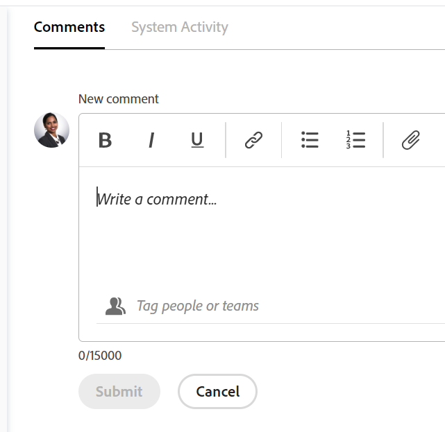
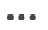
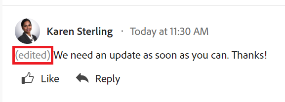
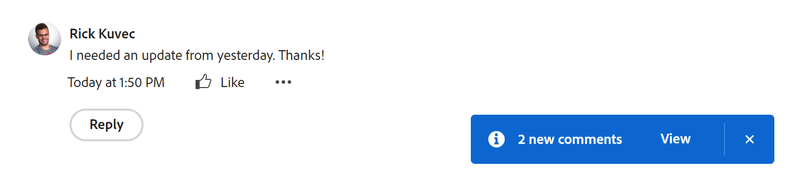
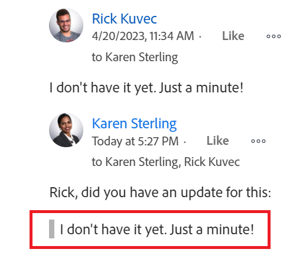
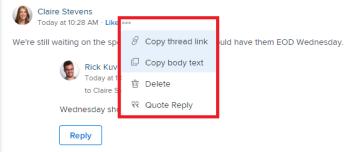
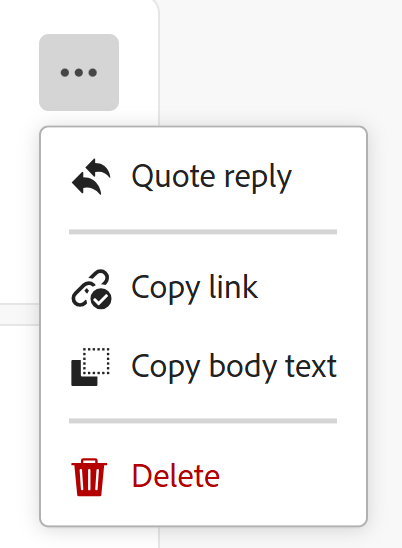
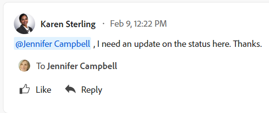
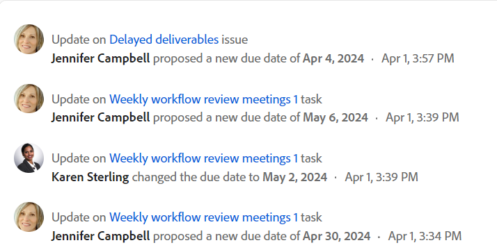
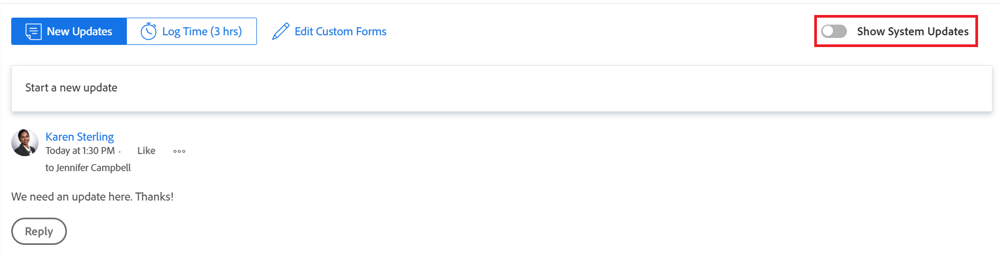

# Update work

<!--take "Beta" references out when we remove the beta-->

The highlighted information on this page refers to functionality not yet generally available. It is available only in the Preview environment.

>[!NOTE]
>
>We are currently redesigning the commenting experience in Adobe Workfront.
>
>For more information about the new commenting experience, see [New commenting experience](../../product-announcements/betas/new-commenting-experience-beta/unified-commenting-experience.md). 
>
>You can access the new experience for the following objects:
> * Issues, projects, tasks, and documents.
>
>     This is available when you enable the commenting Beta experience.
>
>     This functionality is available only for the Updates section, and it is not available for the following areas:
>
>     * Home
>     * Summary panel in lists
>     * Summary panel in timesheets
>
> * Goals
>
>   The new commenting experience is the default for goals. You must have an additional license to access Workfront Goals. For more information, see [Requirements to uses Workfront Goals](../../workfront-goals/goal-management/access-needed-for-wf-goals.md). 
>
>    For information about commenting on goals, see [Manage goal comments in Adobe    Workfront Goals](../../workfront-goals/goal-management/manage-goal-comments.md).

You can add comments to most objects in Adobe Workfront in the Updates section. For more information about which objects display the Updates section, see [Updates section overview](../updating-work-items-and-viewing-updates/updates-tab-overview.md). 

You can add an update on an Workfront object (project, task, or issue) to communicate about progress on the object, as you comment on the object. Users who are assigned or subscribed to the object can view your update. You can also tag users to bring their attention to the update. Tagged users receive an in-app notification and an email about your update. 

The information on this page describes how you can comment on Workfront objects and how you update projects, tasks, and issues. For information about commenting on goals, see [Manage goal comments in Adobe Workfront Goals](../../workfront-goals/goal-management/manage-goal-comments.md). You must have an additional license to access Workfront Goals. 

You can add an update to projects, tasks, and issues from the following areas of Workfront:

* From a Workfront object, in the Updates  section  
* From the Home area (for tasks and issues)
* From the Summary panel in a list of objects (for tasks and issues)
* From the timesheet (for tasks and issues)

## Access requirements

<!--
drafted for P&P release:
<table style="table-layout:auto"> 
 <col> 
 </col> 
 <col> 
 </col> 
 <tbody> 
  <tr> 
   <td role="rowheader"><strong>Adobe Workfront plan*</strong></td> 
   <td> 
Any
 </td> 
  </tr> 
  <tr> 
   <td role="rowheader"><strong>Adobe Workfront license*</strong></td> 
   <td> 
Current license: Contributor or higher for issues and documents: Light or higher for all other objects
 
   Or
   
Legacy  license: Request or higher for issues and documents; Review or higher for all other objects

   </td> 
  </tr> 
  <tr> 
   <td role="rowheader"><strong>Access level configurations*</strong></td> 
   <td> 
View or Edit access for the object the update is on
 
<b>NOTE</b>
   
   If you still don't have access, ask your Workfront administrator if they set additional restrictions in your access level. For information on how a Workfront administrator can modify your access level, see <a href="../../administration-and-setup/add-users/configure-and-grant-access/create-modify-access-levels.md" class="MCXref xref">Create or modify custom access levels</a>.
 </td> 
  </tr> 
  <tr> 
   <td role="rowheader"><strong>Object permissions</strong></td> 
   <td> 
View access to the object
 
For information on requesting additional access, see <a href="../../workfront-basics/grant-and-request-access-to-objects/request-access.md" class="MCXref xref">Request access to objects </a>.
 </td> 
  </tr> 
 </tbody> 
</table>
-->
You must have the following access to perform the steps in this article:

<table style="table-layout:auto"> 
 <col> 
 </col> 
 <col> 
 </col> 
 <tbody> 
  <tr> 
   <td role="rowheader"><strong>Adobe Workfront plan*</strong></td> 
   <td> 
Any
 </td> 
  </tr> 
  <tr> 
   <td role="rowheader"><strong>Adobe Workfront license*</strong></td> 
   <td> 
Request or higher for issues and documents; Review or higher for all other objects
 </td> 
  </tr> 
  <tr> 
   <td role="rowheader"><strong>Access level configurations*</strong></td> 
   <td> 
View or Edit access for the object the update is on
 
<b>NOTE</b>
   
   If you still don't have access, ask your Workfront administrator if they set additional restrictions in your access level. For information on how a Workfront administrator can modify your access level, see <a href="../../administration-and-setup/add-users/configure-and-grant-access/create-modify-access-levels.md" class="MCXref xref">Create or modify custom access levels</a>.
 </td> 
  </tr> 
  <tr> 
   <td role="rowheader"><strong>Object permissions</strong></td> 
   <td> 
View access to the object
 
For information on requesting additional access, see <a href="../../workfront-basics/grant-and-request-access-to-objects/request-access.md" class="MCXref xref">Request access to objects </a>.
 </td> 
  </tr> 
 </tbody> 
</table>

&#42;To find out what plan, license type, or access you have, contact your Workfront administrator.

## Add an update to a work item

<!--drafted for the commenting experience - change the NOTE at the top of the following section with every new release to other objects -->

Adding an update to a work item differs depending on what version of the Updates section and what object you choose. 

### Add an update to a work item in the current Updates section

>[!NOTE]
>
>The following functionality is available for all objects except for goals. You must have an additional license to access Workfront Goals. For information about commenting on goals, see [Manage goal comments in Adobe Workfront Goals](../../workfront-goals/goal-management/manage-goal-comments.md)

1. Go to the work item for which you want to provide an update (such as a project, task, or issue).
1. Click the **Updates** section.
1. Click **Start a new update,** then type your update.  
1. (Optional) Use Rich Text, or add emojis, links, or images to your update, to enhance your content. For more information, see the [Use Rich Text in a Workfront update](#use-rich-text-in-a-workfront-update) section in this article
1. (Optional) Update any of the following information about the work item:

   <table style="table-layout:auto"> 
    <col> 
    <col> 
    <tbody> 
     <tr> 
      <td role="rowheader"><strong>Notify</strong></td> 
      <td>Identify users who must be notified of the update. Users assigned or subscribed to the object automatically receive notification when an update is made. 
For information about how to include others on an update, see <a href="../../workfront-basics/updating-work-items-and-viewing-updates/tag-others-on-updates.md" class="MCXref xref">Tag others on updates</a>.
</td> 
     </tr> 
     <tr> 
      <td role="rowheader"><strong>Commit Date</strong></td> 
      <td>In the date picker, select the date that you commit to complete the work item. For information about Commit Date, see <a href="../../manage-work/projects/updating-work-in-a-project/overview-of-commit-dates.md" class="MCXref xref">Commit Date overview</a>.</td> 
     </tr> 
     <tr> 
      <td role="rowheader"><strong>Condition</strong></td> 
      <td>Select a new condition for the task or issue. For information about selecting a condition, see <a href="../../manage-work/projects/updating-work-in-a-project/update-condition-for-tasks-and-issues.md" class="MCXref xref">Update Condition for tasks and issues</a>.</td> 
     </tr> 
     <tr> 
      <td role="rowheader"><strong>Status</strong></td> 
      <td>Click the arrow beside the current status, then select the desired status from the drop-down menu. For information about setting a Status, see <a href="../../manage-work/projects/updating-work-in-a-project/update-task-status.md" class="MCXref xref">Update task status</a>.
Updating the status of a work item does not automatically change the status of a project. Depending on how your project is set up, you might must make updates to the project status separately. For more information on the various project update types, see <a href="../../manage-work/projects/manage-projects/select-project-update-type.md" class="MCXref xref">Select the project Update Type </a>.

<b>NOTE</b>
      
      You cannot change the status of a work item while it is in a Pending Approval status.
</td> 
     </tr> 
     <tr> 
      <td role="rowheader"><strong>Completion Bar</strong></td> 
      <td>(Only available on tasks) Indicate the percentage of work completed by sliding the progress bar to the desired percentage. You can also double-click the completion bar and enter the percent complete.</td> 
     </tr> 
     <tr> 
      <td role="rowheader"><strong>Private to my company</strong></td> 
      <td> 
Disable this option to prevent users outside your company from having access to view this update.
 
      
<b>NOTE</b>

      
This option displays only when the user is associated with a Company.

      </td> 
     </tr> 
    </tbody> 
   </table>

1. Click **Update** to add the update to the Workfront object.

   >[!NOTE]
   >
   >A small pop-up window will appear for seven seconds after clicking **Update**, allowing you to undo the update and return to the editing pane before the update is posted. The update will be posted if you dismiss the undo pop-up, wait for it to disappear, or navigate away from the page. 
   >
   >If your Workfront administrator selects the "Never allow users to delete comments" setting in your access level, you cannot undo a comment. For more information, see [Create and modify custom access levels](../../administration-and-setup/add-users/configure-and-grant-access/create-modify-access-levels.md).

1. To reply to an update, see [Reply to updates](../../workfront-basics/updating-work-items-and-viewing-updates/reply-to-updates.md).

### Add an update to a work item using the commenting Beta experience

1. Locate the object you want to update, then click its name to open the object's page.
1. Click  **Updates** in the left panel. 
1. Enable the **Commenting Beta** toggle in the upper-right corner of the Updates area, then click **Agree** on the Beta agreement. This switches the Updates area to the commenting Beta experience. 
   The **Comments** tab is selected by default. 
1. Start entering a comment in the **New comment** box. 
   
   

   >[!TIP]
   >
   >Navigating away from the Updates section before you finish typing and submitting a comment keeps the comment on the page in draft mode even after you log off and log back on. Any images that are added to the comment are also saved in the draft. Drafts are saved for 7 days after which they are discarded and cannot be recovered. Drafted comments are only visible to the user entering them.

1. (Optional) To undo or redo a change, use the following shortcut keys:
      * CTRL + Z (⌘+z for Mac) to undo a change 
      * CTRL + Y (⌘+y for Mac) to redo a change 
1. (Optional) In the **Tag people or teams** area, start typing the name or the email of a user, or a team that you would like to include in this comment, then select it when it displays in the list. 
1. (Optional) To add rich text formatting to your update, use any of the following options from the **Rich Text** toolbar to enhance your text: 

   * Bold
   * Italics
   * Underline
   * Link
   * Bulleted List
   * Numbered List
   * Add attachment <!--(mark this parenthesis as draft: ************ this might be renamed to "Add image")-->
   
   For more information, see the [Use Rich Text in a Workfront update](#use-rich-text-in-a-workfront-update) section in this article. <!--remove this list, above, when we get to parity for Rich Text-->

      >[!TIP]
      >
      >If another user submits a comment to the same item you are updating, there will be a red line with a "New" indicator to inform you of the newer comments. 
      >
      >The indicator only displays only after the comment was submitted on the item, and not when the comment is still composed. 
      >
      >The "New" indicator displays only when both the user that entered a new update as well as the user who is currently entering an update are using the new commenting experience. 
      >   

1. Click **Submit** to add the update to the Workfront object. 
1. (Optional) To edit a comment, click the **More** menu  to the right of the Like icon, then click **Edit**.
1. Edit the information in the comment, add or remove images or remove any of the tagged users. 
   You can edit your comment within 15 from submitting it. An "Edited" indicator is added to the left of the date stamp that displays when the comment was updated. 

   

   >[!TIP]
   >
   >* An email is generated to notify users of your update only when you submit the original update. No email is generated after you edited your update.
   >* The date stamp next to the comment is the date of the original comment, not the date of the last edit. 

1. (Optional) Click **Reply** to reply to an existing comment, then follow the steps 4-7 above. <!--(**************insure this stays accurate***********)-->. For information about replying to an update, see [Reply to updates](../../workfront-basics/updating-work-items-and-viewing-updates/reply-to-updates.md).
1. (Conditional and optional) If other users have added comments that display outside of the visible area in the Updates section, click **View** inside the blue **new comments banner** at the bottom of the screen  to display these comments.

   

   Additional comments display at the bottom of the screen.

   >[!NOTE]
   >
   >   The "new comments" indicator and "View" button display only when both the users that entered the new updates as well as the user currently looking at the Updates section are using the new commenting experience.

   
1. (Optional) Click the **Like** icon. The icon updates with the number of likes.
1. (Conditional and Optional) If you included additional people in your comment, click the number of members included in the update to display a list of entities that the comment you entered is shared with. 

   
1. (Optional) Click the **System Activity** tab to view updates logged by the system. When the object or any of its children are updated, Workfront generates a note about that update and displays it in the System Activity tab. 

   For more information see [Updates section  overview](../updating-work-items-and-viewing-updates/updates-tab-overview.md)

   >[!TIP]
   >
   >You cannot add a comment to a system update.

 
## Use Rich Text in a Workfront update{#use-rich-text-in-a-workfront-update} 

<!--remove this top note when we get to parity with the current version, OR change the note to mention that some options are ONLY available in the Beta version and not the current one.-->

>[!NOTE]
>
>Some of the options in the Rich Text toolbar might not be available for the commenting Beta experience.

You can enhance your updates by using Rich Text, or adding various items to it, like emojis, links, or images. 

1. Go to the Updates area and start typing a comment. 
1. (Optional) To add rich text formatting to your update, use any attributes on the **Rich Text** toolbar as you type.

   | **Attribute** |**Toolbar button** |**Mac shortcut keys** |**Windows shortcut keys** |
   |---|---|---|---|
   | Bold | |⌘+b |Ctrl+B |
   | Italics | |⌘+i |Ctrl+I |
   | Underline | |⌘+u |Ctrl+U |
   | Hyperlink | |  To open the Create Links or Add links box: ⌘+K   In the commenting beta experience, to paste a link over the selected text: ⌘+V   |  To open the Create Links or Add links box: Ctrl+K   In the commenting beta experience, to paste a link over the selected text: Ctrl+V  |
   | Bulleted List | |⌘+Shift+8 |Ctrl+Shift+8 |
   | Numbered List | |⌘+Shift+7 |Ctrl+Shift+7 |
   | Block Quote | |⌘+Shift+9 |Ctrl+Shift+9 |

    To stop formatting text, deselect the attribute on the **Rich Text** toolbar.

   <!-- in the table above: take "Create Links" verbiage from the hyperlink when the old commenting is removed and the commenting beta is the only way to comment-->

   >[!NOTE]
   >
   >* Formatting also displays in any email notification users receive containing your update.
   >* Rich Text formatting applied to an update in an email does not display on the update when viewed in the Updates tab.  
   >* If your organization uses Workfront with Internet Explorer, any formatted text pasted into an update loses its Rich Text formatting and displays as plain text. You can reformat the text using the attributes on the Rich Text toolbar.
   >* Rich Text formatting is not available for updates made in the Timesheets area or for Note and Last Condition objects viewed in a report.

1. (Optional) If you want to include text from previous updates or from other sources and distinguish it from your own update, you can mark it as a Block Quote. Click the **Block Quote** icon  and type the text you want to quote. The quoted text displays marked with a vertical gray line. Click the **Block Quote** icon again to return to normal formatting.

   

1. (Optional) Add emojis to your update.

   >[!NOTE]
   >
   >* Workfront does not replace punctuation emoticons such as :) with emojis.
   >* Emojis are not available for updates made in the Timesheets area or for Note and Last Condition objects viewed in a report.
   >* The emoji feature in Workfront utilizes Unicode characters and, as such, displays only on browsers and operating systems that support Unicode code points. Users on a platform, browser, or operating system version different than yours might not have access to the same emojis.
   >* An unsupported emoji is represented by a black or white box.
   >* Windows 7 supports only black and white emojis.  
   >* Emojis that are applied to an update made via email do not display on the update when viewed in the Updates area.

1. (Optional) To add a URL link to additional information sources:

   1. Click in your update where you want to insert a link.
   1. On the **Rich Text** toolbar, click the **Hyperlink** icon .  

   1. In the **Create Link** box that appears, under **URL**, type or paste the URL of the source to which you want to link.
   
   1. Under **Text to display**, type or paste the link text.
   1. Click **Save**.

1. (Optional) To attach an image to your update, do one of the following, depending on the environment you use:

   * Click the **Image** icon  and browse to the image on your computer or drag the image into the update area, when using the current updating experience

   Or

   Click the **Add attachment** icon  and browse to the image on your computer, when using the commenting Beta experience. <!--the name of the icon and the icon for it might change-->

   >[!NOTE]
   >
   >* Your Workfront administrator must enable adding images in the Update Feeds Preferences section of the Workfront Interface area before you can see the Image or the Add attachment icons. For information, see [Configure preferences for user updates](../../administration-and-setup/set-up-workfront/system-tracked-update-feeds/configure-preferences-user-updates.md). 
   >* The maximum image file size is 7 MB. Supported image file types are .jpg, .gif, and .png.
   >* Images are accessible from the Updates section on an object and they are also available in the Documents area. 
   >* You can send an update with an image and no text.
   >* When you delete a comment that contains an image, the following scenarios exist depending on which experience you choose: 
   >
   >     * In the current commenting experience, the image remains in the Documents area but is no longer visible in the Updates section.
   >     * In the new commenting experience, the image is removed from the Updates section as well as from the Documents area. The image is also deleted from the Documents area when you edit a comment and delete the image. 
   >* When someone deletes an image attached to a comment from the Documents area, it is also removed from the comment. 
  
1. Click **Update**  or **Submit**, when using the commenting Beta experience. 

## Copy update information

<!--drafted for beta release toggle - remove when copying an update will be available:

>[!NOTE]
>
>Copying an update is not possible when using the Beta commenting experience.
-->

There are several ways you can copy an update. After copying a link, you can share the link with others to direct them to the update.

* [Copy the update](#copy-the-update) 
* [Copy the thread link](#copy-the-thread-link) 
* [Copy the update link](#copy-the-update-link)

### Copy the update {#copy-the-update}

This option copies the text from a specific update to the clipboard.

1. Go to the update or reply you want to copy.
1. Click the **More** menu, then click **Copy body text**.

   

### Copy the thread link {#copy-the-thread-link}

This option copies the full thread link to the clipboard so you can share the thread with other users.

1. Go to the update thread you want to copy.

1. Click the **More** menu, then click **Copy thread link** or **Copy link**, when using the Beta experience.

   

### Copy the update link {#copy-the-update-link}

This option copies a specific update link to the clipboard. When you share the update link, the user who follows it sees a border around the update.

1. Go to the update or reply you want to copy.
1. Click the **More** menu next to the individual update, then click **Copy update link** or **Copy link**, when using the Beta experience.

   

## Delete an update or reply

Depending on the access your Workfront administrator gives you, you might be able to delete updates you added on the Updates tab of an object. For more information, see [Create or modify custom access levels](../../administration-and-setup/add-users/configure-and-grant-access/create-modify-access-levels.md#creating-a-new-access-from-scratch) in the article [Create or modify custom access levels](../../administration-and-setup/add-users/configure-and-grant-access/create-modify-access-levels.md).

No Workfront user (including the Workfront administrator) can delete updates made by another user. However, if a user's access level allows them to delete their own updates, the Workfront administrator can log in as that user and delete updates they made. For more information, see [Create or modify custom access levels](../../administration-and-setup/add-users/configure-and-grant-access/create-modify-access-levels.md#creating-a-new-access-from-scratch) and [Log in as another user](../../administration-and-setup/add-users/create-and-manage-users/log-in-as-another-user.md).

1. Go to the update or reply you want to delete.
1. Click the **More** menu next to the update or reply you wish to delete, then click **Delete**.

   

1. In the message that appears, click **Confirm** or click **Delete**, when using the commenting Beta experience.

   >[!NOTE]
   >
   >Deleting an update with an attached image deletes both the comment and the image. For more information, see the [Use rich text in a Workfront update](#use-rich-text-in-a-workfront-update) section in this article.

   When the comment you delete has replies associated with it, there is an indication that the comment was removed with the name of the user who removed it.

    

   When using the commenting Beta experience, deleted comments are removed immediately from Workfront. A user using the Updates section sees a comment being deleted by another user in real time.

   <!--when we remove the beta, take out the first part of the sentence above about only when commenting in beta experience. Leave the rest though-->

## Add an update on a Timesheet

1. Go to a Timesheet on which you want to make an update.
1. Click the Timesheet to open it.
1. At the bottom of the Timesheet, click **Include a comment**.
1. In the box that displays at the bottom of the Timesheet, type an update.

   

1. (Conditional)To save your update without submitting the Timesheet for approval, click **Save for Later**.

   Or

   To save your update and submit the Timesheet for approval, click **Submit for Approval**.

   Or

   If your Timesheet is not set up with an approver, click **Save and Close Timesheet** to save your update.

## Enable or disable system updates

<!--remove the preview tag with 23.2 production, but keep the note till we remove Beta and it becomed the only exprience: -->

>[!NOTE]
>
>It is not possible to disable system updates when using the Beta commenting experience.
>The information in this section refers only to functionality available in the current Updtes section.
>For more information about system updates in the Beta version, see [Updates section overview](../updating-work-items-and-viewing-updates/updates-tab-overview.md).

The Updates section for a Workfront object displays two types of information:

* **User updates:** User updates are comments that you and other users in your system enter.

  

* **System updates:** System updates record removing assets, adding or deleting versions, attaching or removing an approval request, as well as any edits or changes made to the documents on the object.

  

Depending on your Workfront license, system updates might be enabled by default. Workfront administrators can determine what is tracked in system updates, as explained in [System-tracked updates](../../administration-and-setup/set-up-workfront/system-tracked-update-feeds/system-tracked-update-feeds.md). You can also filter out system updates or activities so that you see only user updates for all objects.

For more information about the difference between user and system updates, see [System-tracked updates](../../administration-and-setup/set-up-workfront/system-tracked-update-feeds/system-tracked-update-feeds.md).

To enable or disable system updates:

1. Click the **Updates** tab on an object.
1. Click **Show System Updates** to slide the switch left (disabled) or right (enabled).

   

   This option is persistent across all objects throughout Workfront and remains in the position you select, even if you log out of Workfront.

