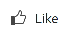
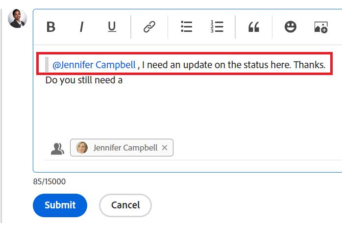

# Update work

<!--take "legacy" and "new commenting" references out when we remove the legacy - Jan 2024???-->

The highlighted information on this page refers to functionality not yet generally available. It is available only in the Preview environment for all customers. 

For information about the current release schedule, see [First Quarter 2024 release overview](../../product-announcements/product-releases/24-q1-release-activity/24-q1-release-overview.md). 

<!--
After the monthly releases to Production, the same features are also available in the Production environment for customers who enabled fast releases.   
For information about fast releases, see [Enable or disable fast releases for your organization](../../administration-and-setup/set-up-workfront/configure-system-defaults/enable-fast-release-process.md)  
-->

>[!IMPORTANT]
>
>We are currently redesigning the commenting experience in Adobe Workfront.
>
>Depending on what objects you access the commenting experience for, you might see the following functionality for the Updates section:
>* The new experience
>* The legacy experience
>* The new and the legacy experience
>
>For more information about the new commenting experience and its availability, see [New commenting experience](../../product-announcements/betas/new-commenting-experience-beta/unified-commenting-experience.md). 
>
>The new commenting experience is available only for the Updates section of Workfront objects, and it is not available when you access updates from the following areas:
>
> * Home
> * Summary panel in lists
> * Summary panel in timesheets 
> * Summary panel in the Workload Balancer

<!-- with October 26 release: add somewhere this, and decide where we need to keep information about the legacy commenting. Should we create an article about iterations comments like we have for goals and cards?!:

>[!NOTE]
>
>Iterations display the legacy commenting experience.-->

<!--old message, before Auhust 17: 

>[!NOTE]
>
>We are currently redesigning the commenting experience in Adobe Workfront.
>
>For more information about the new commenting experience, see [New commenting experience](../../product-announcements/betas/new-commenting-experience-beta/unified-commenting-experience.md). 
>
>You can access the new experience for the following objects:
> * Issues, projects, tasks, and documents.
>
>     This is available when you enable the commenting Beta experience.
>
>     This functionality is available only for the Updates section, and it is not available for the following areas:
>
>     * Home
>     * Summary panel in lists
>     * Summary panel in timesheets
>
> * Goals, cards in the Boards area
>
>   The new commenting experience is the only experience for goals and cards. You must have an additional license to access Workfront Goals. For more information, see [Requirements to use Workfront Goals](../../workfront-goals/goal-management/access-needed-for-wf-goals.md). 
>
>     You can add and view updates to cards in the Boards area when you enable the Comments and System Activity sections on a card. For more information, see [Add an ad hoc card to a board](../../agile/get-started-with-boards/add-card-to-board.md).
-->

## Considerations about updating work

* You can add comments to most objects in Adobe Workfront in the Updates section. For more information about which objects display the Updates section, see [Updates section overview](../updating-work-items-and-viewing-updates/updates-tab-overview.md). 

* You can add comments to Workfront objects from other applications that are integrated with Workfront or from the Workfront mobile app. 

   Not all applications that are integrated with Workfront can add comments to Workfront objects. 
   
   Not all features that are available in the Updates section of an object in Workfront are available in other applications, when accessing Workfront objects from the application. For example, Rich Text capabilities or making a comment private to someone's Company might not be available when adding comments to a Workfront object from a third-party application. 

* You can communicate about progress on a Workfront object (project, task, or issue), as you comment on the object. Users who are assigned or subscribed to the object can receive a notification about your update. Anyone with View access to the object can view your update. 

* You can tag users to bring their attention to the update. Tagged users receive an in-app notification and an email about your update. 

   >[!TIP]
   >
   >   In the new commenting experience, comment owners are automatically tagged. For more information, see [Tag others on updates](../../workfront-basics/updating-work-items-and-viewing-updates/tag-others-on-updates.md). 
   <!--take the "in the new commenting experience" out when this is the only experience-->
   
* You can add a comment to an object that you can view, or you can log in as a Workfront or group administrator and add a comment on behalf of another user. For more information, see [Log in as another user](../../administration-and-setup/add-users/create-and-manage-users/log-in-as-another-user.md). 

* You can add an update to projects, tasks, and issues from the following areas of Workfront:

   * From a Workfront object, in the Updates  section  
   * From the Home area (for tasks and issues)
   * From the Summary panel in a list of objects, a timesheet, or from the Workload Balancer (for tasks and issues)

The information on this page describes how you can comment on Workfront objects and how you update projects, tasks, and issues while adding comments to them.

<!--take this out (below) when we remove legacy out of the application-->

For information about commenting on goals, see [Manage goal comments in Adobe Workfront Goals](../../workfront-goals/goal-management/manage-goal-comments.md). You must have an additional license to access Workfront Goals.

For information about commenting on cards in the Boards area, see [Add an ad hoc card to a board](../../agile/get-started-with-boards/add-card-to-board.md).

## Access requirements

You must have the following access to perform the steps in this article:

<table style="table-layout:auto"> 
 <col> 
 </col> 
 <col> 
 </col> 
 <tbody> 
  <tr> 
   <td role="rowheader"><strong>Adobe Workfront plan*</strong></td> 
   <td> 
Any
 </td> 
  </tr> 
  <tr> 
   <td role="rowheader"><strong>Adobe Workfront license*</strong></td> 
   <td> 
   
Current: Request or higher for issues and documents; Review or higher for all other objects

   
New: Contributor or higher for issues and documents: Light or higher for all other objects
 
   </td> 
  </tr> 
  <tr> 
   <td role="rowheader"><strong>Access level configurations*</strong></td> 
   <td> 
View or Edit access for the object the update is on
 
<b>NOTE</b>
   
   If you still don't have access, ask your Workfront administrator if they set additional restrictions in your access level. For information on how a Workfront administrator can modify your access level, see <a href="../../administration-and-setup/add-users/configure-and-grant-access/create-modify-access-levels.md" class="MCXref xref">Create or modify custom access levels</a>.
 </td> 
  </tr> 
  <tr> 
   <td role="rowheader"><strong>Object permissions</strong></td> 
   <td> 
View access to the object
 
For information on requesting additional access, see <a href="../../workfront-basics/grant-and-request-access-to-objects/request-access.md" class="MCXref xref">Request access to objects </a>.
 </td> 
  </tr> 
 </tbody> 
</table>

&#42;To find out what plan, license type, or access you have, contact your Workfront administrator.

## Add an update to a work item

Adding an update to a work item differs depending on what version of the Updates section you use.  

You can add updates to the following objects: 

* Projects
* Tasks
* Issues
* Programs
* Portfolios
* Templates
* Template tasks
* Users
* Timesheets
* Teams
* Goals
* Cards in the Boards area
* Iterations

### Add an update to a work item in the legacy Updates section

>[!IMPORTANT]
>
>The information on this page describes how you update projects, tasks, and issues.

1. Go to the work item for which you want to provide an update (such as a project, task, or issue).
1. Click the **Updates** section.
1. (Conditional) If it is enabled, click the **New commenting** option in the upper-right corner of the Updates section to disable it and enable the legacy commenting experience.
1. Click **Start a new update,** then type your update.  
1. (Optional) Use the options in the Rich Text toolbar to format your text, add emojis, links, or images to your update, to enhance your content. For more information, see the [Use Rich Text in a Workfront update](#use-rich-text-in-a-workfront-update) section in this article.
1. (Optional) Update any of the following information about the work item:

   <table style="table-layout:auto"> 
    <col> 
    <col> 
    <tbody> 
     <tr> 
      <td role="rowheader"><strong>Notify</strong></td> 
      <td>Identify users who must be notified of the update. Users assigned or subscribed to the object automatically receive notification when an update is made. 
For information about how to include others on an update, see <a href="../../workfront-basics/updating-work-items-and-viewing-updates/tag-others-on-updates.md" class="MCXref xref">Tag others on updates</a>.
</td> 
     </tr> 
     <tr> 
      <td role="rowheader"><strong>Commit Date</strong></td> 
      <td>In the date picker, select the date that you commit to complete the work item. For information about Commit Date, see <a href="../../manage-work/projects/updating-work-in-a-project/overview-of-commit-dates.md" class="MCXref xref">Commit Date overview</a>.</td> 
     </tr> 
     <tr> 
      <td role="rowheader"><strong>Condition</strong></td> 
      <td>Select a new condition for the task or issue. For information about selecting a condition, see <a href="../../manage-work/projects/updating-work-in-a-project/update-condition-for-tasks-and-issues.md" class="MCXref xref">Update Condition for tasks and issues</a>.</td> 
     </tr> 
     <tr> 
      <td role="rowheader"><strong>Status</strong></td> 
      <td>Click the arrow beside the current status, then select the desired status from the drop-down menu. For information about setting a Status, see <a href="../../manage-work/projects/updating-work-in-a-project/update-task-status.md" class="MCXref xref">Update task status</a>.
Updating the status of a work item does not automatically change the status of a project. Depending on how your project is set up, you might make updates to the project status separately. For more information on the various project update types, see <a href="../../manage-work/projects/manage-projects/select-project-update-type.md" class="MCXref xref">Select the project Update Type </a>.

<b>NOTE</b>
      
      You cannot change the status of a work item while it is in a Pending Approval status.
</td> 
     </tr> 
     <tr> 
      <td role="rowheader"><strong>Completion Bar</strong></td> 
      <td>(Only available on tasks) Indicate the percentage of work completed by sliding the progress bar to the desired percentage. You can also double-click the completion bar and enter the percent complete.</td> 
     </tr> 
     <tr> 
      <td role="rowheader"><strong>Private to my company</strong></td> 
      <td> 
Disable this option to prevent users outside your company from having access to view this update.
 
      
<b>NOTE</b>

      
This option displays only when the user is associated with a Company.

      
This option is not available in all areas where you can add updates from. For example, this is not available in third-party applications where you can add updates from. 

      </td> 
     </tr> 
    </tbody> 
   </table>

1. Click **Update** to add the update to the Workfront object.

   >[!NOTE]
   >
   >A small pop-up window will appear for seven seconds after clicking **Update**, allowing you to undo the update and return to the editing pane before the update is posted. The update is posted if you dismiss the undo pop-up, wait for it to disappear, or navigate away from the page. 
   >
   >If your Workfront administrator selects the "Never allow users to delete comments" setting in your access level, you cannot undo a comment. For more information, see [Create and modify custom access levels](../../administration-and-setup/add-users/configure-and-grant-access/create-modify-access-levels.md).

1. To reply to an update, see [Reply to updates](../../workfront-basics/updating-work-items-and-viewing-updates/reply-to-updates.md).

### Add an update to a work item using the new commenting experience

1. Locate the object you want to update (project, task, or issue), then click its name to open the object's page.
1. Click  **Updates** in the left panel. 
1. (Conditional) If the **New commenting** option is disabled, click to enable it. 

   This enables the new commenting experience. The **Comments** tab is selected by default. 
1. Start entering a comment in the **New comment** box. 
   
   

   >[!TIP]
   >
   >Navigating away from the Updates section before you finish typing and submitting a comment keeps the comment on the page in draft mode even after you log off and log back on. Any images that are added to the comment are also saved in the draft. Drafts are saved for 7 days after which they are discarded and cannot be recovered. Drafted comments are only visible to the user entering them.

1. (Optional) To undo or redo a change, use the following shortcut keys:
      * CTRL + Z (⌘+z for Mac) to undo a change 
      * CTRL + Y (⌘+y for Mac) to redo a change 
1. (Optional) In the **Tag people or teams** area, start typing the name or the email of a user, or a team that you would like to include in this comment, then select it when it displays in the list. 
1. (Optional) Use the options in the Rich Text toolbar to format your text, add emojis, links, or images to your update, to enhance your content. For more information, see the [Use Rich Text in a Workfront update](#use-rich-text-in-a-workfront-update) section in this article. 

      >[!TIP]
      >
      >If another user submits a comment to the same item you are updating, there is a red line with a "New" indicator to inform you of the newer comments. 
      >
      >The indicator displays only after the comment was submitted on the item, and not when the comment is still composed. 
      >
      >The "New" indicator displays only when both the user that entered a new update as well as the user who is currently entering an update are using the new commenting experience. 
      >

1. Click **Submit** to add the update to the Workfront object. 
1. (Optional) To edit a comment, click the **More** menu  in the upper-right corner of the comment, then click **Edit**.

   >[!IMPORTANT]
   >
   >You can edit your comment only within 15 minutes from submitting it.  

1. Edit the information in the comment, add or remove images or remove any of the tagged users. An "Edited" indicator is added to the left of the date stamp that displays when the comment was entered.
   
      >[!TIP]
      >
      >Comments from the current year do not display the year in the date stamp. Hovering over a timestamp displays the full date, including the year.

   

   >[!TIP]
   >
   >* An email is generated to notify users of your update only when you submit the original update. No email is generated after you edited your update.
   >* The date stamp next to the comment is the date of the original comment, not the date of the last edit. 
   >* When you add a comment on behalf of another user (when logging in as another user as a Workfront or group administrator), you cannot edit the comment if you are logged in as the other user. You can edit the comment only after you log out as the user and log back in as yourself.  
     

1. (Optional) Click **Reply** or start typing a comment in the **Add reply ...** area, to reply to an existing comment, then follow the steps 4-8 above. <!--(**************insure this stays accurate***********)--> For information about replying to an update, see [Reply to updates](../../workfront-basics/updating-work-items-and-viewing-updates/reply-to-updates.md).  

1. (Conditional and optional) If other users have added comments that display outside of the visible area in the Updates section while you were adding your comments, click **View** inside the blue **new comments banner** at the bottom of the screen  to display these comments.

   

   Additional comments display at the bottom of the screen.
  

   >[!NOTE] 
   >
   >   The "new comments" indicator and "View" button display only when both the users that entered the new updates as well as the user currently looking at the Updates section are using the new commenting experience.
   
1. (Optional) Click the **Like** icon. The icon updates with the number of likes.
1. (Conditional and optional) If you included additional people in your comment, click the number of members included in the update to display a list of entities that the comment you entered is shared with. 

   

   >[!TIP]
   >
   >The names of the first two tagged entities display next to their avatars. If more than two entities are tagged only the name of the first one and the number of additional entities display.
   
1. (Optional) Click the **System Activity** tab to view updates logged by the system. When the object or any of its children are updated, Workfront generates a note about that update and displays it in the System Activity tab. 

   For more information see [Updates section overview](../updating-work-items-and-viewing-updates/updates-tab-overview.md)

   >[!TIP]
   >
   >You cannot add a comment to a system update.

## Use Rich Text in a Workfront update{#use-rich-text-in-a-workfront-update} 

<!--October 2023: remove this top note when we get to parity with the current version, OR change the note to mention that some options are ONLY available in the Beta version and not the current one.-->

>[!NOTE]
>
>The following information describes using Rich Text in the new commenting experience, unless otherwise specified.

You can enhance your updates by using Rich Text, or adding various items to it, like emojis, links, or images. 

1. Go to the **Updates** area of a Workfront object and start typing a comment. 
1. (Optional) To add Rich Text formatting to your update, use any attributes on the **Rich Text** toolbar as you type. 

   

   <!--October 2023: the individual icons in the toolbar will need replacing-->

   | **Attribute** |**Toolbar button** |**Mac shortcut keys** |**Windows shortcut keys** |
   |---|---|---|---|
   | Bold | |⌘+b |Ctrl+B |
   | Italics | |⌘+i |Ctrl+I |
   | Underline | |⌘+u |Ctrl+U |
   | Hyperlink | |  To open the Add links box: ⌘+K   To paste a link over the selected text: ⌘+V   |  To open the Add links box: Ctrl+K   To paste a link over the selected text: Ctrl+V  |
   | Bulleted List | |⌘+Shift+8 |Ctrl+Shift+8 |
   | Numbered List | |⌘+Shift+7 |Ctrl+Shift+7 |
   | Block Quote | |⌘+Shift+9 | Ctrl+Shift+9   This is not available in the new commenting experience.   |
   
   <!--remove the last row when we remove legacy from the system-->

   To stop formatting text, deselect the attribute on the **Rich Text** toolbar.

   <!-- in the table above: take "Create Links" verbiage from the hyperlink when the old commenting is removed and the commenting beta is the only way to comment - with October 2023-->

   >[!NOTE]
   >
   >* Formatting also displays in any email notification users receive containing your update.
   >* Rich Text formatting applied to an update in an email does not display on the update when viewed in the Updates tab.  
   >* If your organization uses Workfront with Internet Explorer, any formatted text pasted into an update loses its Rich Text formatting and displays as plain text. You can reformat the text using the attributes on the Rich Text toolbar.
   >* Rich Text formatting is not available for updates made in the Timesheets area or for Note and Last Condition objects viewed in a report.

1. (Optional and conditional) If you want to include text from previous updates or from other sources and distinguish it from your own update, you can mark it as a Block Quote. Click the **Block Quote** icon  and type the text you want to quote. The quoted text displays marked with a vertical gray line. Click the **Block Quote** icon again to return to normal formatting. This is not available in the new commenting experience. 

   <!--remove this picture below and the bullet above when we remove legacy-->

   

1. (Optional) Click the **emoji** icon  to add emojis to your update. 

   >[!NOTE]
   >
   >* Workfront does not replace punctuation emoticons such as :) with emojis.
   >* Emojis are not available for the Note and Last Condition objects viewed in a report.
   >* The emoji feature in Workfront utilizes Unicode characters and, as such, displays only on browsers and operating systems that support Unicode code points. Users on a platform, browser, or operating system version different from yours might not have access to the same emojis.
   >* An unsupported emoji is represented by a black or white box.
   >* Windows 7 supports only black and white emojis.  
   >* Emojis that are applied to an update made via email do not display on the update when viewed in the Updates area.

1. (Optional) To add a URL link to additional information sources:

   1. Click in your update where you want to insert a link.
   1. On the **Rich Text** toolbar, click the **Hyperlink** icon .  

   1. In the **Create Link** box that appears, under **URL**, type or paste the URL of the source to which you want to link.
   
   1. Under **Text to display**, type or paste the link text.
   1. Click **Save**.

1. (Optional) To attach an image to your update, do one of the following: 

   * Save the image on our computer, then drag and drop it in the New comment area.
   This is not available in the Production environment for the new commenting experience. Dragging and dropping an image in a comment is available in the legacy commenting experience in Production. 
     
   * Copy a screenshot from your computer, then paste it in the comment  
   * Click the **Add image** icon  and browse to the image on your computer. 

   
   >[!NOTE]
   >
   >* Your Workfront administrator must enable adding images in the Update Feeds Preferences section of the Workfront Interface area before you can see the Image or the Add attachment icons. For information, see [Configure preferences for user updates](../../administration-and-setup/set-up-workfront/system-tracked-update-feeds/configure-preferences-user-updates.md). 
   >* The maximum image file size is 7 MB. Supported image file types are .jpg, .gif, and .png.
   >* Images are accessible from the Updates section on an object and they are also available in the Documents area under the Main Menu. 
   >* You can paste the image by right-clicking in the new comment, or by pressing CTRL + V for Windows (or CMD + V for Mac) on your keyboard. 
   >* You can send an update with an image and no text.
   >* When you delete a comment that contains an image, the following scenarios exist depending on which experience you choose: 
   >
   >     * In the legacy commenting experience, the image remains in the Documents area but is no longer visible in the Updates section. 
   >     * In the new commenting experience, the image is removed from the Updates section as well as from the Documents area. The image is also deleted from the Documents area when you edit a comment and delete the image. 
   >* When someone deletes an image attached to a comment from the Documents area, it is also removed from the comment. 

   <!--remove the statement above about legacy, when we remove the legacy environment.-->

1. (Optional) To view an image in the existing update do one of the following:

   * Click the **Preview** icon  on the image thumbnail to open the full-size image in a new browser tab.
   * Click the **Download** icon  on the image thumbnail to download the image.
  
1. Click **Submit** to add your comment. 

## Search for an update

>[!NOTE]
>
>This functionality is available only for the Comments tab in the new comment experience. This is not available for the System Activity tab of the Updates section. 

You can search for a comment or a reply in the Updates section of an object. 

1. Go to the **Updates** section of an object.
1. Start typing a keyword <!--or a user's name --> in the **Search** box in the upper-right corner of the **Comments** tab. 

    <!--Add this tip when it'll be possible: You can search for users who have been tagged or for comment owners.-->

      

      The keyword <!--or user--> you searched for is highlighted and the comments that contain it display at the top of the Updates section. 
   
      Workfront searches the entire update stream of the object, outside the comments that are visible on the screen. 

1. Click the **x** icon in the search field to clear the search results and return to all comments.

<!-- when we release search to production, check above and make sure you don't have to add that the users tagged/ owners are also searchable-->

## Copy update information

There are several ways you can copy an update. After copying a link, you can share the link with others to direct them to the update.

Copying an update differs depending on which commenting experience you use. 

### Copy an update in the new commenting experience   

For information about what features are available for the new commenting experience and for what objects, see [New commenting experience](../../product-announcements/betas/new-commenting-experience-beta/unified-commenting-experience.md). 

<!--when we remove and deprecate the legacy stream, add screen shots in the sections below- October 2023--> 

You can copy information from an existing comment by doing one of the following:

* [Copy link](#copy-link)
* [Copy body text](#copy-body-text)
* [Quote reply](#quote-reply-1)

#### Copy link 

The Copy link option copies the comment or thread link to the clipboard so you can share the comment or the entire thread with other users.

1. Go to the update whose link you want to copy.

1. Click the **More** menu, then click **Copy link**.

1. Paste the link you copied in the previous step in an email or another application to share it with others. The shared link opens the comment you shared the link from. 

   >[!TIP]
   >
   >When you share the link of a conversation on a child object from a higher-ranking object, the link opens the thread in the higher-ranking object's Updates area. 
   >
   >For example, if you copy the link of a task comment from the project's Updates area, the comment opens the project page.

#### Copy body text

The Copy body text option copies the text from a specific update to the clipboard.

1. Go to the update or reply you want to copy.
1. Click the **More** menu, then click **Copy body text**.

#### Quote reply

The Quote reply option copies the original comment to a new reply as a block quote. 

1. Go to the update or reply you want to copy.
1. Click the **More** menu, then click **Quote reply**.

   A new comment box opens and the quoted reply is included in the new comment and marked as a block quote.

   

   <!--ensure the screen shot above is correct - missing he block quote icon in rich text -->

1. Continue adding your update and click **Submit** to add the comment.

### Copy an update in the legacy commenting experience

<!--remove legacy when removed from the UI-->

* [Copy the update](#copy-the-update) 
* [Copy the thread link](#copy-the-thread-link) 
* [Copy the update link](#copy-the-update-link)
* [Quote Reply](#quote-reply)

   >[!TIP]
   >
   >When you copy and share the link of a conversation on a child object from a higher-ranking object, the link opens the thread in the child object's Updates area. 
   >
   >For example, if you copy the link of a task comment from the project's Updates area, the comment opens the task page.

#### Copy the update {#copy-the-update}

This option copies the text from a specific update to the clipboard.

1. Go to the update or reply you want to copy.
1. Click the **More** menu, then click **Copy body text**.

   

#### Copy the thread link {#copy-the-thread-link}

This option copies the full thread link to the clipboard so you can share the thread with other users.

1. Go to the update thread you want to copy.

1. Click the **More** menu, then click **Copy thread link**.

    

1. Paste the link you copied in the previous step in an email or another application to share it with others. The shared link opens the comment you shared the link from. 

#### Copy the update link {#copy-the-update-link}

This option copies a specific update link to the clipboard. When you share the update link, the user who follows it sees a border around the update.

1. Go to the update or reply you want to copy.
1. Click the **More** menu next to the individual update, then click **Copy update link**.

   

1. Paste the link you copied in the previous step in an email or another application to share it with others. The shared link opens the comment you shared the link from. 

#### Quote Reply  

The Quote Reply option copies the original comment to a new reply as a block quote. 

1. Go to the update or reply you want to copy.
1. Click the **More** menu, then click **Quote Reply**.

   A new comment box opens and the quoted reply is included in the new comment and marked as a block quote.

1. Continue adding your update and click **Reply** to add the comment.

## Delete an update or reply

Depending on the access your Workfront administrator gives you, you might be able to delete updates you added on the Updates tab of an object. For more information, see [Create or modify custom access levels](../../administration-and-setup/add-users/configure-and-grant-access/create-modify-access-levels.md#creating-a-new-access-from-scratch) in the article [Create or modify custom access levels](../../administration-and-setup/add-users/configure-and-grant-access/create-modify-access-levels.md).

No Workfront user (including the Workfront administrator) can delete updates made by another user. However, if a user's access level allows them to delete their own updates, the Workfront administrator can log in as that user and delete updates they made. For more information, see [Create or modify custom access levels](../../administration-and-setup/add-users/configure-and-grant-access/create-modify-access-levels.md#creating-a-new-access-from-scratch) and [Log in as another user](../../administration-and-setup/add-users/create-and-manage-users/log-in-as-another-user.md).

1. Go to the update or reply you want to delete.
1. Click the **More** menu next to the update or reply you wish to delete, then click **Delete**. <!--October 2023 - replace screen shot here-->

   

1. In the message that appears, click **Delete**. 

   >[!NOTE]
   >
   >Deleting an update with an attached image deletes both the comment and the image. For more information, see the [Use Rich Text in a Workfront update](#use-rich-text-in-a-workfront-update) section in this article.

   When the comment you delete has replies associated with it, there is an indication that the comment was removed with the name of the user who removed it.
   
    

   Deleted comments are removed immediately from Workfront. A user using the Updates section sees a comment being deleted by another user in real time.

   <!--when we remove the beta, take out the first part of the sentence above about only when commenting in beta experience. Leave the rest though-->

<!--this is no longer needed - adding timesheet comments is just like adding comments to any other object now

## Add an update on a Timesheet

1. Go to a Timesheet on which you want to make an update.
1. Click the Timesheet to open it.
1. At the bottom of the Timesheet, click **Include a comment**.
1. In the box that displays at the bottom of the Timesheet, type an update.

   

1. (Conditional) To save your update without submitting the Timesheet for approval, click **Save for Later**.

   Or

   To save your update and submit the Timesheet for approval, click **Submit for Approval**.

   Or

   If your Timesheet is not set up with an approver, click **Save and Close Timesheet** to save your update.

-->

## Enable or disable system updates

<!--update this section when we remove legacy, to just point to the article in green below and rename this section as "Review system activity updates" or something-->

<!--October 2023: when the new stream goes to all objects production, consider updating this article also, to say there is no System Activity tab to be disabled for objects anymore: help\quicksilver\administration-and-setup\set-up-workfront\system-tracked-update-feeds\system-tracked-update-feeds.md-->

>[!NOTE]
>
>It is not possible to disable system updates when using the new commenting experience.
>The information in this section refers only to functionality available in the legacy Updates section. <!--remove this section when we remove legacy from the system->
>For more information about system updates in the new commenting experience, see [Updates section overview](../updating-work-items-and-viewing-updates/updates-tab-overview.md).

The Updates section for a Workfront object displays two types of information:

* **User updates:** User updates are comments that you and other users in your system enter. <!--October 2023 - new screen shot -->

  

* **System updates:** System updates record removing assets, adding or deleting versions, attaching or removing an approval request, as well as any edits or changes made to the documents on the object. <!--October 2023 - new screen shot --> 

  

   Depending on your Workfront license, system updates might be enabled by default. Workfront administrators can determine what is tracked in system updates, as explained in [System-tracked updates](../../administration-and-setup/set-up-workfront/system-tracked-update-feeds/system-tracked-update-feeds.md). You can also filter out system updates or activities so that you see only user updates for all objects.

   The following objects don't have system-generated updates: 

   * Team
   * Template
   * Template Task

To enable or disable system updates:

1. Click the **Updates** tab on an object.
1. Click **Show System Updates** to slide the switch left (disabled) or right (enabled).

   

   This option is persistent across all objects throughout Workfront and remains in the position you select, even if you log out of Workfront.

   >[!TIP]
   >
   >   Objects that don't record system updates don't have the option Show System Updates in their Updates area.
   
   <!--when Anna adds the new updates stream to ALL objects, she will remove the System Activity tab from the objects that don't record system updates - add another line to the TIP above to say: The System Activity tab is not available for objects that don't record system-generated updates.*************** OR: maybe make this part of the statement where we list which objects these are, above???  -->

