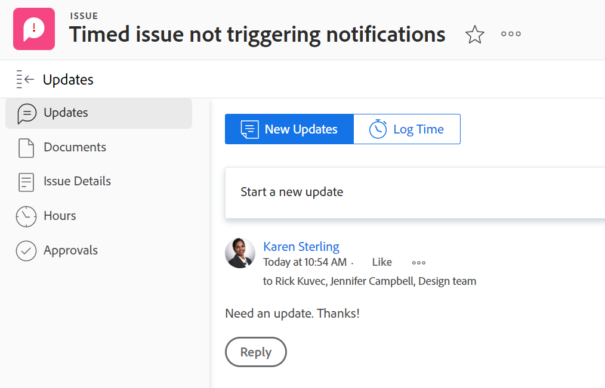

# Updates section overview

<!--take "Beta" references out when we remove the beta-->

The highlighted information on this page refers to functionality not yet generally available. It is available only in the Preview environment.

>[!NOTE]
>
>We are currently redesigning the commenting experience in Adobe Workfront.
>
>For more information about the new commenting experience, see [New commenting experience](../../product-announcements/betas/new-commenting-experience-beta/unified-commenting-experience.md). 
>
>You can access the new experience for the following objects:
> * Issues, projects, tasks, and documents.
>
>     This is available when you enable the commenting Beta experience.
>
>     This functionality is available only for the Updates section, and it is not available for the following areas:
>
>     * Home
>     * Summary panel in lists
>     * Summary panel in timesheets
>
> * Goals, cards in the Boards area
>
>   The new commenting experience is the only experience for goals and cards. You must have an additional license to access Workfront Goals. For more information, see [Requirements to uses Workfront Goals](../../workfront-goals/goal-management/access-needed-for-wf-goals.md). 
>
>     You can add and view updates to cards in the Boards area when you enable the Comments and System Activity sections on a card. For more information, see [Add an ad hoc card to a board](../../agile/get-started-with-boards/add-card-to-board.md).

The Updates section of an object displays comments that users make on the object or system updates that track changes to the object.

## Overview of the Updates section

The information in the Updates section is organized differently, depending on which environment you access it from. 

### Overview of the current Updates section 

The Updates section of an object shows up to 200 of the most recent updates made within the past 90 days. 

The current Updates section shows the following information:

* Comments made by users and replies to those comments. 
* System updates which are informational messages that Workfront creates to record certain events on an objects. For example, you can capture changes in status, name, or custom fields with system updates. Your Workfront or group administrator can enable system updates for your objects. For more information, see [Configure system updates](../../administration-and-setup/set-up-workfront/system-tracked-update-feeds/configure-system-updates.md).

The Updates section displays for the following objects:

<table style="table-layout:auto"> 
 <col> 
 <col> 
 <tbody> 
  <tr> 
   <td> 
    <ul> 
     <li>Documents</li> 
     <li>Goals</li> 
     <li>Issues</li> 
     <li>Iterations</li> 
     <li>Projects</li> 
     <li>Programs</li> 
     <li>Portfolios</li> 
    </ul> </td> 
   <td> 
    <ul> 
     <li>Stories</li> 
     <li>Tasks</li> 
     <li>Templates</li> 
     <li>Template Tasks</li> 
     <li>Timesheets</li> 
     <li>Users</li>
    </ul> </td> 
  </tr> 
 </tbody> 
</table>

### Overview of the Updates section in the Beta commenting experience

The Updates section displays information in the following tabs in the new commenting experience: 

* **Comments**: Displays comments made by users and replies to those comments. For information about updating objects in the new commenting experience, see [Update work](../updating-work-items-and-viewing-updates/update-work.md). 
* **System Activity**: Displays system updates which are informational messages that Workfront creates to record certain events on an objects. For example, you can capture changes in status, name, or custom fields with system updates. Your Workfront or group administrator can enable system updates for your objects. For more information, see [Configure system updates](../../administration-and-setup/set-up-workfront/system-tracked-update-feeds/configure-system-updates.md).

Currently, you can add comments and reply to updates using the new commenting experience on the following objects:

<table style="table-layout:auto"> 
 <col> 
 <col> 
 <tbody> 
  <tr> 
   <td> 
    <ul> 
     <li>
Goals

     <li>Cards in the Boards area</li>
      This is the only experience for goals and cards.
     </li> 
     <li>Projects</li>
    </ul> </td> 
   <td> 
    <ul> 
     <li>Issues</li> 
     <li>Tasks</li>
     <li>Documents</li>
     </ul> </td> 
  </tr> 
 </tbody> 
</table>

>[!NOTE]
>
>You can add and view updates to cards in the Board areas when you enable the Comments and System Activity sections on a card. For more information, see [Add an ad hoc card to a board](../../agile/get-started-with-boards/add-card-to-board.md). 

## Updates that also appear on higher-rank objects

Comments or replies made to updates on certain objects also appear on the Updates section of higher-ranked objects.

For example, when you add an update to a task, the update appears on the Updates section for the task and on the Updates section for the project containing the task.

>[!NOTE]
>
>When enabling the new commenting Beta experience, comments display on the following higher-ranking objects: 
>
>* Issues
>* Projects
>* Tasks
>
>For more information, see [New commenting experience](../../product-announcements/betas/new-commenting-experience-beta/unified-commenting-experience.md). 

The following table shows the objects whose comments also display on their higher-ranking objects: 

<table style="table-layout:auto"> 
 <col> 
 <col> 
 <thead> 
  <tr> 
   <th><strong>Object where the original update was added</strong> </th> 
   <th> 
<strong>Higher-ranked object where the original update also appears</strong> 
 </th> 
  </tr> 
 </thead> 
 <tbody> 
  <tr> 
   <td>Issue</td> 
   <td>Project</td> 
  </tr> 
  <tr> 
   <td>Task</td> 
   <td>Project</td> 
  </tr> 
  <tr> 
   <td>Project</td> 
   <td>Program, Portfolio</td> 
  </tr> 
  <tr data-mc-conditions=""> 
   <td>Document </td> 
   <td>Object where document is attached, Project </td> 
  </tr> 
  <tr> 
   <td>Program</td> 
   <td>Portfolio</td> 
  </tr> 
  <tr> 
   <td>User</td> 
   <td>Team</td> 
  </tr> 
  <tr> 
   <td>Timesheet</td> 
   <td>User, Team</td> 
  </tr> 
  <tr> 
   <td>Template Task</td> 
   <td>Template</td> 
  </tr> 
  <tr> 
   <td>Story</td> 
   <td>Iteration, Team</td> 
  </tr> 
  <tr> 
   <td>Iteration</td> 
   <td>Team</td> 
  </tr> 

<tr> 
   <td>Goals</td> 
   <td>Result, Activity</td> 
  </tr> 
 </tbody> 
</table>

>[!NOTE]
>
>Replies added to system updates do not roll up to the parent object. Only direct replies on a child object and replies added to existing updates roll up to parent objects.
>
>For information about the object hierarchy in Adobe Workfront, see [Understand objects in Adobe Workfront](../../workfront-basics/navigate-workfront/workfront-navigation/understand-objects.md).
>
> It is not possible to reply to system updates in the new commenting Beta experience. For more information, see [New commenting experience](../../product-announcements/betas/new-commenting-experience-beta/unified-commenting-experience.md).

## Limitations of the Updates section

There are some limitations in the Updates section of a team and when entering updates on behalf of other users. 

### Limitations for users and teams

You cannot make updates on teams. The Updates section for teams is populated by updates entered on the following objects:

* Users
* Timesheets
* Stories
* Iterations

On the Updates section for users and teams, you can view the updates that have been entered in the past 90 days.

If you want to see all the updates made on a user or a team, beyond the 90-day limit, you can build a report for notes. The report should not have a time filter that displays all updates made for users or teams. For more information, see [Create a custom report](../../reports-and-dashboards/reports/creating-and-managing-reports/create-custom-report.md).

### Limitations when entering comments on behalf of another user

Adobe Workfront administrators and group administrators can log in as other users and perform actions in Workfront such as entering comments. (For information, see [Log in as another user](../../administration-and-setup/add-users/create-and-manage-users/log-in-as-another-user.md).) Any comments made on behalf of another user are indicated on the comment.

A group administrator can comment on behalf of another person but cannot delete that comment. Only an Adobe Workfront administrator can delete a comment that they made on behalf of another user.

## View system updates on work items with the Journal Entry report

The Journal Entry report surfaces system updates from the Updates area of projects, tasks, and issues.

The report allows you to see:

* How many status changes occurred
* When a task or issue was deleted
* How values in important custom fields changed over the course of a project
* What important dates changed over the course of a project
* If priority changed over the course of a project
* If the owner of a project changed

For more information, see [Report on the Updates area](../../reports-and-dashboards/reports/creating-and-managing-reports/create-journal-entry-report.md).
