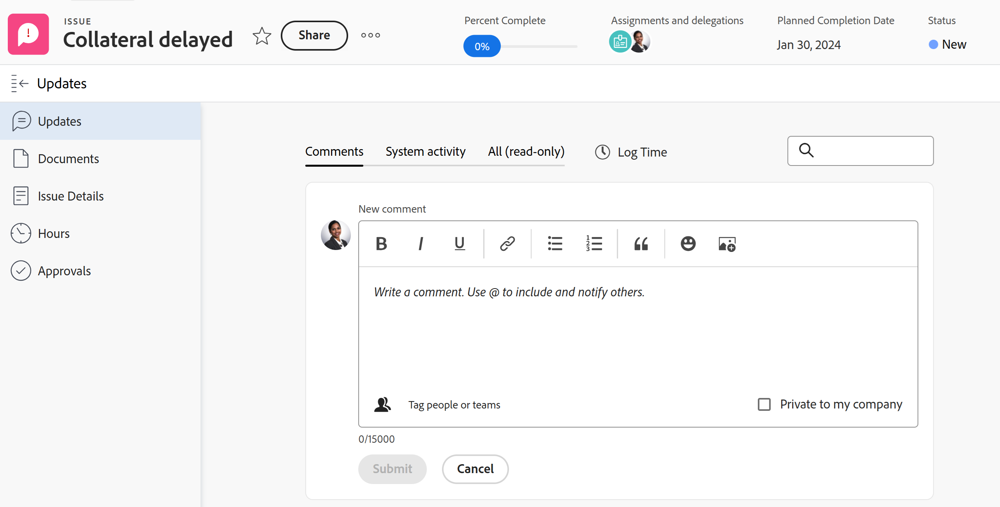
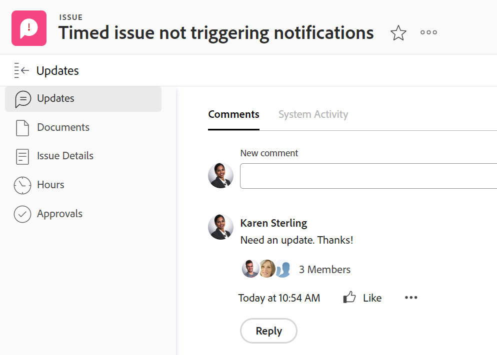
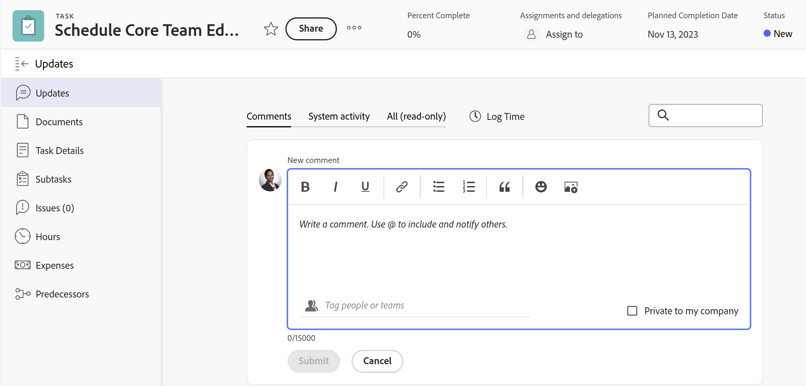
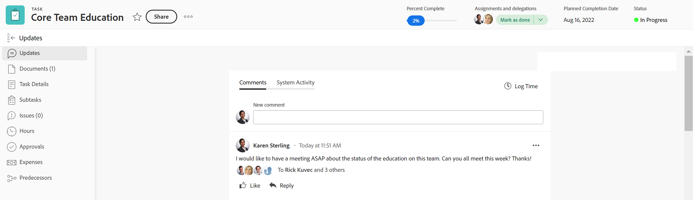
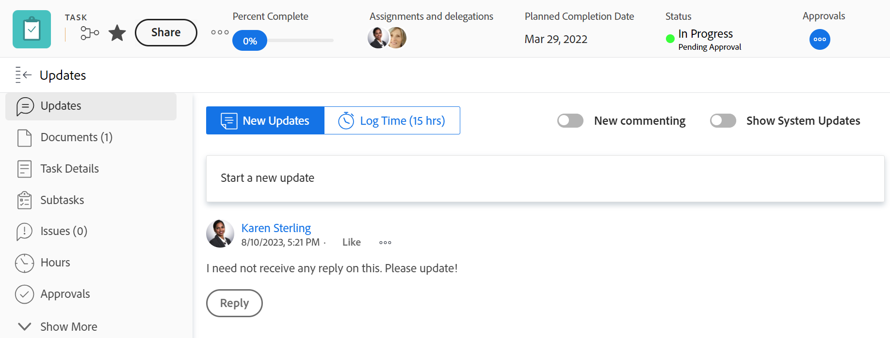

# Updates section overview

{{highlighted-preview}}

<!-- Audited: 1/2024 -->

<!--take "legacy" and "new commenting" references out when we remove the legacy - April 2024???-->

<!--The highlighted information on this page refers to functionality not yet generally available. It is available only in the Preview environment for all customers. 

For information about the current release schedule, see [First Quarter 2024 release overview](/help/quicksilver/product-announcements/product-releases/24-q1-release-activity/24-q1-release-overview.md). -->

>[!IMPORTANT]
>
>We are currently redesigning the commenting experience in Adobe Workfront.
>
>Depending on what objects you access the commenting experience for, you might see the following functionality for the Updates section:
>* The new experience
>* The legacy experience
>* The new and the legacy experience
>
>This article contains information about the new and the legacy versions of the Updates section.
>
>For more information about the new commenting experience and its availability, see [New commenting experience](../../product-announcements/betas/new-commenting-experience-beta/unified-commenting-experience.md). 
>
>The new commenting experience is available only for the Updates section of Workfront objects, and it is not available when you access the objects from the following areas:
>
> * Home
> * Summary panel in lists
> * Summary panel in timesheets 
> * Summary panel in the Workload Balancer
>
>The new commenting experience is available in the Summary panel in lists, timesheets, and the Workload Balancer in the Preview environment.

## Overview of the Updates section

The Updates section of an object shows system updates, and up to 200 of the most recent updates users made within the past 90 days.

Example of the Updates section in the Preview environment:
  

Example of the Updates section in the Production environment:
  

Depending on what objects you access the commenting experience for, you might find the following experience for the Updates section:

* Both the new and legacy commenting experience for the following objects: 

  * Project
  * Task (this includes Stories)
  * Issue
  * Document

    >[!TIP]
    >
    >Use the New commenting option to display the new commenting experience (when you enable it) or the legacy commenting experience (when you disable it). The new commenting experience is the default. For more information, see [New commenting experience](../../product-announcements/betas/new-commenting-experience-beta/unified-commenting-experience.md). 

* Only the new commenting experience for the objects listed below. There is no option to enable the legacy commenting experience for these objects:   

  * Goal

    >[!NOTE]
    >
    >You must have an additional license to Adobe Workfront Goals to be able to access this area of Workfront. For more information, see [Requirements to use Workfront Goals](../../workfront-goals/goal-management/access-needed-for-wf-goals.md). 

  * Card on a board
  * Team
  * Template
  * Template Task
  * Timesheet
  * Program
  * Portfolio
  * User

* Only the legacy commenting experience for the following objects:

  * Iterations

    There is no option to enable the new commenting experience for iterations.

### Overview of the Updates section in the new commenting experience

Example of the Updates section in the Preview environment:

Example of the Updates section in the Production environment:

>[!NOTE]
>
>The new commenting experience is not available for iterations.

* The Updates section displays information in the following tabs in the new commenting experience:

  * **Comments**: Displays comments made by users and replies to those comments. Use the Comments tab to add new comments or reply to existing ones. For information about updating objects in the new commenting experience, see [Update work](../updating-work-items-and-viewing-updates/update-work.md).
  * **System Activity**: Displays system updates which are informational messages that Workfront creates to record certain events on an objects. For example, changes in status, name, or custom fields are captured with system updates. Your Workfront or group administrator can enable system updates for your objects. Any replies made to system activity records in the legacy commenting experience are populated on the System Activity tab as read-only. For more information, see [Configure system updates](../../administration-and-setup/set-up-workfront/system-tracked-update-feeds/configure-system-updates.md).
  * **All (read-only)**: Displays both user comments and system activity comments in one place. This is a view-only tab. You cannot reply to comments or tag other users in existing comments in the All tab. To reply to a specific comment, use the link from the All tab to the Comments tab. For information about updating objects in the new commenting experience, see [Update work](../updating-work-items-and-viewing-updates/update-work.md).

* The following objects don't have a System Activity tab or All tab:

  * Team
  * Template
  * Template Task
  * Ad-hoc Card

    
### Overview of the legacy Updates section 

<!--when we remove legacy, make this section an "Iterations-only" section-->

The legacy Updates section shows the following information:

* **User updates**: Comments made by users and replies to those comments. 
* **System updates**: Informational messages that Workfront creates to record certain events on an objects. For example, you can capture changes in status, name, or custom fields with system updates. Your Workfront or group administrator can enable system updates for your objects. For more information, see [Configure system updates](../../administration-and-setup/set-up-workfront/system-tracked-update-feeds/configure-system-updates.md).

The following objects don't record system updates:

* Team
* Template
* Template Task
* Iterations

## Updates that also appear on higher-rank objects

Comments, replies, or system updates of certain objects also appear on the Updates section of higher-ranked objects.

For example, when you add an update to a task, the update appears on the Updates section for the task and on the Updates section for the project containing the task.

The following table shows the objects whose comments also display on their higher-ranking objects: 

<table style="table-layout:auto"> 
 <col> 
 <col> 
 <thead> 
  <tr> 
   <th><strong>Object where the original update was added</strong> </th> 
   <th> 
<strong>Higher-ranked object where the original update also appears</strong> 
 </th> 
  </tr> 
 </thead> 
 <tbody> 
  <tr> 
   <td>Issue</td> 
   <td>Project</td> 
  </tr> 
  <tr> 
   <td>Task</td> 
   <td>Project</td> 
  </tr> 
  <tr> 
   <td>Project</td> 
   <td>Program, Portfolio</td> 
  </tr> 
  <tr data-mc-conditions=""> 
   <td>Document </td> 
   <td>Object where document is attached, Project </td> 
  </tr> 
  <tr> 
   <td>Program</td> 
   <td>Portfolio</td> 
  </tr> 
  <tr> 
   <td>User</td> 
   <td>Team</td> 
  </tr> 
  <tr> 
   <td>Timesheet</td> 
   <td>
User, Team

   
<b>NOTE</b>

   
Timesheet comments display in the Updates section of the user who makes the comment and the Updates section of their Home Team.

   </td> 
  </tr> 
  <tr> 
   <td>Template Task</td> 
   <td>Template</td> 
  </tr> 
  <tr> 
   <td>Story</td> 
   <td>Iteration, Team</td> 
  </tr> 
  <tr> 
   <td>Iteration</td> 
   <td>Team</td> 
  </tr> 

<tr> 
   <td>Result</td> 
   <td>Goal</td> 
  </tr> 
  <tr> 
   <td>Activity</td> 
   <td>Goal</td> 
  </tr> 
 </tbody> 
</table>
 
>[!NOTE]
>
>Replies added to system updates do not roll up to the parent object. Only direct replies on a child object and replies added to existing updates roll up to parent objects.
>
>For information about the object hierarchy in Adobe Workfront, see [Understand objects in Adobe Workfront](../../workfront-basics/navigate-workfront/workfront-navigation/understand-objects.md).
>
> It is not possible to reply to system updates in the new commenting experience. For more information, see [New commenting experience](../../product-announcements/betas/new-commenting-experience-beta/unified-commenting-experience.md).

## Limitations of the Updates section

There are some limitations in the Updates section of a team and when entering updates on behalf of other users. 

### Limitations for users and teams

Consider the following when viewing updates for users and teams: 

* You cannot add new comments in the Updates section of a team. 

* You can add a reply to an update you view on a team. The reply displays in the team's Updates section as well as the Updates section of the object it belongs to. 

* The Updates section for teams is populated by updates entered on the following objects:

  * Users
  * Timesheets*
  * Stories
  * Iterations*

  *These are not available for the new commenting experience. 

* On the Updates section for users and teams, you can view the updates that have been entered in the past 90 days.

  If you want to see all the updates made on a user or a team, beyond the 90-day limit, you can build a report for notes. The report should not have a time filter that displays all updates made for users or teams. For more information, see [Create a custom report](../../reports-and-dashboards/reports/creating-and-managing-reports/create-custom-report.md).

### Limitations when entering comments on behalf of another user

Adobe Workfront administrators and group administrators can log in as other users and perform actions in Workfront such as entering comments. 

For information, see [Log in as another user](../../administration-and-setup/add-users/create-and-manage-users/log-in-as-another-user.md).

Consider the following when logging in as another user and adding comments:

* Any comments made on behalf of another user are indicated on the comment.

* A group administrator can comment on behalf of another person but cannot delete that comment. Only an Adobe Workfront administrator can delete a comment that they made on behalf of another user.

* A Workfront or group administrator can only edit a comment they added on behalf of another user only when they log out as the user and log back in as themselves. They cannot delete a comment on behalf of another user. 

## View system updates on work items with the Journal Entry report

The Journal Entry report surfaces system updates from the Updates area of projects, tasks, and issues.

The report allows you to see:

* How many status changes occurred
* When a task or issue was deleted
* How values in important custom fields changed over the course of a project
* What important dates changed over the course of a project
* If priority changed over the course of a project
* If the owner of a project changed

For more information, see [Report on the Updates area](../../reports-and-dashboards/reports/creating-and-managing-reports/create-journal-entry-report.md).
