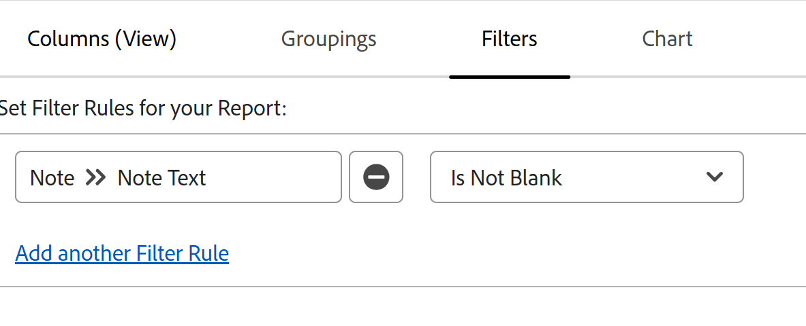

# View all updates in a Note report

<!--

(NOTE: Alina: ***This is a report and it is in the Getting Started/ Updates section because I think it makes more sense to be in this area, where people want to view updates. - added this to this section from Reporting on 7/3/2018 ) 

-->

The Updates area of an object displays a maximum number of 200 updates by default. To see all the updates that any of the users have entered for an object, you can create a Note report that displays all the updates.

>[!NOTE]
>
>You can build a report to view updates on objects in Preview with the Journal entry report. For more information, see [Report on the Updates area](../../reports-and-dashboards/reports/creating-and-managing-reports/create-journal-entry-report.md).

## Access requirements

You must have the following access to perform the steps in this article:

<table style="table-layout:auto"> 
 <col> 
 </col> 
 <col> 
 </col> 
 <tbody> 
  <tr> 
   <td role="rowheader"><strong>Adobe Workfront plan</strong></td> 
   <td> 
Any
 </td> 
  </tr> 
  <tr> 
   <td role="rowheader"><strong>Adobe Workfront license*</strong></td> 
   <td> 
New: Standard 

   
Current: Plan
 </td> 
  </tr> 
  <tr> 
   <td role="rowheader"><strong>Access level configurations</strong></td> 
   <td> 
Edit access to:
 
    <ul> 
     <li> 
Create Reports, Dashboards, and Calendars
 </li> 
     <li> 
Create Filters, Views, and Groupings
 </li> 
    </ul> </td> 
  </tr> 
  <tr> 
   <td role="rowheader"><strong>Object permissions</strong></td> 
   <td> 
View
 
<b>NOTE</b>

   
If you do not have View permission or higher to an object, information for that object does not display in the report.
  </td> 
  </tr> 
 </tbody> 
</table>

*For information, see [Access requirements in Adobe Workfront](/help/quicksilver/administration-and-setup/add-users/access-levels-and-object-permissions/access-level-requirements-in-documentation.md). 

## Create a Note report

Creating a report for Notes for any object is identical, regardless of the object.

For example, to create a Note report for all the notes on a project:

1. Click the **Main Menu** icon  in the upper-right corner of Adobe Workfront.

1. Click&nbsp;**Reports**.
1. Click **New Report**, then choose&nbsp;**Note**.

1. (Optional) Click **Views**, then **Add Column** to add the **Name** of the **Project** in the view of the report.&nbsp;

1. (Optional) Click **Groupings**, then **Add Grouping** to group by the **Project Name**, if you are reporting on multiple projects at the same time.  
   This ensures that the notes are grouped by their respective projects, making the report easier to read.&nbsp;

1. (Optional) Click **Filters,** then **Add a Filter Rule**.
1. Add a filter for **Note** > **Note Text** > **Is Not Blank**.

   

   >[!TIP]
   >
   >   If a project field was updated but no note was added at the time of the update, the **Note Text** of the update displays as **(No text added to update)**.

1. (Optional) Add another filter for **Project** > **Name** > **Equals to** and add one or several project names for which you want to view notes. 
1. Click **Save + Close**.  
   All the updates entered on the project by all users with permissions to at least View the project are displayed in the report.
