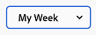

# Get started with New Home in Adobe Workfront

New Home is a powerful new feature for managing your work. This flexible space can be customized to highlight the work that is most important to you and streamline your task, issue, request, and approval management.

## Customize New Home

New Home is designed to be highly customizable, allowing you to select the widgets that track your most important work, filter the scope of that work based on when it's due, or even add a splash of color.

### Widgets

Widgets are the foundation of New Home. By adding widgets to your Home page, you can choose the type of information that is displayed to best meet your work needs. Some widgets are only available to specific license types, as the objects they track are only available to those licenses. Below are the ten widgets currently available to choose from, as well as a summary of the information they display:

* **My work**\
    A great place to start for managing a variety of work, this widget displays all of your assigned tasks, issues, and requests in one place.

* **My projects**\
    Displays projects that are assigned to you in a table that can be sorted to display only projects you own or all projects you are on; standard filter, view, and grouping options; and a button to directly create a new project.

* **My tasks**\
    Displays tasks that are assigned to you in a table with customizable filters, views, and groupings, as well as a button to directly create a new task.

* **My issues**\
    Displays issues that are assigned to you in a table with customizable filters, views, and groupings, as well as a button to directly create a new issue.

* **My requests**\
    Displays all requests assigned to you, a filter that allows you to only display open requests, and a button that opens the summary pane for a request.

* **Team requests**\
    Displays all pending requests for teams that you are on sorted by team, as well as buttons to directly assign a request to a user or to work on it yourself.

* **Awaiting my approval**\
    Displays all of your pending assigned or delegated approvals, a button to delegate approvals, and buttons to make approval decisions directly within the widget.

* **All approvals**\
    Displays all approvals for your organization in a table with customizable columns, as well as a search bar that allows you to search for specific approvals.

* **Mentions**\
    Displays recent comment threads that contain @ mentions of you across Workfront, as well as a reply button that allows you to compose a reply within the widget.

* **To-dos**\
    This unique widget allows you to add text items to a personal checklist that you can freely edit.

For information on adding, moving, resizing, or deleting widgets, see [Add, edit, or remove widgets in New Home](/help/quicksilver/workfront-basics/using-home/new-home/add-edit-remove-widgets-in-new-home.md)

### Background customization

You can add a bit of personal flare to your Home page by selecting a colorful banner for the top of the page.

**To change the color of your Home background:**

1. Navigate to your Home page, either by clicking on the Adobe Workfront icon  at the top of your screen if Home is set as your landing page, or by clicking on the main menu icon  then clicking on **Home**.

1. Click on the Customize button  at the top-right corner of the screen.

    

1. In the **Background** section of the **Customize** pane that appears, click on the color you would like to select for your Home background. You can also click **None** to remove the background.

### Filter by time range

You can quickly filter all of the information on your Home page to display object information within three specific time ranges: Day, Week, or Month. Additionally, a summary of the number of tasks you have due and those you've completed within range is displayed at the top of the Home page.

**To change the time range of your Home page:**

1. Navigate to your Home page, either by clicking on the Adobe Workfront icon  at the top of your screen if Home is set as your landing page, or by clicking on the main menu icon  then clicking on **Home**.

1. Click on the time range filter in the top-left corner of the Home page. By default, the filter is set to **My Week**.

    

1. Click on either **Day**, **Week**, or **Month** to filter your Home page so that it only displays information on objects due within that time frame.

## Revert to current Home experience

For users that prefer the existing Home experience, New Home can be toggled off.

**To go back to the current Home experience:**

1. Navigate to your Home page, either by clicking on the Adobe Workfront icon  at the top of your screen if Home is set as your landing page, or by clicking on the main menu icon  then clicking on **Home**.

1. Click on the **Go back to the current Home** button in the bottom-right corner of the page.

    

1. In the confirmation window that appears, you can choose to take a brief survey about your experience with New Home or click **Go Back to the current Home** to finalize your decision and revert to the current Home experience.
