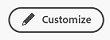
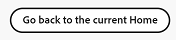

# Get started with the new Home

<!--Audited: 12/2023-->

The new Home experience in Adobe Workfront aims to improve the current Home experience while providing a more flexible way for you to focus on the right work.

The new Home is a powerful new feature for managing your work. You can customize this flexible space to highlight the work that is most important to you and streamline your task, issue, request, and approval management.

## Customize the new Home

The new Home is designed to be highly customizable, allowing you to select the widgets that track your most important work, filter the scope of that work based on when it's due, and even add a splash of color.

### Widgets

Widgets are the foundation of the new Home. By adding widgets to your Home page, you can choose the type of information that displays to best meet your work needs. Some widgets are only available to specific license types, as the objects they track are only available to those licenses. 

For information on adding, moving, resizing, or deleting widgets, see [Add, edit, or remove widgets in New Home](/help/quicksilver/workfront-basics/using-home/new-home/add-edit-remove-widgets-in-new-home.md).

Below are the ten widgets currently available to choose from, as well as a summary of the information they display:

* **My work**\
    A great place to start for managing a variety of work, this widget displays all of your assigned tasks, issues, and requests in one place. You can click the Work On It button to start working on an item. 

* **My projects**\
    Displays projects you own or projects you are on in a list. You can use  existing filters, views, or groupings to customize the list, or you can create a project directly from the widget.

* **My tasks**\
    Displays tasks that are assigned to you in a list. You can use  existing filters, views, or groupings to customize the list, or you can create a task directly from the widget. You can also delegate your tasks while you are away from the office. 

* **My issues**\
    Displays issues that are assigned to you in a list. You can use  existing filters, views, or groupings to customize the list, or you can create an issue directly from the widget.This widget only includes issues whose associated projects are set to Current. You can also delegate your issues while you are away from the office. 

* **My requests**\
    Displays all requests you have submitted, a filter to only display open requests, and a button that opens the summary pane for a request.

* **Team requests**\
    Displays all pending requests for teams that you are on sorted by team, as well as buttons to directly assign a request to a user or to work on it yourself.

* **Awaiting my approval**\
    Displays all of your pending assigned or delegated approvals, a button to delegate approvals, and buttons to make approval decisions directly within the widget.

* **All approvals**\
    Displays all approvals for your organization in a table with customizable columns, as well as a search bar that allows you to search for specific approvals.

* **Pending approvals**<\
    Displays approvals assigned to a document on a project you own. Here, you can view approval status and remind users about incomplete reviews and approvals. This feature is part of a phased release and is currently only available for specific customers.

* **Mentions**\
    Displays recent comment threads from across Workfront, similarly to the My Updates page. You can use the reply button to compose a reply within the widget. This widget also shows comments made on tasks and issues that you are assigned to, that you assigned to another user, that you own, that you are primary contact on, or that you created—as long as the task or issue has been updated in the last 30 days.

* **To-dos**\
    This unique widget allows you to add text items to a personal checklist that you can freely edit.

    >[!NOTE]
    >
    >You must have permission to create tasks in order to create to-dos in the To-dos widget.

By default, the Home page is populated with a few specific widgets based on your license type. The tables below outline which widgets users of each license type see when they first navigate to New Home.

<table border=1 class="inlineTable">
    <tr>
        <td><b>New license type</b></td>
        <td><b>Default widgets</b></td>
    </tr>
    <tr>
        <td>Standard</td>
        <td>My Projects, My Work, Mentions, To-dos</td>
    </tr>
    <tr>
        <td>Light</td>
        <td>My Work, Awaiting My Approval</td>
    </tr>
    <tr>
        <td>Contributor</td>
        <td>My Requests, Mentions, Awaiting My Approval, Boards</td>
    </tr>
    <tr>
        <td>External</td>
        <td>Awaiting My Approval</td>
    </tr>
</table>

<table border=1 class="inlineTable">
    <tr>
        <td><b>Current license type</b></td>
        <td><b>Default widgets</b></td>
    </tr>
    <tr>
        <td>Plan</td>
        <td>My Projects, Mentions, To-dos</td>
    </tr>
    <tr>
        <td>Work</td>
        <td>My Work, Mentions, To-dos</td>
    </tr>
    <tr>
        <td>Review</td>
        <td>My Work, Mentions</td>
    </tr>
    <tr>
        <td>Request</td>
        <td>My Projects, Awaiting My Approval</td>
    </tr>
    <tr>
        <td>Contribute</td>
        <td>My Work, Mentions</td>
    </tr>
    <tr>
        <td>External</td>
        <td>Awaiting My Approval</td>
    </tr>
</table>

### Background customization

You can add a bit of personal flare to your Home page by selecting a colorful banner for the top of the page.

**To change the color of your Home background:**

1. Go to your Home page, by doing one of the following: 

    * If Home is set as your landing page, click the **Adobe Workfront** icon  in the upper-left corner of your screen.
    * Click the **Main Menu** icon in the upper-right corner of the screen, or the **Main Menu** icon  in the upper-left corner, if available, then click **Home**.

1. Click **Customize** at the upper-right corner of the screen.

    

    The Customize panel opens. 

1. In the **Background** section of the **Customize** panel, click the color you would like to select for your Home background. You can also click **None** to remove the background.

## Revert to the current Home experience

If you prefer the existing Home experience, you can toggled off the new Home experience.

To go back to the current Home experience:

1. Go to your Home page, either by clicking the **Adobe Workfront** icon  in the upper-left corner of your screen if Home is set as your landing page, or click the **Main Menu** icon in the upper-right corner  or the **Main Menu** icon  in the upper-left corner, if available, then click **Home**.

1. Click on the **Go back to the current Home** button in the bottom-right corner of the page.

    

    A confirmation window displays. 

1. Take a brief survey about your experience with the new Home or click **Go Back to the current Home** to revert to the current Home experience.

>[!NOTE]
>
> System Administrators can disable the new Home as the default for their users. For information on changing the default Home experience for users across a system, see [Configure system preferences](/help/quicksilver/administration-and-setup/manage-workfront/security/configure-security-preferences.md).
