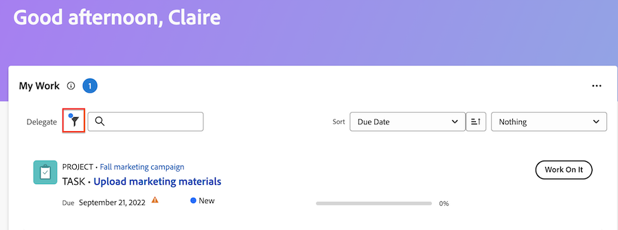

# Manage your work with the My Work widget

The My Work widget displays all of your assigned tasks, issues, and requests in one place. Here, you can filter and organize your work, log time, make updates, and mark work items complete.

## Access requirements

 +++ Expand to view access requirements for the functionality in this article.

You must have the following access to perform the steps in this article:

<table style="table-layout:auto"> 
 <col> 
 </col> 
 <col> 
 </col> 
 <tbody> 
  <tr> 
   <td role="rowheader"><strong>[!DNL Adobe Workfront plan]</strong></td> 
   <td> 
Any
 </td> 
  </tr> 
  <tr> 
   <td role="rowheader"><strong>[!DNL Adobe Workfront] license</strong></td> 
   <td> 
Current: Contribute

   
Or
 
   
New:[!UICONTROL Light] or higher
 
  </td> 
  </tr> </ul>
  <tr> 
   <td role="rowheader"><strong>Access level configurations</strong></td> 
   <td> 
[!UICONTROL View] or higher access to Projects, Tasks, Issues, and Documents
 </td> 
  </tr>  
  <tr> 
   <td role="rowheader"><strong>Object permissions</strong></td> 
   <td> 
Contribute permissions or higher to the tasks and issues that you need to work on
  </td> 
  </tr> 
 </tbody> 
</table>

For more detail about the information in this table, see [Access requirements in Workfront documentation](/help/quicksilver/administration-and-setup/add-users/access-levels-and-object-permissions/access-level-requirements-in-documentation.md).

+++

## Find your work with filters

You can fine-tune the My Work filters to focus on specific items in your list of work:   

### Filter details

<table>
  <tbody>
    <tr>
      <td>Working on</td>
      <td>Displays items that you are currently working on</td>
    </tr>
    <tr>
      <td>Ready to start</td>
      <td>Displays items with 
      <ul>
      <li>No incomplete predecessors or task constraints</li>
      
and

      <li>The Planned Start Date is in the past or up to two weeks in the future</li>
      </ul>
      </td>
    </tr>
    <tr>
      <td>Not ready</td>
      <td>Displays items that have
       <ul>
      <li>Incomplete predecessors or task constraints that prevent the item from being worked on</li>
      
or

      <li>The Planned Start Date more than two weeks in the future</li>
      </ul>
       </td>
    </tr>
    <tr>
      <td>Requested</td>
      <td>Displays issues that you have not started work on</td>
    </tr>
    <tr>
      <td>Delegated by me</td>
      <td>Displays items that you have delegated to other users</td>
    </tr>
    <tr>
      <td>Delegated to me</td>
      <td>Displays items users have delegated to you</td>
    </tr>
    <tr>
      <td>Completed</td>
      <td>Displays work completed within the last two weeks. This filter option does not include approvals.</td>
    </tr>
  </tbody>
</table>

>[!TIP]
>
>If you are looking for more specific filtering options, you can use the My Task or My Issue widgets. For more information on My Task and My Issue filters, see [Home widget filters overview](/help/quicksilver/workfront-basics/using-home/using-the-home-area/widget-filter-overview-home.md).

## Organize your work

You can use the My Work widget's sorting and group features to organize your work in a way that makes sense to you.

### Sort

You can sort the work list by 

* Due Date
    Past-due items display a warning icon next to the date. Workfront uses the Planned Completion Date to determine if tasks and issues are past due.
* Name 
* Percent Complete
* Status

>[!TIP]
>
>To create a list that displays all past-due items at the top of the My Work widget, sort by Due Date and do not apply a grouping. 

### Group

You can group the work list by 

* Project
* Status 
* Due Date
    The Due Date is determined by the Planned Completion Date.

>[!NOTE]
>
>When you apply a grouping, your selection in the Sort menu determines the order within the grouping.

## Update work item information in the Summary

You can open the Summary panel to quickly update information in a task or issue. In the Summary, you can

* Update the percent complete
* Add an update
* Navigate to the Document area to upload a document
* View work item details and update custom fields
    Workfront administrators can customize which fields appear in the Summary in the layout template. For more information, see [Customize Home and Summary using a layout template](/help/quicksilver/administration-and-setup/customize-workfront/use-layout-templates/customize-home-summary-layout-template.md).
* Change the work item status
* View subtasks
* Log time
* View attached approval processes

To open the Summary, hover over the work item, then click the **Summary** icon .

For additional information about how to use the Summary panel, see [Summary overview](/help/quicksilver/workfront-basics/the-new-workfront-experience/summary-overview.md).

## Use quick actions to update work items

You can use the quick actions menu to 
 
* Log time
* Add an Update
* Update a custom form
* Upload a file

To locate the quick actions menu, hover over the work item. The quick actions list displays near the **Work On It** or **Done** button. 

## View approvals and team requests

Approvals and team requests do not display in the My Work widget. If you regularly work with approvals and team requests, we recommend you add the following widgets to your New Home page:

* Awaiting my approval
* All approvals
* Team requests 

For information about adding widgets to your New Home page, see [Add, edit, or remove widgets in New Home](/help/quicksilver/workfront-basics/using-home/new-home/add-edit-remove-widgets-in-new-home.md).

