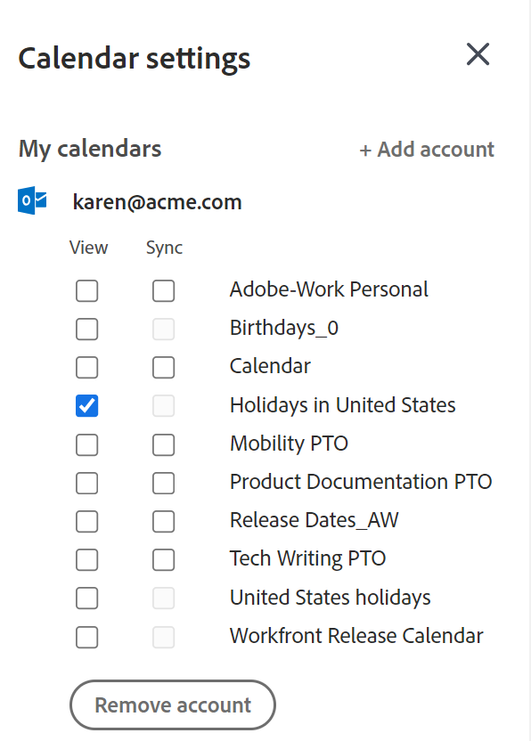
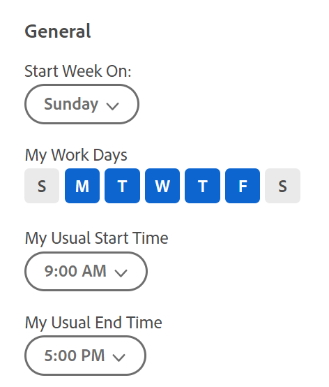

# Configure your [!UICONTROL Home Calendar] view settings

<!--Audited: 01/2024-->

You can configure the [!UICONTROL Home Calendar] settings to do the following:

* Integrate with a web-based version of [!DNL Outlook] in cloud-hosted [!DNL Office 365] or [!DNL Outlook Live]. You can display all events from your Outlook calendar and any associated calendars you select in your [!UICONTROL Home Calendar] in Adobe Workfront.
* Help you track your workload against your available work hours on the [!UICONTROL Allocation] bar.

To learn more about the Home Calendar, see [[!UICONTROL Home Calendar] view](../../../workfront-basics/using-home/using-the-home-area/home-calendar-view.md).

This article describes how you can configure the Home Calendar settings and integrate the Home Calendar with your external Outlook calendar. 

## Access requirements

You must have the following access to perform the steps in this article:

<table style="table-layout:auto"> 
 <col> 
 </col> 
 <col> 
 </col> 
 <tbody> 
  <tr> 
   <td role="rowheader"><strong>[!DNL Adobe Workfront plan]</strong></td> 
   <td> 
Any
 </td> 
  </tr> 
  <tr> 
   <td role="rowheader"><strong>[!DNL Adobe Workfront] license*</strong></td> 
   <td> 
Current: [!UICONTROL Work] or higher
 
   Or
   
New: [!UICONTROL Standard]
 
   </td> 
  </tr> 
   </tbody> 
</table>

*To find out what plan or license type you have, contact your [!DNL Workfront] administrator. For more information, see [Access requirements in Workfront documentation](/help/quicksilver/administration-and-setup/add-users/access-levels-and-object-permissions/access-level-requirements-in-documentation.md). 

## About integrating [!DNL Microsoft Outlook] calendars

Consider the following as you configure your Home Calendar with your [!DNL Microsoft Outlook] calendar:

* You can integrate only a web-based version of [!DNL Outlook] in cloud-hosted [!DNL Office 365] or [!DNL Outlook Live].

   On-premise [!DNL Outlook] and [!DNL Outlook] on a cloud-based enterprise [!DNL Exchange] server are not supported.

   If your organization uses single sign-on, you need [!DNL Microsoft 365 E3] or [!DNL E5].

* Attachments associated with your [!DNL Outlook] events are not attached to the [!DNL Outlook] events in your Home Calendar.
* Integration with an [!DNL Outlook] calendar must be completed for each user individually.
* Events that appear in the [!UICONTROL Due] bar do not appear on your [!DNL Microsoft] calendar unless you have dragged them from the [!UICONTROL Work List] to your [!DNL Adobe Workfront] Calendar. For more information, see [[!UICONTROL Due] bar](../../../workfront-basics/using-home/using-the-home-area/home-calendar-view.md#viewing-the-due-bar) and [Work list on the [!UICONTROL Home Calendar]](../../../workfront-basics/using-home/using-the-home-area/home-calendar-view.md#using-the-left-panel-of-the-home-view) in [[!UICONTROL Home Calendar] view](../../../workfront-basics/using-home/using-the-home-area/home-calendar-view.md).

* When you enable the integration with [!DNL Outlook], only work items that are dragged onto the [!UICONTROL Home Calendar] from that point forward will sync. Items that were on the Home Calendar prior to enabling the integration will not appear, and you must drag them onto the Home Calendar again if you want them to appear in [!DNL Outlook].
* When you share (or unshare) an [!DNL Outlook] calendar with other people, or when you change the permission level for a calendar you share with others, this change does not affect their calendars for about 30 minutes. For more information, consult the [!DNL Microsoft Outlook] documentation.\
   Consequently, when you integrate [!DNL Workfront] Calendar with an [!DNL Outlook] calendar that you share with other users, they will not see your [!DNL Workfront] Calendar items for about 30 minutes.

>[!NOTE]
>
>The [!DNL Outlook] calendar configuration is completely separate from the [!DNL Outlook] Add-in ([!UICONTROL [!DNL Outlook] Integration] or [!DNL Workfront Outlook]). There's no installation required to configure the calendar, but there is an installation needed for the [!DNL Outlook] Add-in. For more information on the [!DNL Outlook] Add-in see [Set up [!DNL Adobe Workfront for Outlook]](../../../workfront-integrations-and-apps/using-workfront-with-outlook/set-up-workfront-for-outlook.md).

## Configure your [!UICONTROL Home Calendar] view settings and integrate it with Outlook calendars

1. In the [!UICONTROL Home Calendar] view, click the **[!UICONTROL Settings]** gear icon  in the upper right corner to open the **[!UICONTROL Calendar settings]** panel on the right.

   If you need information about accessing the [!UICONTROL Home Calendar] view, see [View the [!UICONTROL Home Calendar]](../../../workfront-basics/using-home/using-the-home-area/view-home-calendar.md).

1. (Optional) To integrate your [!DNL Microsoft Outlook] calendar, click **[!UICONTROL Add account]** in the upper-right corner of the **[!UICONTROL Calendar settings]** panel. Then, if you are prompted to do so, enter your [!DNL Microsoft Outlook] login information. You can repeat this step to add multiple [!DNL Outlook] accounts.

   >[!NOTE]
   >
   >You must give [!DNL Workfront] permission to access your [!DNL Outlook] calendar. Granting permission allows [!DNL Workfront] to maintain access to calendar data, read your [!DNL outlook] profile, and read and update your [!DNL Microsoft] calendar.

1. Refresh the browser window to see information from your [!DNL Outlook] account in the calendar and in the [!UICONTROL Calendar settings] panel.
1. Click the **[!UICONTROL Settings]** gear icon again in the upper right corner to open the **[!UICONTROL Calendar settings]** panel. 

1. (Optional) Under each [!DNL Microsoft] account you have added in the previous step, select **[!UICONTROL View]** or **[!UICONTROL Sync]**:

   * **[!UICONTROL View]**: This is a read-only option that displays [!DNL Microsoft] calendar events on your [!UICONTROL Home Calendar].
   * **[!UICONTROL Sync]**: This option allows a two-way sync between your [!DNL Microsoft] and [!UICONTROL Home] calendars. In other words, [!DNL Workfront] [!UICONTROL Home Calendar] items export to your [!DNL Microsoft] calendar and [!DNL Microsoft] calendar items import to your Workfront [!UICONTROL Home Calendar] in real time.

      

1. (Optional) Under your [!DNL Workfront] account or an integrated account, select the associated calendars you want to view on your [!UICONTROL Home Calendar] (such as your PTO, Birthdays, or Holidays calendar) then click your browser's [!UICONTROL Refresh] or [!UICONTROL Reload] button to see your changes.

1. (Optional) In the **[!UICONTROL General]** section under **[!UICONTROL Start Week On]**, select the day you want to display  as the first day of your work week in the Home Calendar.

   

1. Configure the following options:

   * **[!UICONTROL My Work Days]:** Select the days you work.
   * **[!UICONTROL My Usual Start Time]:** Select the time you start your work day.
   * **[!UICONTROL My Usual End Time]:** Select the time you end your work day.

   [!DNL Workfront] uses these three settings to calculate the number of hours you work in a week. This number affects the [!UICONTROL Allocation] bar, which helps you track your workload against your available work hours. For more information, see [[!UICONTROL Allocation] bar](../../../workfront-basics/using-home/using-the-home-area/home-calendar-view.md#understanding-the-allocation-of-time) in the article [[!UICONTROL Home Calendar] view](../../../workfront-basics/using-home/using-the-home-area/home-calendar-view.md).

1. Click outside the **[!UICONTROL Calendar settings]** area to close it.

   [!DNL Workfront] saves your changes automatically.

For information about using the [!UICONTROL Calendar] view to manage your work assignments and integrated calendar events, see [Use the [!UICONTROL Home Calendar] view](../../../workfront-basics/using-home/using-the-home-area/use-home-calendar-view.md).

<!--
<MadCap:conditionalText data-mc-conditions="QuicksilverOrClassic.Draft mode">
(NOTE: from Courtney: [step #] Type your weekly work hours under How many hours a week do you work?This number affects the Allocation bar, which helps you track your workload against your available work hours. For more information, see "Allocation Bar" in the article "Understanding the Home Calendar View.")
</MadCap:conditionalText>
-->
