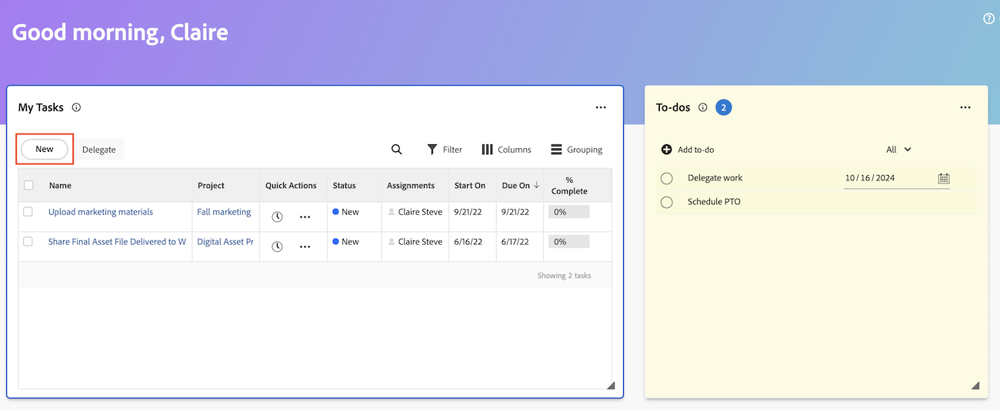
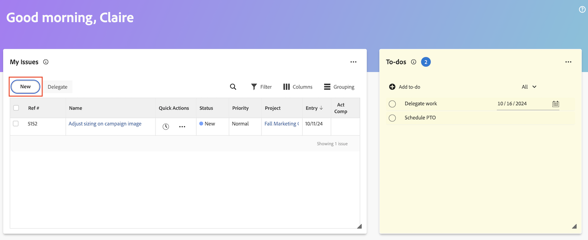
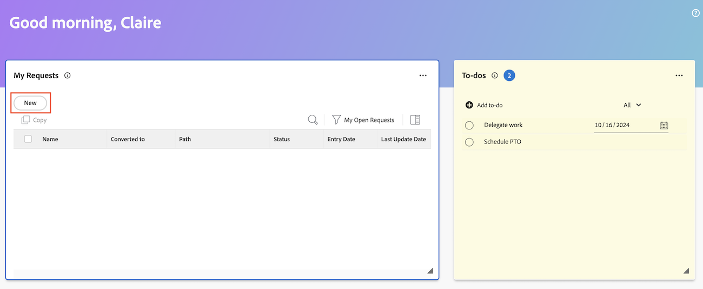
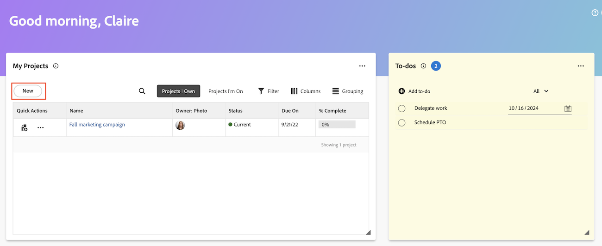

# Create work items and projects from the Home area

You can create work items and projects from the [!UICONTROL Home] area. 

From Home, you can 

* Submit requests
* Add tasks and issues to specific projects
* Create projects from a template, blank project, or import an MS project.

## Access requirements

+++ Expand to view access requirements for the functionality in this article. 

You must have the following access to perform the steps in this article:

<table style="table-layout:auto"> 
 <col> 
 <col> 
 <tbody> 
  <tr> 
   <td role="rowheader"><strong>[!DNL Adobe Workfront plan*]</strong></td> 
   <td> 
Any
 </td> 
  </tr> 
  <tr> 
   <td role="rowheader"><strong>[!DNL Adobe Workfront] license*</strong></td> 
   <td> 
[!UICONTROL Work] or higher
 </td> 
  </tr> 
  <tr> 
   <td role="rowheader"><strong>Access level configurations*</strong></td> 
   <td> 
[!UICONTROL Worker]
 
<b>NOTE</b>
 
   
If you still don't have access, ask your [!DNL Workfront] administrator if they set additional restrictions in your access level. For information on how a [!DNL Workfront] administrator can modify your access level, see <a href="../../../administration-and-setup/add-users/configure-and-grant-access/create-modify-access-levels.md" class="MCXref xref">Create or modify custom access levels</a>.
 </td> 
  </tr> 
  <tr> 
   <td role="rowheader"><strong>Object permissions</strong></td> 
   <td> 
[!UICONTROL Edit] access or higher on tasks
 
For information on requesting additional access, see <a href="../../../workfront-basics/grant-and-request-access-to-objects/request-access.md" class="MCXref xref">Request access to objects </a>.
 </td> 
  </tr> 
 </tbody> 
</table>

&#42;To find out what plan, license type, or access you have, contact your [!DNL Workfront] administrator.

+++

## Create a personal to-do item

You can create a personal to-do item in the To-dos widget in the [!UICONTROL Home] area. The to-do items are personal tasks that you create for yourself. 

You and other users can view your personal tasks in a personal task report. From there, they can add them to projects, if needed. 

>[!TIP]
>
>Work items that you send to other users or to yourself from the user profile page also display in the To-dos widget in the Home area of the user. For information, see [Create personal tasks](/help/quicksilver/workfront-basics/updating-work-items-and-viewing-updates/create-personal-tasks.md). 

To create a to-do item: 

1. Click the **[!UICONTROL Main Menu]**  in the upper-right corner, or the **Main menu**  in the upper-left corner, if available, then click **[!UICONTROL Home]**.
1. (Conditional) Click **Customize**, then click **To-dos** to add the To-dos widget to your home screen.
1. Go to the **To-do** widget, then click **Add to-do**. 
1. Type the name for your personal to-do item, then click Enter. 
1. (Optional) Click the **Date** icon  to add a due date for the item. 

1. (Optional) Create a personal task report or filter. For information about creating a personal task filter, see [Filter: personal task](/help/quicksilver/reports-and-dashboards/reports/custom-view-filter-grouping-samples/filter-personal-tasks.md).
   You can view your to-do items as well as other users' to-do items in the personal task report. 

## Add a task to a project

You can add a task to an existing project directly from the Home area:

1. Click the **[!UICONTROL Main Menu]**  in the upper-right corner, then click **[!UICONTROL Home]**.
1. (Conditional) Add the **My Tasks** widget to your home screen. Click **Customize**, and find **My Tasks**. 
1. Go to the **My Tasks** widget, then click **New**. 
   
1. In the **New Task** dialog box, enter the task name.
1. Begin typing a project name, then select the name from the list.
1. (Optional) Enter information in the following fields:

   | Field | Instructions |
   |----------|----------|
   | **Description**    | Enter a description.   |
   | **Assignments**    | Assign users.   |
   | **Duration**    | Enter the duration.   |
   | **Planned Completion Date**   | Choose a planned completion date.   |
   |**More options** | Choose more options to configure more settings for the task. For more information on creating tasks, see [Edit tasks](/help/quicksilver/manage-work/tasks/manage-tasks/edit-tasks.md).   |

1. Click **Create task**.

## Add an issue to a project

You can add an issue to an existing project directly from the Home area:

1. Click the **[!UICONTROL Main Menu]**  in the upper-right corner, then click **[!UICONTROL Home]**.
1. (Conditional) Add the **My Issues** widget to your home screen. Click **Customize**, and find **My Issues**. 
1. Go to the **My Issues** widget, then click **New**. 
   
1. In the **New issue dialog** box, begin typing a project name, then select the name from the list.
1. Enter an issue name. 
1. (Optional) Enter information in the following fields:

   | Field | Instructions |
   |----------|----------|
   | **Description**    | Enter a description.   |
   | **Assignments**    | Assign users.   |
   | **Priority**    | Choose a priority level.   |
   | **Documents**    | Upload a document.   |

1. Click **Save new issue**.

## Create a request

You can create a request directly from the Home area:

1. Click the **[!UICONTROL Main Menu]**  in the upper-right corner, then click **[!UICONTROL Home]**.
1. (Conditional) Add the **My Requests** widget to your home screen. Click **Customize**, and find **My Requests**. 
1. Go to the **My Requests** widget, then click **New**. 
   

1. In the **New request** dialog, begin typing the name of the request queue. 
1. Fill out the relevant fields.
1. Click **Submit**.

For more information about submitting requests, see [Create and submit requests](/help/quicksilver/manage-work/requests/create-requests/create-submit-requests.md).

## Create a project

You can create a project directly from the Home area:

1. Click the **[!UICONTROL Main Menu]**  in the upper-right corner, then click **[!UICONTROL Home]**.
1. (Conditional) Add the **My Projects** widget to your home screen. Click **Customize**, and find **My Projects**. 
1. Go to the **My Projects** widget, then click **New**. 
   
1. Choose one of the following options:

   | Field | Instructions |
   |----------|----------|
   | From a template    | Go to [Create a project using a template](/help/quicksilver/manage-work/projects/create-projects/create-project-from-template.md) for detailed instructions on creating a project from a template.   |
   | Blank project    | Go to [Create a project from scratch](/help/quicksilver/manage-work/projects/create-projects/create-project.md#create-a-project-from-scratch) for detailed instructions on creating a blank project.   |
   | Import MS Project   | Go to [Import a project from Microsoft Project](/help/quicksilver/manage-work/projects/create-projects/import-project-from-ms-project.md) for detailed instructions on importing an MS project.   |

<!--
## Create a board

You can create a board directly from the Home area:

1. Click the **[!UICONTROL Main Menu]**  in the upper-right corner, then click **[!UICONTROL Home]**.
1. (Conditional) Add the **Boards** widget to your home screen. Click **Customize**, and find **Boards**. -->

<!--
## Delete a to-do item

1. Click the **[!UICONTROL Main Menu]**  in the upper-right corner, then click **[!UICONTROL Home]**.
1. Go to the to-do widget.
1. Hover over the item, then click the **Delete** icon . 

## Edit a to-do item

1. Click the **[!UICONTROL Main Menu]**  in the upper-right corner, then click **[!UICONTROL Home]**.
1. Go to the to-do widget.
1. Edit the item name.
1. Click on the **Date** icon  to add or adjust a due date. -->