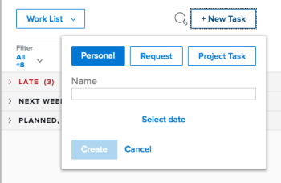
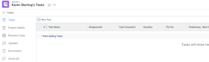
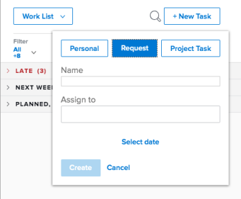

# Create work items from the Home area

You can create work items from the Home area. You can create personal tasks for yourself, request work from other users, or add tasks to specific projects.

## Access requirements

You must have the following access to perform the steps in this article:

<table cellspacing="0"> 
 <col> 
 <col> 
 <tbody> 
  <tr> 
   <td role="rowheader">Adobe Workfront plan*</td> 
   <td> 
Any
 </td> 
  </tr> 
  <tr> 
   <td role="rowheader">Adobe Workfront license*</td> 
   <td> 
Work or higher
 </td> 
  </tr> 
  <tr> 
   <td role="rowheader">Access level configurations*</td> 
   <td> 
Worker
 
Note: If you still don't have access, ask your Workfront administrator if they set additional restrictions in your access level. For information on how a Workfront administrator can modify your access level, see <a href="../../../administration-and-setup/add-users/configure-and-grant-access/create-modify-access-levels.md" class="MCXref xref">Create or modify custom access levels</a>.
 </td> 
  </tr> 
  <tr> 
   <td role="rowheader">Object permissions</td> 
   <td> 
Edit access or higher on tasks
 
For information on requesting additional access, see <a href="../../../workfront-basics/grant-and-request-access-to-objects/request-access.md" class="MCXref xref">Request access to objects in Adobe Workfront</a>.
 </td> 
  </tr> 
 </tbody> 
</table>

&#42;To find out what plan, license type, or access you have, contact your Workfront administrator.

## Create a personal task

You can create a personal task that is available only to you in the Home area:

1. Click the **Main Menu**  in the upper-right corner, then click&nbsp;**Home**. 
1. Click **New Task** >&nbsp;**Personal**.  
  
   

1. In the **Name** field, specify a name for the task.
1. (Optional) Click&nbsp;**Select date**, then select the&nbsp;date when the task is due. This sets the Planned Completion Date for the task.  
   You can change the **Planned Completion Date** by clicking on the date in the right panel or editing the **This will be done by** date directly in the task.

1. Click **Create**&nbsp;to save the task.  
   The task is assigned to you and is available in the Home area.

>[!NOTE]
>
>When you create a personal task, it is stored in a "hidden" project that is not searchable in Workfront. You can only access this project when you delete a task on it (from the task itself, not from the Home area).  
>>

## Request work from another user

You can request work from another user directly from the Home area. When you request work from another user as described in this section, the task is displayed as a request in the user's Home area until the user clicks **Work On It**.

To request work from another user from the Home area:

1. Click the **Main Menu**  in the upper-right corner, then click&nbsp;**Home**. 
1. Click **New Task**, then select **Request**.  
   

1. In the **Name** field, specify a name for the task.&nbsp;
1. In the **Assign to** field, begin typing the name of the user,&nbsp;team, or role who you want to assign, then click the name when it appears in the drop-down menu.
1. In the Add As drop-down menu, select whether to add a task or issue.&nbsp;
1. Click&nbsp;**Select date**, then select the&nbsp;date and time when the task is due.
1. Click **Create** to save the task.  
   The task is displayed as a work request in the Home area of the user you designated.

## Add a task or issue to a project

You can add a task or issue to an existing project directly from the Home area:

1. Click the **Main Menu**  in the upper-right corner, then click&nbsp;**Home**. 
1. Click **New Task**, then select **Project Task**.  
   

1. In the **Name** field, specify a name for the task or issue.
1. In the **Assign to** field, begin typing the name of the user,&nbsp;team, or role who you want to assign, then click the name when it appears in the drop-down menu.
1. Begin typing the name of the project where you want to create the task or issue, then click the name when it appears in the drop-down menu.

   >[!IMPORTANT]
   >
   >The task or issue appears on the Work List only when the project Status is set to Current.

1. (Conditional) To create an issue, select **Issue** from the **Add As** drop-down menu. By default, **Task** is selected.

1. Click&nbsp;**Select date**, then select the&nbsp;date and time when the task is due.
1. Click **Create** to save the task.

