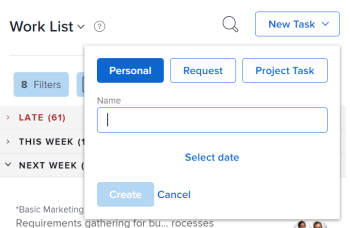
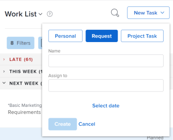
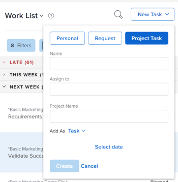

# Create work items from the Home area

<!--

(NOTE: From Courtney: Need to rename)

-->

You can create work items from the [!UICONTROL Home] area. You can create personal tasks for yourself, request work from other users, or add tasks to specific projects.

## Access requirements

You must have the following access to perform the steps in this article:

<table style="table-layout:auto"> 
 <col> 
 <col> 
 <tbody> 
  <tr> 
   <td role="rowheader"><strong>[!DNL Adobe Workfront plan*]</strong></td> 
   <td> 
Any
 </td> 
  </tr> 
  <tr> 
   <td role="rowheader"><strong>[!DNL Adobe Workfront] license*</strong></td> 
   <td> 
[!UICONTROL Work] or higher
 </td> 
  </tr> 
  <tr> 
   <td role="rowheader"><strong>Access level configurations*</strong></td> 
   <td> 
[!UICONTROL Worker]
 
<b>NOTE</b>
 
   
If you still don't have access, ask your [!DNL Workfront] administrator if they set additional restrictions in your access level. For information on how a [!DNL Workfront] administrator can modify your access level, see <a href="../../../administration-and-setup/add-users/configure-and-grant-access/create-modify-access-levels.md" class="MCXref xref">Create or modify custom access levels</a>.
 </td> 
  </tr> 
  <tr> 
   <td role="rowheader"><strong>Object permissions</strong></td> 
   <td> 
[!UICONTROL Edit] access or higher on tasks
 
For information on requesting additional access, see <a href="../../../workfront-basics/grant-and-request-access-to-objects/request-access.md" class="MCXref xref">Request access to objects </a>.
 </td> 
  </tr> 
 </tbody> 
</table>

&#42;To find out what plan, license type, or access you have, contact your [!DNL Workfront] administrator.

## Create a personal task

You can create a personal task that is available only to you in the [!UICONTROL Home] area:

1. Click the **[!UICONTROL Main Menu]**  in the upper-right corner, then click **[!UICONTROL Home]**.
1. Click **[!UICONTROL New Task]** > **[!UICONTROL Personal]**.

   

1. In the **[!UICONTROL Name]** field, specify a name for the task.
1. (Optional) Click **[!UICONTROL Select date]**, then select the date when the task is due. This sets the [!UICONTROL Planned Completion Date] for the task.\
   You can change the **[!UICONTROL Planned Completion Date]** by clicking on the date in the right panel or editing the **[!UICONTROL This will be done by]** date directly in the task.

1. Click **[!UICONTROL Create]** to save the task.\
   The task is assigned to you and is available in the [!UICONTROL Home] area.

>[!NOTE]
>
>* When you create a personal task, it is stored in a "hidden" project that is not searchable in [!UICONTROL Workfront]. The project is named "< User Name >'s Tasks". The "User Name" is the full name of the user who created the task. You can access this project only when you click the personal task in the [!UICONTROL Home] area, from the breadcrumb of the task, for example. 
>
>* Unlike regular project tasks, personal tasks have a limited set of fields that are visible in the Workfront interface, and don't influence the timeline or the progress of any project. Reassigning a personal task to another user adds all task fields to a personal task, but the task remains on the personal project of the user who created the task.
>
>
>* Personal tasks display on timesheets only when they have hours logged or they are pinned to the timesheet. You can only pin a personal task to a timesheet only when there are hours logged for the task. For more information, see [Log time](../../../timesheets/create-and-manage-timesheets/log-time.md). 
> 
>* We recommend that you create a project and move any personal tasks to it, if you want to make personal tasks part of the regular workflow.
>
> ![[!UICONTROL Project for personal tasks]](assets/createworkitems-personal--project-350x105.png)

## Request work from another user

You can request work from another user directly from the Home area. When you request work from another user as described in this section, the task is displayed as a request in the user's Home area until the user clicks **[!UICONTROL Work On It]**.

To request work from another user from the [!UICONTROL Home] area:

1. Click the **[!UICONTROL Main Menu]**  in the upper-right corner, then click **[!UICONTROL Home]**.
1. Click **[!UICONTROL New Task]**, then select **[!UICONTROL Request]**.

   

1. In the **[!UICONTROL Name]** field, specify a name for the task. 
1. In the **[!UICONTROL Assign to]** field, begin typing the name of the user, team, or role who you want to assign, then click the name when it appears in the drop-down menu.
1. In the [!UICONTROL Add As] drop-down menu, select whether to add a task or issue. 
1. Click **[!UICONTROL Select date]**, then select the date and time when the task is due.
1. Click **[!UICONTROL Create]** to save the task.\
   The task is displayed as a work request in the [!UICONTROL Home] area of the user you designated.

## Add a task or issue to a project

You can add a task or issue to an existing project directly from the Home area:

1. Click the **[!UICONTROL Main Menu]**  in the upper-right corner, then click **Home**.
1. Click **[!UICONTROL New Task]**, then select **[!UICONTROL Project Task]**.

   

1. In the **[!UICONTROL Name]** field, specify a name for the task or issue.
1. In the **[!UICONTROL Assign to]** field, begin typing the name of the user, team, or role who you want to assign, then click the name when it appears in the drop-down menu.
1. Begin typing the name of the project where you want to create the task or issue, then click the name when it appears in the drop-down menu.

   >[!IMPORTANT]
   >
   >The task or issue appears on the [!UICONTROL Work List] only when the project [!UICONTROL Status] is set to [!UICONTROL Current].

1. (Conditional) To create an issue, select **[!UICONTROL Issue]** from the **[!UICONTROL Add As]** drop-down menu. By default, **[!UICONTROL Task]** is selected.

1. Click **[!UICONTROL Select date]**, then select the date and time when the task is due.
1. Click **[!UICONTROL Create]** to save the task.
