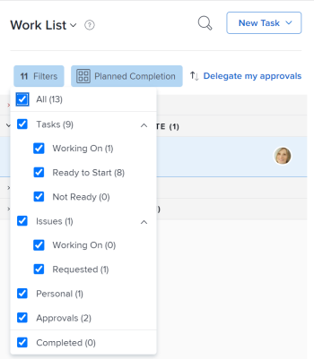
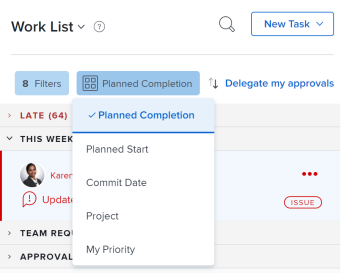
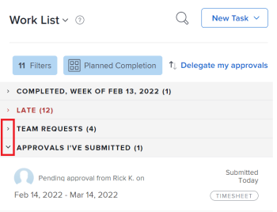

# Display items in the [!UICONTROL Work List] in the Home area

The [!UICONTROL Work List] in the [!UICONTROL Home] area displays all work items that are assigned to you. You can control which items display in the [!UICONTROL Work] List as described below.

>[!NOTE]
>
>When converting an issue to a task or a project, the issue is removed from the the Home area of the user assigned to the issue.
>
>When converting a task to a project, the task is deleted and it is removed from the Home area of the user assigned to the task.

## Access requirements

You must have the following access to perform the steps in this article:

<table style="table-layout:auto"> 
 <col> 
 </col> 
 <col> 
 </col> 
 <tbody> 
  <tr> 
   <td role="rowheader"><strong>[!DNL Adobe Workfront plan*]</strong></td> 
   <td> 
Any
 </td> 
  </tr> 
  <tr> 
   <td role="rowheader"><strong>[!DNL Adobe Workfront] license*</strong></td> 
   <td> 
[!UICONTROL Review] for approvals only
 
[!UICONTROL Work] or higher for all other objects
 </td> 
  </tr> 
  <tr> 
   <td role="rowheader"><strong>Access level configurations*</strong></td> 
   <td> 
[!UICONTROL View] or higher access to Projects, Tasks, Issues, and Documents
 
Note: If you still don't have access, ask your [!DNL Workfront] administrator if they set additional restrictions in your access level. For information on how a [!DNL Workfront] administrator can modify your access level, see <a href="../../../administration-and-setup/add-users/configure-and-grant-access/create-modify-access-levels.md" class="MCXref xref">Create or modify custom access levels</a>.
 </td> 
  </tr> 
  <tr> 
   <td role="rowheader"><strong>Object permissions</strong></td> 
   <td> 
Contribute permissions or higher to the tasks and issues you need to work on
 
For information on requesting additional access, see <a href="../../../workfront-basics/grant-and-request-access-to-objects/request-access.md" class="MCXref xref">Request access to objects</a>.
 </td> 
  </tr> 
 </tbody> 
</table>

&#42;To find out what plan, license type, or access you have, contact your [!DNL Workfront] administrator.

## Filter the [!UICONTROL Work List]

You can filter items in the [!UICONTROL Work List] to see only specific types of items. For example, you can filter the [!UICONTROL Work List] to display only issues or requests.

>[!NOTE]
>
>The filter options are stored in the browser. If you consistently use the same browser on the same computer (and do not clear the site data) the selected filters do not change. If you switch browsers or computers then the filters revert to the default option which is with all filters deselected.

1. Click the **[!UICONTROL Main Menu]**  in the upper-right corner, then click **[!UICONTROL Home]**.
1. Click the **[!UICONTROL Filter]**  drop-down menu.
1. Select from the following filter options to specify the type of items you want to display:

   <table style="table-layout:auto"> 
    <col> 
    <col> 
    <tbody> 
     <tr> 
      <td role="rowheader"><strong>[!UICONTROL All]</strong></td> 
      <td>Displays and selects all items. This includes tasks, issues, approvals, personal tasks, and completed tasks and issues. </td>
     </tr> 
     <tr> 
      <td role="rowheader"><strong>[!UICONTROL Tasks Working On]</strong></td> 
      <td> 
Displays only tasks that you are actively working on. These are tasks assigned to you for which you have clicked the [!UICONTROL Work On It] button.
 </td> 
     </tr> 
     <tr> 
      <td role="rowheader"><strong>[!UICONTROL Tasks Ready to Start]</strong></td> 
      <td> 
       
 
        
Displays only tasks that are ready for you to start. Both of the following statements must be true:
 
        <ul> 
         <li> 
The tasks and their parents have no predecessors or task constraints preventing them from being worked on.
 </li> 
         <li> 
The [!UICONTROL Planned Start Date] of the tasks is in the past or up to two weeks in the future.
 </li> 
        </ul> 
       
 </td> 
     </tr> 
     <tr> 
      <td role="rowheader"><strong>[!UICONTROL Tasks Not Ready]</strong></td> 
      <td> 
       
 
        
Displays only tasks that are not yet ready to start. Either one of the following statements must be true:
 
        <ul> 
         <li> 
The tasks and their parents might have predecessors or task constraints that prevent them from being worked on.
 </li> 
         <li> 
The tasks have a [!UICONTROL Planned Start Date] that is more than two weeks in the future.
 </li> 
        </ul> 
       
 </td> 
     </tr> 
     <tr> 
      <td role="rowheader"><strong>[!UICONTROL Issues Working On]</strong></td> 
      <td> 
Displays only issues that you are actively working on. These are issues assigned to you for which you have clicked the [!UICONTROL Work On It] button.
 </td> 
     </tr> 
     <tr> 
      <td role="rowheader"><strong>[!UICONTROL Issues Requested]</strong></td> 
      <td>Displays only issues that you are assigned to but for which you have not clicked the [!UICONTROL Work On It] button.</td> 
     </tr> 
     <tr> 
      <td role="rowheader"><strong>Personal</strong></td> 
      <td>Displays only personal tasks. These are tasks that you create as a [!UICONTROL To Do] task, as described in the section <a href="../../../workfront-basics/using-home/using-the-home-area/create-work-items-in-home.md#creating-a-personal-task">Create a personal task</a> in the article <a href="../../../workfront-basics/using-home/using-the-home-area/create-work-items-in-home.md">Create work items from the [!UICONTROL Home] area</a>.</td> 
     </tr> 
     <tr> 
      <td role="rowheader"><strong>[!UICONTROL Approvals]</strong></td> 
      <td> 
       
 
        
Displays only approvals assigned or delegated to you and approvals you have submitted. Approvals include approvals on work items (projects, tasks, and issues), and approvals for documents, proofs, requests for access, and timesheets. For more information about approvals, see the following articles:
 
        <ul> 
         <li><a href="../../../review-and-approve-work/manage-approvals/view-approvals.md" class="MCXref xref">View approvals</a> </li> 
        </ul> 
        <ul> 
         <li> 
<a href="../../../review-and-approve-work/manage-approvals/manage-approvals.md" class="MCXref xref">Work approvals</a> 
 </li> 
        </ul> 
        
Note: Approvals that you submitted and where you are also one of the approvers are counted twice.
 
       
 </td> 
     </tr> 
     <tr> 
      <td role="rowheader"><strong>[!UICONTROL Completed]</strong></td> 
      <td> 
Displays only completed tasks, issues, and personal tasks. Completed work displays for the previous two weeks and it is grouped in the Work List according to the week in which they were completed. Approvals are not included.
 
Completed work is hidden in the [!UICONTROL Work List] unless you select this filter.
 </td> 
     </tr> 
    </tbody> 
   </table>

   

   >[!TIP]
   >
   >* Filter options are based on objects (Tasks, Issues, Approvals, Personal tasks).
   >* Tasks and issues are further filtered by their state in relationship with our readiness to work on them ([!UICONTROL Working On], [!UICONTROL Ready to Start], [!UICONTROL Not Ready] for tasks, and [!UICONTROL Working On] and [!UICONTROL Requested] for issues). You can select to display tasks or issues in a specific state or click Tasks or Issues to select and display all states.
   >* There is a separate filter for completed items and it includes both tasks and issues. This does not include approvals. The [!UICONTROL Completed] filter includes Personal tasks.
   >* You can select only one state at a time. For example, you can display only [!UICONTROL Working On] tasks and only [!UICONTROL Requested] issues.
   >* You cannot apply filters for items assigned to one of your teams and they are not included in the items that are assigned directly to you.

1. (Optional) Further organize the [!UICONTROL Work List], as described in the section [Group and sort by Date, Project, and Priority](#group-and-sort-by-date-project-and-priority) in this article.

## Group and sort by [!UICONTROL Date], [!UICONTROL Project], and [!UICONTROL Priority] 

You can group and sort the [!UICONTROL Work List] by [!UICONTROL Planned Completion Date], [!UICONTROL Commit Date], [!UICONTROL Project], or [!UICONTROL My Priority]. The option you choose determines how items are grouped in the [!UICONTROL Work List].

1. Click the **[!UICONTROL Main Menu]**  in the upper-right corner, then click **[!UICONTROL Home]**.
1. Click the **[!UICONTROL Group by]** drop-down menu.

   

1. Select from the following options:

   <table style="table-layout:auto"> 
    <col> 
    <col> 
    <tbody> 
     <tr> 
      <td role="rowheader"><strong>[!UICONTROL Planned Completion]</strong></td> 
      <td> 
 Items display in the following groupings in the [!UICONTROL Work List], depending on their [!UICONTROL Planned Completion Date] (the number of items contained within each grouping displays in parenthesis next to the heading title):
 
       <ul> 
        <li> 
[!UICONTROL Late]
 </li> 
        <li> 
[!UICONTROL No Planned Completion Date]
 </li> 
        <li> 
[!UICONTROL This Week]
 
This grouping is expanded by default.
 </li> 
        <li> 
[!UICONTROL Next Week]
 </li> 
        <li> 
[!UICONTROL Planned], followed by various [!UICONTROL Planned Completion Dates] (multiple groupings)
 </li> 
        <li> 
[!UICONTROL Complete]
 </li> 
       </ul> </td> 
     </tr> 
     <tr> 
      <td role="rowheader"><strong>[!UICONTROL Planned Start]</strong></td> 
      <td> 
Items display in the following groupings in the [!UICONTROL Work List], depending on their [!UICONTROL Planned Start Date] (the number of items contained within each grouping displays in parenthesis next to the heading title):
 
       <ul> 
        <li> 
[!UICONTROL Late]
 </li> 
        <li> 
[!UICONTROL This Week] 
 
This grouping is expanded by default.
 </li> 
        <li> 
[!UICONTROL Next Week]
 </li> 
        <li> 
[!UICONTROL Planned], followed by various [!UICONTROL Planned Start Dates] (multiple groupings)
 </li> 
       </ul> </td> 
     </tr> 
     <tr> 
      <td role="rowheader"><strong>[!UICONTROL Commit Date]</strong></td> 
      <td> 
Items display in the following groupings in the [!UICONTROL Work List] (the number of items contained within each grouping displays in parenthesis next to the heading title):
 
       <ul> 
        <li> 
[!UICONTROL No Commit Date]
 </li> 
        <li> 
[!UICONTROL Committed Next Week]
 </li> 
       </ul> </td> 
     </tr> 
     <tr> 
      <td role="rowheader"><strong>[!UICONTROL Project]</strong></td> 
      <td>Items are grouped according to project, and projects appear alphabetically in the [!UICONTROL Work List]. (The number of items contained within each grouping displays in parenthesis next to the heading title.)</td> 
     </tr> 
     <tr> 
      <td role="rowheader"><strong>[!UICONTROL My Priority]</strong></td> 
      <td>Items display in an order you choose. For more information, see <a href="../../../workfront-basics/using-home/using-the-home-area/prioritize-work-in-home.md" class="MCXref xref">Prioritize work in the [!UICONTROL Home] area</a>.</td> 
     </tr> 
    </tbody> 
   </table>

>[!NOTE]
>
>The default sorting is ascending.. If you change the sorting to descending , the selected sorting options are stored in the browser. If you consistently use the same browser on the same computer (and do not clear the site data) the sorting does not change, but if you switch browsers or computers then the sorting changes to the default sorting.

## View late items

[!DNL Adobe Workfront] uses the following dates to determine if work requests are late:

* **Tasks**: [!UICONTROL Planned Completion Date]
* **Issues**: [!UICONTROL Planned Completion Date]
* **Documents**: [!UICONTROL Submitted date]
* **Timesheets**: [!UICONTROL Submitted date]
* **Approvals**: [!UICONTROL Submitted date]
* **Proof approvals**: [!UICONTROL Proof deadline]

## Search the [!UICONTROL Work List]

When you search the [!UICONTROL Work List], any items assigned to you are returned in the search (even items that are not currently loaded on the screen). If the [!UICONTROL Show complete] option is selected, any items you marked complete within the past two weeks are also returned.

In addition, only the names of the work items are searched (information within the work item are not searched, neither are the names of the projects where the work item resides).

To search the [!UICONTROL Work List]:

1. Click the **[!UICONTROL Main Menu]**  in the upper-right corner, then click **[!UICONTROL Home]**.
1. (Optional) Filter the [!UICONTROL Work List], as described in [Filter the [!UICONTROL Work List]](#filter-the-work-list) and [Group and sort by Date, Project, and Priority](#group-and-sort-by-date-project-and-priority).

1. (Optional) If you are searching for a work item that is already complete, you must configure the [!UICONTROL Work List] to display completed items before searching.
1. 

1. Begin typing the name of the item name you are searching for.\
   The [!UICONTROL Work List] is automatically filtered as to include items with a matching name.

## Change the size of the Work List

You can change the size of the [!UICONTROL Work List] so that it consumes anywhere between about a quarter of the Home area to about half of the [!UICONTROL Home] area.

1. Click the **[!UICONTROL Main Menu]**  in the upper-right corner, then click **[!UICONTROL Home]**.
1. Mouse over the right edge of the [!UICONTROL Work List], then drag left or right until the Work List is the desired size.

## Collapse and expand groupings

Items in the [!UICONTROL Work List] are displayed within groupings. You can collapse and expand groupings to control how much information is displayed on the page at a given time.

You can collapse and expand groupings within the [!UICONTROL Work List] to better control what information is visible.\
By default, the [!UICONTROL This Week] grouping is expanded and all other groupings are collapsed. Any changes you make are remembered the next time you access the Home area.

1. Click the **[!UICONTROL Main Menu]**  in the upper-right corner, then click **[!UICONTROL Home]**.
1. Click the **[!UICONTROL Expand]** or **[!UICONTROL Collapse]** arrow next to any grouping you want to expand or collapse.

   

   Or\
   To expand or collapse all groupings simultaneously, click the **[!UICONTROL Expand]** or **[!UICONTROL Collapse]** arrow next to any grouping while holding down the [!UICONTROL Shift] key.
