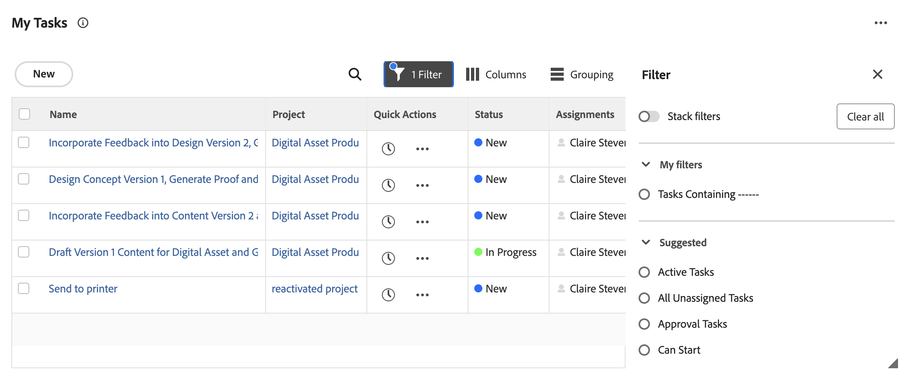
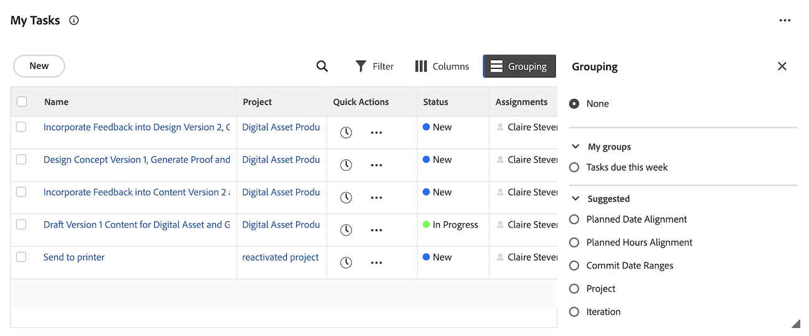
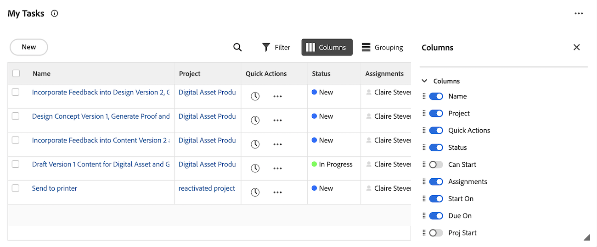

# Display items in the [!UICONTROL worklist] in the [!UICONTROL Home] area

<!-- Audited: 1/2024 -->

Each widget contains its own worklist. Worklists display all work items that are assigned to you. You can control which items display in your [!UICONTROL worklist], by using filters and groupings.

>[!IMPORTANT]
>
>* To display tasks and issues in the Home widgets, their parent project must be in Current status or a status that equates current.
>* Projects must also be in Current status or a status that equates current to display in Home.

## Access requirements

 +++ Expand to view access requirements for the functionality in this article.

You must have the following access to perform the steps in this article:

<table style="table-layout:auto"> 
 <col> 
 </col> 
 <col> 
 </col> 
 <tbody> 
  <tr> 
   <td role="rowheader"><strong>[!DNL Adobe Workfront plan]</strong></td> 
   <td> 
Any
 </td> 
  </tr> 
  <tr> 
   <td role="rowheader"><strong>[!DNL Adobe Workfront] license</strong></td> 
   <td> 
New:
<ul><li>[!UICONTROL Contributor] for approvals only</li> <li>[!UICONTROL Standard] or higher for all other objects</li> 
Or
 
  </ul>
Current:
<ul><li>[!UICONTROL Review] for approvals only</li> <li>[!UICONTROL Work] or higher for all other objects</li> </td> 
  </tr> </ul>
  <tr> 
   <td role="rowheader"><strong>Access level configurations</strong></td> 
   <td> 
[!UICONTROL View] or higher access to Projects, Tasks, Issues, and Documents
 </td> 
  </tr> 
  <tr> 
   <td role="rowheader"><strong>Object permissions</strong></td> 
   <td> 
Contribute permissions or higher to the tasks and issues that you need to work on
  </td> 
  </tr> 
 </tbody> 
</table>

For more detail about the information in this table, see [Access requirements in Workfront documentation](/help/quicksilver/administration-and-setup/add-users/access-levels-and-object-permissions/access-level-requirements-in-documentation.md).

+++

## Requirements for work items to display in the worklist

There are built-in requirements for which work items display in certain widget work list. Work items must meet these requirements in order to appear in the following widget's worklists. 

### My tasks widget

Tasks must meet the following requirements to appear in the My Tasks widget:

* The task status does not equate with Complete.
* The logged in user must be assigned to the task.
* The task status is not equal to Done.
* The project the task belongs to must be in a status that equates with Current. 

### My issues widget

Issues must meet the following requirements to appear in the My Issues widget:

* The logged in user must be assigned to the issue.
* The issue status does not equate with Complete.
* There is not a unresolved object attached to the issue.
* The issue status is not equal to Done.
* The project the issue belongs to must be in a status that equates with Current. 

### My teams widget

Team requests must meet the following requirements to appear in the My Teams widget:

* The logged in user belongs to the team the work item is assigned to.
* The work item status does not equate with Complete.
* The work item does not have an unresolved approval process attached. 
* The work item is not a recurring task.
* The project the work item belongs to must be in a status that equates with Current. 

## Filter your work

You can filter items in a widget's [!UICONTROL Worklist] to see only specific types of items. For example, you can filter the My Work [!UICONTROL Worklist] to display only issues or requests.

>[!NOTE]
>
>The filter options are stored in the browser. If you consistently use the same browser on the same computer (and do not clear the site data) the selected filters, do not change. If you switch browsers or computers, then the filters revert to the default option, which is with all filters deselected.

To filter your work:

1. Click the **[!UICONTROL Main Menu]**  in the upper-right corner, then click **[!UICONTROL Home]**.
1. (Conditional) Click **Customize** to add any of the following widgets:

   | Widget         | Description                                                                                      |
   |--------------|---------------------------------------------------------------------------------------------------|
   | Boards       | Displays any boards that you have created or have been invited to use                                                               |
   | My Work      | Displays tasks and issues assigned to you                                                                      |
   | My Projects  | Displays projects that you own or projects you are on                                                     |
   | My Tasks     | Displays tasks assigned to you                                                                    |
   | My Issues    | Displays issues assigned to you                                                                   |
   | My Requests  | Displays all requests that you have submitted                                                                 |
   | My Approvals | Displays all of your pending, assigned, delegated, and submitted approvals    |

1. Click the **Filter** icon  in the right-top corner of the widget worklist. 
1. Choose a **Suggested** filter or a filter that you have created. 
   For detailed information on suggested filters, see [Home widget filters overview](/help/quicksilver/workfront-basics/using-home/using-the-home-area/widget-filter-overview-home.md).
1. (Optional) Toggle **Stack filters** on to select multiple filter options. 

   

## Group your work

You can group the widget [!UICONTROL worklist] to keep your work items organized.

To group your worklist:

1. Click the **[!UICONTROL Main Menu]**  in the upper-right corner, then click **[!UICONTROL Home]**.
1. (Conditional) Click **Customize** to add any of the following widgets:

   | Widget         | Description                                                                                      |
   |--------------|---------------------------------------------------------------------------------------------------|
   | Boards       | Displays any boards that you have created or have been invited to use                                                               |
   | My Work      | Displays tasks and issues assigned to you                                                                      |
   | My Projects  | Displays projects that you own or projects you are on                                                     |
   | My Tasks     | Displays tasks assigned to you                                                                    |
   | My Issues    | Displays issues assigned to you                                                                   |
   | My Requests  | Displays all requests that you have submitted                                                                 |
   | My Approvals | Displays all of your pending, assigned, delegated, and submitted approvals    |

1. Click the **Group** icon  in the right-top corner of the widget worklist. 
1. Choose a **Suggested** grouping or a grouping that you have created. 
   

## Customize worklist columns

You can choose which columns appear in the widget worklist:

1. Click the **[!UICONTROL Main Menu]**  in the upper-right corner, then click **[!UICONTROL Home]**.
1. (Conditional) Click **Customize** to add any of the following widgets:

   | Widget         | Description                                                                                      |
   |--------------|---------------------------------------------------------------------------------------------------|
   | Boards       | Displays any boards that you have created or have been invited to use                                                               |
   | My Work      | Displays tasks and issues assigned to you                                                                      |
   | My Projects  | Displays projects that you own or projects you are on                                                     |
   | My Tasks     | Displays tasks assigned to you                                                                    |
   | My Issues    | Displays issues assigned to you                                                                   |
   | My Requests  | Displays all requests that you have submitted                                                                 |
   | My Approvals | Displays all of your pending, assigned, delegated, and submitted approvals    |

1. Click the **Column** icon  in the right-top corner of the widget worklist. 
1. Toggle the columns on or off depending on your preferences. 
1. (Optional) Click the **Drag** icon  to reorder the columns. 
   

## View late items

[!DNL Adobe Workfront] uses the following dates to determine if work requests are late:

* **Tasks**: [!UICONTROL Planned Completion Date]
* **Issues**: [!UICONTROL Planned Completion Date]
* **Documents**: [!UICONTROL Submitted date]
* **Timesheets**: [!UICONTROL Submitted date]
* **Approvals**: [!UICONTROL Submitted date]
* **Proof approvals**: [!UICONTROL Proof deadline]

