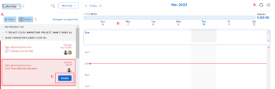
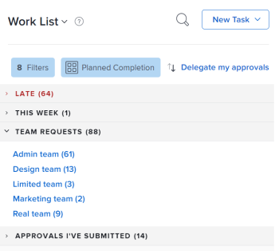
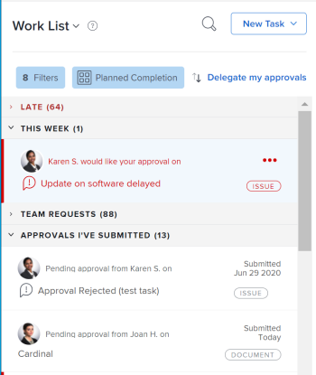
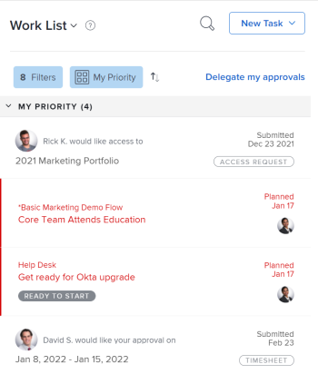
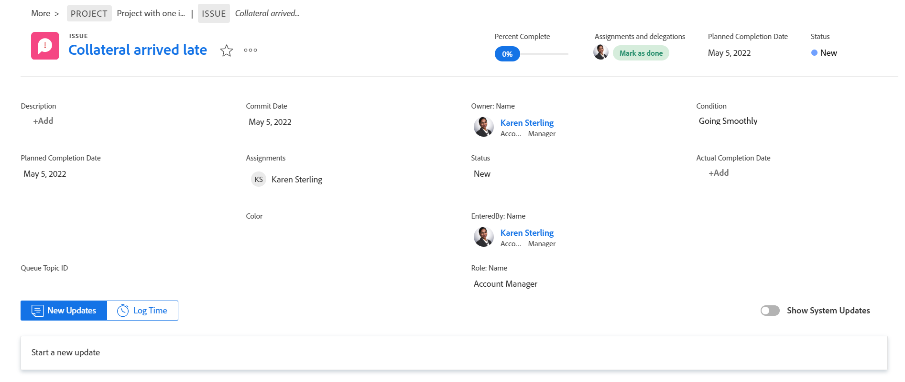
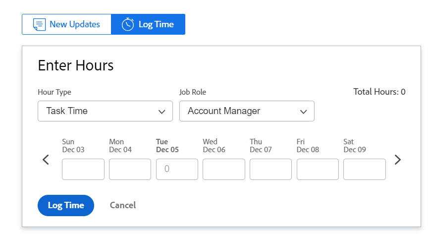

# Get started with [!UICONTROL Home]

<!--Audited: 12/2023-->

This article describes an overview of the current [!UICONTROL Home] area in [!DNL Adobe Workfront]. For information about working in the new [!UICONTROL Home], see [Get started with New Home](../new-home/get-started-with-new-home.md).

There are two ways to view your work in the current [!UICONTROL Home] area:

* From the [!UICONTROL Work List] 
* From the [!UICONTROL Calendar].

## [!UICONTROL Work List]

You can view all of your assigned work in one place, in the [!UICONTROL Work List]:

![[!UICONTROL Work List] panels](assets/worklist-and-right-panel-home.png)

Review the following sections in the current [!UICONTROL Home] area, as highlighted in the above image: 

* **A**: Use the left panel to filter, sort, and select work assigned to you.

* **B**: After selecting a work item in the left panel, use the right panel to interact with custom fields, make updates, and log time.

For more information about using the [!UICONTROL Home Work List], see the following articles:

* [Display items in the [!UICONTROL Work List] in the [!UICONTROL Home] area](../../../workfront-basics/using-home/using-the-home-area/display-items-in-home-work-list.md)
* [Create work items from the [!UICONTROL Home] area](../../../workfront-basics/using-home/using-the-home-area/create-work-items-in-home.md)

## [!UICONTROL Calendar]

You can visualize your work by displaying when work items are due and you can block out time to complete them, by reviewing your work in the [!UICONTROL Calendar] in the [!UICONTROL Home] area: 

Review the following sections in the current [!UICONTROL Home] area, as highlighted in the above image: 

* **A**: Use the [!UICONTROL Calendar] view to create a visual map of the work you need to complete. Simply click and drag work items from the [!UICONTROL Work List] on to the [!UICONTROL Calendar] to block out time to work.

* **B**: Use the [!UICONTROL Calendar]'s sync option to sync with your [!DNL Outlook] calendar. Manage meetings and work all in one place.

* **C**: Use the [!UICONTROL Details] button to open a new right panel where you can view more information about the work item.

* **D**: Use the due bar to keep track of when work assigned to you is due.

For more information on how to use the Home Calendar, see [Use the [!UICONTROL Home Calendar] view](../../../workfront-basics/using-home/using-the-home-area/use-home-calendar-view.md).

## Find your work

The [!UICONTROL Home] area is your one-stop shop to find tasks, issues, and approvals assigned to you. The filter, grouping, and sorting options work together to support you in organizing your work items the way you want. You can use groupings to group items together, filters to focus in on work that needs to be completed, and lastly, sorting to list the items in the ascending or descending order of your grouping.

>[!NOTE]
>
>The filter and sort options are stored in the browser. If you consistently use the same browser on the same computer (and do not clear the site data) the filters and sorting will not change, but if you switch browsers or computers then the filters and sorting will be different.

### Group similar work items together with groupings

You can use groupings to display like items under a common header in the Work List. You can group items by:

* [!UICONTROL Planned Completion]
* [!UICONTROL Planned Start]
* [!UICONTROL Commit Date]
* [!UICONTROL Project]
* [!UICONTROL My Priority]

For more information on how to use groupings, see [Display items in the [!UICONTROL Work List] in the [!UICONTROL Home] area](../../../workfront-basics/using-home/using-the-home-area/display-items-in-home-work-list.md).

### Narrow your focus with filters

The [!UICONTROL Work List] Filter allows you to narrow your focus to specific work items.

The following are examples of how you can filter items you view in Home: 

* Filter by item type and state.

   For example, if you want to display all the tasks, you can select the [!UICONTROL Tasks] filter. If you want to be more specific than this and display only tasks that are ready for you to start working on, then select the [!UICONTROL Ready to Start] filters under the [!UICONTROL Tasks] filter.

* Filter by item type only.

   For example, you can select [!UICONTROL Issues] to see all issues in all states ([!UICONTROL Working On] or [!UICONTROL Requested]), or [!UICONTROL Approvals] to see all work item, request for access, timesheet, document, and proof approvals.

For more information on how to use filters, see [Display items in the [!UICONTROL Work List] in the [!UICONTROL Home] area](../../../workfront-basics/using-home/using-the-home-area/display-items-in-home-work-list.md).

### Access work assigned to your team

The [!UICONTROL Home] area has a permanent grouping ([!UICONTROL Team Requests]) that displays tasks and issues assigned to your teams. Teams display in this section. Clicking the name of a team opens the Team Requests page of that team. 

>[!NOTE]
>
>The filter and sorting options do not affect the [!UICONTROL Team Requests] grouping. This grouping is visible as long as you have work assigned to your team.

For more information on accessing team requests, see the article [[!UICONTROL Manage] work and team requests in the [!UICONTROL Home] area](../../../workfront-basics/using-home/using-the-home-area/manage-work-and-team-requests-home.md).

### Monitor work that you submitted

Keep track of work that you submitted for approval directly from [!UICONTROL Work List]. There is a permanent grouping for [!UICONTROL Approvals I've Submitted] when you select to view [!UICONTROL Approvals] in the [!UICONTROL Work List]. You can remind the approver about the work that needs approval. You can also recall the approval if needed.

>[!NOTE]
>
>The filter and sorting  do not affect the [!UICONTROL Approvals I've Submitted] grouping. This grouping is visible as long as you have work waiting for approval.
>
>The number of approvals in the [!UICONTROL Approvals] filter does not display the number of items you submitted for approval. The [!UICONTROL Approvals] filter displays only the items waiting for your approval. 

## Prioritize what's important to you

The [!UICONTROL Work List] allows you to surface and prioritize work that is important to you with the [!UICONTROL My Priority] grouping. You can add up to 20 items to your [!UICONTROL My Priority] list. 

>[!NOTE]
>
>Any work items added to [!UICONTROL My Priority] are visible only to you, and no one can prioritize work for you.

For more information on how to use [!UICONTROL My Priority], see [Prioritize work in the [!UICONTROL Home] area](../../../workfront-basics/using-home/using-the-home-area/prioritize-work-in-home.md).

## Get it done

After clicking the name of an item in the [!UICONTROL Work List], use the right panel in [!UICONTROL Home] to update and complete your work.

### Work in a space customized for you

Your [!DNL Workfront] administrator can add up to 16 custom fields to items in the [!UICONTROL Work List ]to make it easier to find and update the information you need. Most of the fields are editable, so you don't have to navigate into the work item.

To update any of the fields in this area, simply click a field. If the field is editable, you can modify it in the right panel. 

>[!NOTE]
>
>You can't update the [!UICONTROL Commit Date] if this field is added to a work item from a layout template.

### Update others with important information

Communicate quickly and efficiently with others from the [!UICONTROL Home] area. Using the commenting area of a work item, you can ask questions, notify others of recent updates, or reply to direct comments from the [!UICONTROL Home] area. In addition, you can update others on the progress you're making by:

* Updating the [!UICONTROL Commit Date] in the commenting area

   >[!NOTE]
   >
   >   This is the only place where you can update the Commit Date in Home.  

* Reporting on how you feel things are going by adding a comment or updating the [!UICONTROL Condition] of an item
* Updating the percent complete bar

For more information on communicating in the [!UICONTROL Home] area, see [Update work](../../../workfront-basics/updating-work-items-and-viewing-updates/update-work.md).

### Log your time

Keep track of the hours you've worked on individual work items. You can choose a general hour type, such as [!UICONTROL Task Time], or you can choose a project-specific hour type set up by your [!DNL Workfront] administrator.

For more information on how to log time in the [!UICONTROL Home] area, see the section [Home](../../../timesheets/create-and-manage-timesheets/log-time.md#home) in the article [Log time](../../../timesheets/create-and-manage-timesheets/log-time.md).

