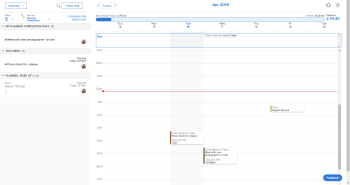
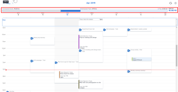

# [!UICONTROL Home Calendar] view

<!--

Updated for QS except for section about expanding a work item in the list--this isn't working yet in QS.

-->

The [!UICONTROL Home Calendar] view in the [!UICONTROL Home] area allows you to view and manage your work week and work assignments on a personal work calendar visible only to you. You can use it to schedule when you want to do your work. And you can integrate it with outside calendars such as a [!UICONTROL Microsoft Outlook] calendar. 

>[!NOTE]
>
>The [!UICONTROL Home Calendar] view is different from [!UICONTROL Calendar] reports. For more information about [!UICONTROL Calendar] reports, see [[!UICONTROL Calendar] reports overview](../../../reports-and-dashboards/reports/calendars/calendar-reports-overview.md).

If you need instructions on setting up your [!UICONTROL Home Calendar], see [Configure your [!UICONTROL Home Calendar] view settings](../../../workfront-basics/using-home/using-the-home-area/configure-home-calendar-view.md).

For information about accessing the [!UICONTROL Home Calendar] view, see [View the [!UICONTROL Home Calendar]](../../../workfront-basics/using-home/using-the-home-area/view-home-calendar.md).

For information integrating your [!UICONTROL Home Calendar] with an outside calendar, see [[!UICONTROL Configure your [!UICONTROL Home Calendar]] view settings](../../../workfront-basics/using-home/using-the-home-area/configure-home-calendar-view.md).

The remaining sections in this article explain sections and functions of the [!UICONTROL Home Calendar] View in more detail.

## Work list on the [!UICONTROL Home Calendar] 

Work items (Tasks, Issues, Requests, and Approvals) assigned to you, your groups, your teams, and your roles display in the [!UICONTROL work list] on the left of the Calendar in the [!UICONTROL Home] area.

You can drag your work items from the [!UICONTROL work list] to your [!UICONTROL Home Calendar] to schedule when you want to work on them. To learn more about scheduling your work, see [Use the [!UICONTROL Home Calendar] view](../../../workfront-basics/using-home/using-the-home-area/use-home-calendar-view.md).

You can click a work item in the list to view and update your progress on it.

Depending on the item, the following information might display on the left of the calendar, for the item that you select in the work list:

* **[!UICONTROL Project name]**: Displays in the top left of the work item. This is the project to which the item is associated. In the example above, the project title is "Fall in 2020 campaign."
* **[!UICONTROL Work item name]**: Displays beneath the project name. In the example above, the title of the work item is "September 15 issue."
* **[!UICONTROL Done]**: Click this button to change the status of your work assignment to [!UICONTROL Done]. This button only displays when you are assigned to the task or issue.
* **[!UICONTROL Done with my part]**: Click the [!UICONTROL Done with my part] button to change the status of your work assignment to [!UICONTROL Done].
* **[!UICONTROL Planned]**: Displays the hours a resource manager has allocated for work to be completed on the item. To learn more about planned hours, see [Planned Hours overview](../../../manage-work/tasks/task-information/planned-hours.md).

* **[!UICONTROL Logged]**: Displays the hours you have logged on the work item in either a timesheet or the [!UICONTROL Updates] tab for the item. To learn more, see [Log time on a work item from the [!UICONTROL Home] area](../../../workfront-basics/using-home/using-the-home-area/log-time-on-work-item-in-home.md)

* **[!UICONTROL Scheduled]**: Displays the hours you have scheduled for the work item in the [!UICONTROL Calendar] view. To learn more about moving work items to your [!UICONTROL Calendar] view, see [Schedule work items in your [!UICONTROL Home Calendar]](../../../workfront-basics/using-home/using-the-home-area/use-home-calendar-view.md#scheduling-work-items-in-home-calendar) in [Use the [!UICONTROL Home Calendar] view](../../../workfront-basics/using-home/using-the-home-area/use-home-calendar-view.md).

* **[!UICONTROL Details]**: Click this button to display the details of the work item in the right panel of the [!UICONTROL Calendar] view.
* **[!UICONTROL Work On It]**: Click this button to accept the assignment to work on the item.

## Allocation bar

When you set up your [!UICONTROL Home Calendar], you specify the number of hours you typically work in a week (see [Configure your [!UICONTROL Home Calendar] view settings](../../../workfront-basics/using-home/using-the-home-area/configure-home-calendar-view.md)). [!DNL Adobe Workfront] uses this number to determine your total allocable work hours. 

The [!UICONTROL Allocation] bar is a visual representation of the number of hours in your work week and how you are using them.

The colors in the [!UICONTROL Allocation] bar indicate the following information:

* **Grey**: Number of hours scheduled for events from integrated calendars. For more information about integrating calendars, see the section [Configure your [!UICONTROL Home Calendar] view settings](../../../workfront-basics/using-home/using-the-home-area/configure-home-calendar-view.md#configuring-your-home-calendar-view) in [Configure your [!UICONTROL Home Calendar] view settings](../../../workfront-basics/using-home/using-the-home-area/configure-home-calendar-view.md).

* **Blue**: Number of hours you have scheduled for [!DNL Workfront] work items assigned to you. You can schedule work by dragging items from the [!UICONTROL Work List] and dropping them into your calendar. For more information about scheduling work, see the [Schedule work items in your [!UICONTROL Home Calendar]](../../../workfront-basics/using-home/using-the-home-area/use-home-calendar-view.md#scheduling-work-items-in-home-calendar) section in [Use the [!UICONTROL Home Calendar] view](../../../workfront-basics/using-home/using-the-home-area/use-home-calendar-view.md).

* **Light Blue**: The number of free hours available for allocation.
* **Red**(not shown above): Scheduled events and work items that have exceeded the number of hours you have available for the week.

## [!UICONTROL Due] bar

The [!UICONTROL Due] bar on your [!UICONTROL Home Calendar] displays the items that are due for the week currently displayed, according to their [!UICONTROL Planned Completion Date].

>[!NOTE]
>
>If you have integrated your Microsoft calendar with your [!DNL Workfront] calendar, items in the [!UICONTROL Due] bar do not appear on your Microsoft calendar unless you have dragged them from the Work List to your [!DNL Workfront] Calendar. For more information, see the section  [Work list on the [!UICONTROL Home Calendar]](#work-list-on-the-home-calendar) above and the article  [Configure your [!UICONTROL Home Calendar] view settings](../../../workfront-basics/using-home/using-the-home-area/configure-home-calendar-view.md).
