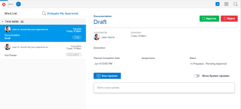

# [!UICONTROL Home] area for Reviewers

>[!IMPORTANT]
>
>This functionality was removed with the Legacy Home deprecation on 10/17/2014.

<!--

(NOTE: from Alina: not sure if we should still keep this one or not. In the past, Reviewers had a limited "Home" area which was their default page. Since now they created a "My Updates" area which is their new default, not sure if this makes much sense to still keep. The "My Updates" article is linked from this one, right at the top.)

Reviewers are assigned the [!UICONTROL My Updates] area by default. They can access a modified version of the [!UICONTROL Home] area only when an [!DNL Adobe Workfront] administrator adds the [!UICONTROL Home] area to their layout template.

This article describes activities that you can perform in the [!UICONTROL Home] area if you have a [!UICONTROL Review] license.

For more information about the default navigation of [!UICONTROL Review]-license users, see [Understand the navigation for a [!UICONTROL Review]-license user](../../../workfront-basics/navigate-workfront/workfront-navigation/reviewer-global-navigation-bar.md). For more information about the [!UICONTROL My Updates] area, see [Use the [!UICONTROL My Updates] area](../../../workfront-basics/using-home/using-the-home-area/my-updates-area.md).

>[!TIP]
>
>* General updates between users outside of an object are not enabled.
>* Although users with a [!UICONTROL Review] license can be assigned tasks, they do not receive email or other notifications regarding assignments, and they cannot mark them as "[!UICONTROL Done]."
>

## Access requirements

You must have the following access to perform the steps in this article:

<table style="table-layout:auto"> 
 <col> 
 </col> 
 <col> 
 </col> 
 <tbody> 
  <tr> 
   <td role="rowheader"><strong>[!DNL Adobe Workfront plan*]</strong></td> 
   <td> 
Any
 </td> 
  </tr> 
  <tr> 
   <td role="rowheader"><strong>[!DNL Adobe Workfront] license*</strong></td> 
   <td> 
[!UICONTROL Review] 
 </td> 
  </tr> 
 </tbody> 
</table>

&#42;To find out what plan or license type you have, contact your [!DNL Workfront] administrator.

## Approve work

1. (Conditional) If your [!DNL Workfront] administrator added the Home area to your layout template, click the **[!DNL Workfront] avatar** icon  in the upper-left corner of [!DNL Adobe Workfront].

   Or

   Click the **[!UICONTROL Main Menu]** , then click **[!UICONTROL Home]**.

   >[!NOTE]
   >
   >The [!DNL Workfront] administrator might make the following changes to the [!DNL Workfront] icon in your environment:
   >
   >   
   >   
   >   * Replace it with an image customized to illustrate your organization. In this case, the icon will look different that shown in this article.
   >   * Replace the page linked to it with a different page. In this case, click the **[!UICONTROL Main Menu]**  in the upper-right corner of the page, then click **[!UICONTROL Home]**.

   

1. Select an approval from the [!UICONTROL Work List] on the left side of the screen.
1. Click **[!UICONTROL Approve]**, **[!UICONTROL Changes]**, or **[!UICONTROL Reject]**.

   >[!IMPORTANT]
   >
   >Once you've made an approval decision, you can't change it.

1. (Optional) Add a comment to your approval decision.

## Delegate approvals

1. (Conditional) If your [!DNL Workfront] administrator added the Home area to your layout template, click the **[!UICONTROL Workfront] avatar** icon  in the upper-left corner of [!DNL Adobe Workfront]

   Or

   Click the **[!UICONTROL Main Menu]** , then click **[!UICONTROL Home]**.

1. Click **[!UICONTROL Delegate My Approvals]** above the work list.

   

1. Type the name of a user you'd like to delegate your approvals to. You can delegate only Project, Task, and Issue approvals.
1. Choose a **[!UICONTROL Start Date]**.
1. Choose an **[!UICONTROL End Date]**.\
   or\
   Choose **[!UICONTROL No end date]**.

1. Click **[!UICONTROL Save]**.

## Remind or recall approvals you've submitted

1. (Conditional) If your [!DNL Workfront] administrator added the Home area to your layout template, click the **[!UICONTROL Workfront] avatar** icon  in the upper-left corner of [!DNL Adobe Workfront].

   Or

   Click the **[!UICONTROL Main Menu]** , then click **[!UICONTROL Home]**.

   

1. Expand the **[!UICONTROL Approvals I've Submitted]** grouping in the work list.
1. Select an approval.
1. In the top-right corner, click **[!UICONTROL Recall]** or **[!UICONTROL Remind]**.

## Make comments

1. (Conditional) If your [!DNL Workfront] administrator added the [!UICONTROL Home] area to your layout template, click the **[!UICONTROL Workfront] avatar** icon  in the upper-left corner of [!DNL Adobe Workfront].

   Or

   Click the **[!UICONTROL Main Menu]** , then click **[!UICONTROL Home]**.

   

1. Select an approval from the [!UICONTROL Work List] on the left side of the screen.
1. In the right panel, click in the **[!UICONTROL Start a new update]** box.
1. Make your update.
1. Click **[!UICONTROL Update]**.

 
-->