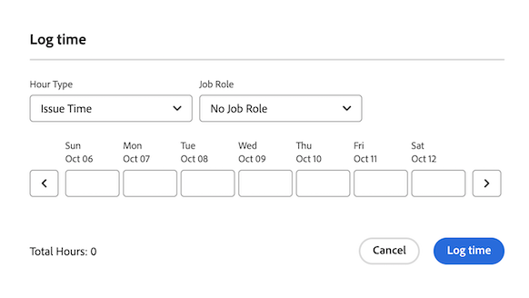

# Log time on a work item from the [!UICONTROL Home] area

You can log time on a work item in the following widgets:

* My Tasks
* My Issues
* My Work

## Log time on a task or issue

1. Click the **[!UICONTROL Main Menu]**  in the upper-right corner, then click **[!UICONTROL Home]**.
1. Go to one of the following widgets:
    * My Tasks
    * My Issues
    * My Work

    If you don't have one of the widgets mentioned above, you can add it. Click Customize and find the desired widget. 
1. Locate the work item
1. Click the Log time icon
    
1. In the **Hour Type** drop-down menu, select the appropriate hour type. Hour types are available depending on what has been defined at the system, project, and user levels, as described in Define hour types and availability.
1. (Conditional) If your Workfront or group administrator has enabled the Assign job roles to hour entries manually setting, select a job role from the drop-down menu. The role specified when you are assigned to the work item displays by default. If you are not assigned a role on the object, your Primary Role displays as the default. If you do not have a Primary Role assigned, No Job role displays.
1. Enter the time you want to log, then click **Log time**.

    

    For more detailed information on logging time in Workfront, see [Log time](../../../timesheets/create-and-manage-timesheets/log-time.md)