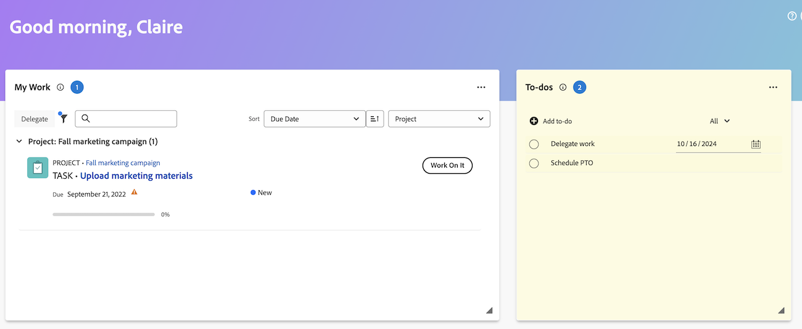

# Create and manage personal to-do item

You can create a personal to-do item in the To-dos widget in the [!UICONTROL Home] area. The to-do items are personal tasks that you create for yourself. 

You and other users can view your personal tasks in a personal task report. From there, they can add them to projects, if needed. 

>[!TIP]
>
>Work items that you send to other users or to yourself from the user profile page also display in the To-dos widget in the Home area of the user. For information, see [Create personal tasks](/help/quicksilver/workfront-basics/updating-work-items-and-viewing-updates/create-personal-tasks.md). 

## Access requirements

+++ Expand to view access requirements for the functionality in this article. 

You must have the following access to perform the steps in this article:

<table style="table-layout:auto"> 
 <col> 
 <col> 
 <tbody> 
  <tr> 
   <td role="rowheader"><strong>[!DNL Adobe Workfront plan*]</strong></td> 
   <td> 
Any
 </td> 
  </tr> 
  <tr> 
   <td role="rowheader"><strong>[!DNL Adobe Workfront] license*</strong></td> 
   <td> 
[!UICONTROL Work] or higher
 </td> 
  </tr> 
  <tr> 
   <td role="rowheader"><strong>Access level configurations*</strong></td> 
   <td> 
[!UICONTROL Worker]
 
<b>NOTE</b>
 
   
If you still don't have access, ask your [!DNL Workfront] administrator if they set additional restrictions in your access level. For information on how a [!DNL Workfront] administrator can modify your access level, see <a href="../../../administration-and-setup/add-users/configure-and-grant-access/create-modify-access-levels.md" class="MCXref xref">Create or modify custom access levels</a>.
 </td> 
  </tr> 
  <tr> 
   <td role="rowheader"><strong>Object permissions</strong></td> 
   <td> 
[!UICONTROL Edit] access or higher on tasks
 
For information on requesting additional access, see <a href="../../../workfront-basics/grant-and-request-access-to-objects/request-access.md" class="MCXref xref">Request access to objects </a>.
 </td> 
  </tr> 
 </tbody> 
</table>

&#42;To find out what plan, license type, or access you have, contact your [!DNL Workfront] administrator.

+++

## Create to-do items

1. Click the **[!UICONTROL Main Menu]**  in the upper-right corner, or the **Main menu**  in the upper-left corner, if available, then click **[!UICONTROL Home]**.
1. (Conditional) Click **Customize**, then click **To-dos** to add the To-dos widget to your home screen.
1. Go to the **To-do** widget, then click **Add to-do**. 
1. Type the name for your personal to-do item, then click Enter. 
1. (Optional) Click the **Date** icon  to add a due date for the item. 

1. (Optional) Create a personal task report or filter. For information about creating a personal task filter, see [Filter: personal task](/help/quicksilver/reports-and-dashboards/reports/custom-view-filter-grouping-samples/filter-personal-tasks.md).
   You can view your to-do items as well as other users' to-do items in the personal task report. 

## Manage to-do items

1. Click the **[!UICONTROL Main Menu]**  in the upper-right corner, or the **Main menu**  in the upper-left corner, if available, then click **[!UICONTROL Home]**.
1. (Conditional) Click **Customize**, then click **To-dos** to add the To-dos widget to your home screen.
1. Go to the **To-do** widget and do any of the following:
    1. To edit the name of a to-do item, click into the name space and make a change.
    1. To change the due date on a to-do item, click the Calendar icon or type in a new date.
    1. To delete a to-do item, hover over the item, then click the Delete icon.
