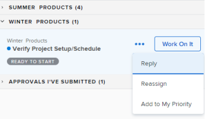

# Manage work items and team requests in the [!UICONTROL Home] area

When work tasks and issues are assigned to you, they are listed in the My Work widget, My Tasks widget, and My Issues widget.  You can view, work on, or remove work items and requests. 

+++ Expand to view access requirements for the functionality in this article.

## Access requirements

+++ Expand to view access requirements for the functionality in this article. 

<table style="table-layout:auto"> 
 <col> 
 </col> 
 <col> 
 </col> 
 <tbody> 
  <tr> 
   <td role="rowheader"><strong>[!DNL Adobe Workfront package]</strong></td> 
   <td> 
Any
 </td> 
  </tr> 
  <tr> 
   <td role="rowheader"><strong>[!DNL Adobe Workfront] license</strong></td> 
   <td>
   
Standard

    
Work or higher
 </td> 
  </tr> 
  <tr> 
   <td role="rowheader"><strong>Access level configurations</strong></td> 
   <td> 
[!UICONTROL Edit] access to Tasks and Issues
 </td> 
  </tr> 
  <tr> 
   <td role="rowheader"><strong>Object permissions</strong></td> 
   <td> 
Contribute permissions or higher to the tasks and issues you need to work on
</td> 
  </tr> 
 </tbody> 
</table>

For information, see [Access requirements in Workfront documentation](/help/quicksilver/administration-and-setup/add-users/access-levels-and-object-permissions/access-level-requirements-in-documentation.md). 

+++

## View a work item in the My Work widget

Work items that are assigned to you are display in the My Work widget in [!UICONTROL Home]. You can configure which work items are displayed in the My Work widget using the filter at the top of the widget [!UICONTROL worklist].

You can select filters that display items that are ready for you to work on, or items that you are currently working on already.

This article describes how to use the filters in the [!UICONTROL Home] area to view items that you are currently working on or might consider starting to work on. For information about how to use filters in the [!UICONTROL Home] area, see [Display items in the [!UICONTROL worklist] in the [!UICONTROL Home] area](/help/quicksilver/workfront-basics/using-home/using-the-home-area/display-items-in-home-work-list.md).

To view a work item in the My Work widget:

1. Click the **[!UICONTROL Main Menu]**  in the upper-right corner, then click **[!UICONTROL Home]**.
1. (Conditional) Click **Customize** to add the **My Work** widget.

1. Click the **Filter** icon  in the top-left corner of the widget worklist. 

1. Click either or both of the following options for tasks:

   **[!UICONTROL Ready to Start]:** Displays only tasks and issues that are ready to start. Both of the following statements must be true:

   * The tasks and their parents have no predecessors or task constraints preventing them from being worked on.
   * The [!UICONTROL Planned Start Date] of the tasks or issues is in the past or up to two weeks in the future.

   **[!UICONTROL Not Ready]**: Displays only tasks and issues that are not yet ready to start. Either one of the following statements must be true:

   * The tasks and their parents might have predecessors or task constraints that prevent them from being worked on.
   * The tasks or issues have a [!UICONTROL Planned Start Date] that is more than two weeks in the future.

1. Click **[!UICONTROL Working On]** under [!UICONTROL Tasks] or [!UICONTROL Issues] to display tasks and issues that you are currently working on.
1. Click **[!UICONTROL Requested]** under [!UICONTROL Issues] to display issues that have been requested from you (you are assigned to them), but you have not accepted to work on yet.

## Access a team request in the Team Request widget

You can access a request assigned to your team directly from the Team Requests widget in [!UICONTROL Home] area. For more information about team requests, see [Team requests overview](../../../people-teams-and-groups/work-with-team-requests/team-requests-overview.md).

To access a team request:

1. Click the **[!UICONTROL Main Menu]**  in the upper-right corner, then click **[!UICONTROL Home]**.
1. (Conditional) Click **Customize** to add the **Team Requests** widget. 

   The widget displays team requests under team groupings. The **[!UICONTROL Team Requests]** widget displays and shows all requests assigned to any team you are on. For more information about working with team requests, see [Manage work and team requests](../../../people-teams-and-groups/work-with-team-requests/manage-work-and-team-requests.md).

   

## Work on a work item in the My Work widget

When you click the [!UICONTROL Work On It] button, you are indicating to the user who submitted the work item and to any other user who might be assigned to the work item that you are going to start work.

To work on a work item:

1. Click the **[!UICONTROL Main Menu]**  in the upper-right corner, then click **[!UICONTROL Home]**.
1. (Conditional) Click **Customize** to add the **My Work** widget.

1. In the **[!UICONTROL worklist]** area of the widget, select the request you want to work on, then click **[!UICONTROL Work On It]**.
1. Hover over the work item, then click the **Summary** icon to view information about the work item.

   

## Remove a work item

If you decide that you should not be working on the work item, you can remove it from your list.

To remove a work item: 

1. Click the **[!UICONTROL Main Menu]**  in the upper-right corner, then click **[!UICONTROL Home]**.
1. (Conditional) Click **Customize** to add the **My Work** widget.

1. In the widget worklist, hover over the work item, then click the **Summary** icon to view information about the work item.
    
1. in the **Assignments** section, remove your name. 
   

<!--
## Reassign a request

1. Click the **[!UICONTROL Main Menu]**  in the upper-right corner, then click **[!UICONTROL Home]**.
1. In the **[!UICONTROL Work List]** area, select the request you want to reassign.

1. Click on the **[!UICONTROL Assignments]** widget and remove yourself from the request, then type the name of the user you want to reassign the request to.

   >[!TIP]
   >
   >If the work request is still in the Ready to Start or Not Ready state, you can use the **[!UICONTROL Reassign]** button in the **[!UICONTROL More]** menu in the [!UICONTROL Work List].\
   >

1. If a task's status is changed to [!UICONTROL New] or [!UICONTROL In Progress] after it was completed, you must unassign the user, save the task, then reassign the user in order for the task to reappear in their Home Work List.

## Reply to a request

You can reply to a request to further clarify the request or to propose a new date.

1. Click the **[!UICONTROL Main Menu]**  in the upper-right corner, then click **[!UICONTROL Home]**.
1. In the **[!UICONTROL Work List]** area, select the request you want to reply to.
1. Locate the individual who assigned the request to you.

   You can find this information on the [!UICONTROL Updates] tab of the task. Make sure the option to **[!UICONTROL Show System Updates]** is enabled.

1. Click **[!UICONTROL Start new update]** and begin typing your reply.
1. Enter the name of the recipient in the **[!UICONTROL Notify]** box, then click **[!UICONTROL Update]**.

   >[!TIP]
   >
   >If the work request is still in the Ready to Start or [!UICONTROL Not Ready] state, you can use the **[!UICONTROL Reply]** button in the **[!UICONTROL More]** menu in the [!UICONTROL Work List].\
   >![[!UICONTROL Reply button]](assets/reassign-in-left-panel-350x204.png)   

   -->
