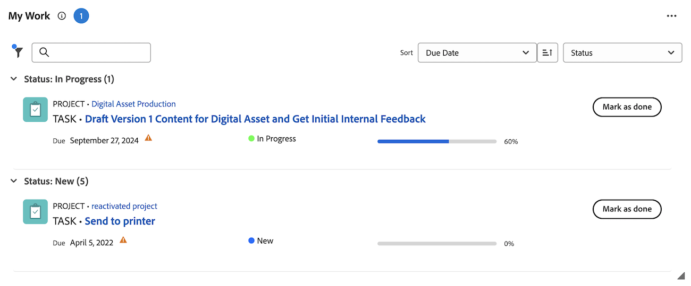
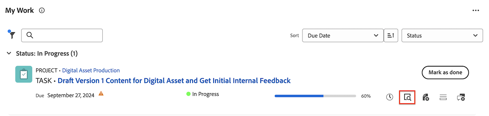
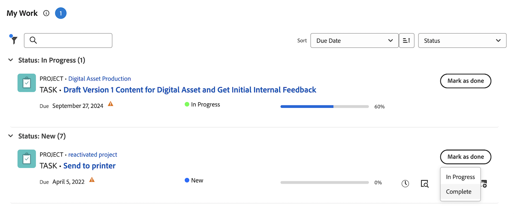
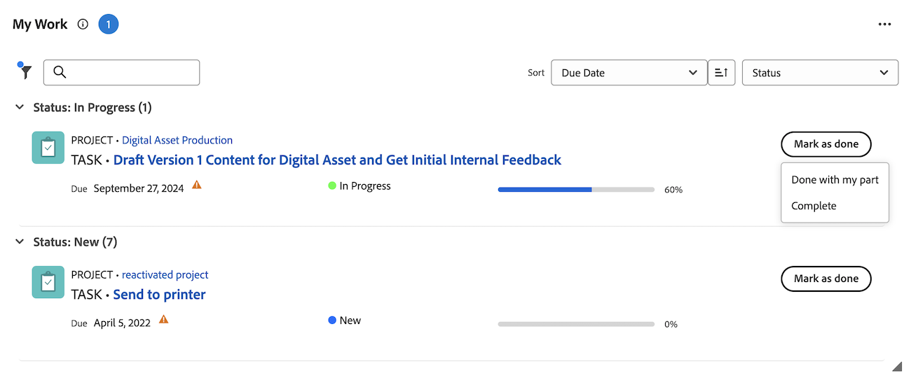

# Mark an item as [!UICONTROL Done] in the [!UICONTROL Home] area

You can mark a task or issue as Done if you are the task or issue assignee. When you mark a task or issue as [!UICONTROL Done], the status of the task or issue is changed to [!UICONTROL Complete].

>[!NOTE]
>
>You do not see the [!UICONTROL Done] button unless you are one of the resources assigned to the task or the issue.

+++ Expand to view access requirements for the functionality in this article.

## Access requirements

You must have the following access to perform the steps in this article:

<table style="table-layout:auto"> 
 <col> 
 </col> 
 <col> 
 </col> 
 <tbody> 
  <tr> 
   <td role="rowheader"><strong>[!DNL Adobe Workfront plan*]</strong></td> 
   <td> 
Any
 </td> 
  </tr> 
  <tr> 
   <td role="rowheader"><strong>[!DNL Adobe Workfront] license*</strong></td> 
   <td> 
[!UICONTROL Work] or higher
 </td> 
  </tr> 
  <tr> 
   <td role="rowheader"><strong>Access level configurations*</strong></td> 
   <td> 
[!UICONTROL Edit] access to Tasks and Issues
 
Note: If you still don't have access, ask your [!DNL Workfront] administrator if they set additional restrictions in your access level. For information on how a [!DNL Workfront] administrator can modify your access level, see <a href="../../../administration-and-setup/add-users/configure-and-grant-access/create-modify-access-levels.md" class="MCXref xref">Create or modify custom access levels</a>.
 </td> 
  </tr> 
  <tr> 
   <td role="rowheader"><strong>Object permissions</strong></td> 
   <td> 
Contribute permissions or higher to the tasks and issues you need to work on
 
For information on requesting additional access, see <a href="../../../workfront-basics/grant-and-request-access-to-objects/request-access.md" class="MCXref xref">Request access to objects </a>.
 </td> 
  </tr> 
 </tbody> 
</table>

&#42;To find out what plan, license type, or access you have, contact your [!DNL Workfront] administrator.

+++

## Mark a work item as Done in the My Work widget

1. Click the **[!UICONTROL Main Menu]**  in the upper-right corner, then click **[!UICONTROL Home]**.
1. (Conditional) Click **Customize** to add the **My Work** widget.
1. Find the work item, then click **[!UICONTROL Mark as Done]** on the work item.
   See [Understand the options of the [!UICONTROL Done] button](#understand-the-options-of-the-done-button) for more detailed information about how this button might appear.
   

## Mark a work item Done in the Summary panel

You can mark a work item as Done in the My Tasks and My Issues widget using the Summary panel.

1. Click the **[!UICONTROL Main Menu]**  in the upper-right corner, then click **[!UICONTROL Home]**.
1. (Conditional) Click **Customize** to add the **My Tasks** or **My Issues** widgets.
1. Hover over the work item, then click the **Summary** icon.
   
1. Click **Mark as done** at the top of the Summary panel.

## Understand the options of the [!UICONTROL Done] button 

By default, clicking the [!UICONTROL Done] button on a work item changes the status of that item to [!UICONTROL Complete] (for tasks) or [!UICONTROL Resolved] (for issues).

Your [!DNL Adobe Workfront] administrator can customize what statuses are associated with the [!UICONTROL Done] button, and apply those customizations to your Home Team.

Depending on how many statuses are associated with the [!UICONTROL Done] button or how many resources are assigned to the task or the issue, the look of the [!UICONTROL Done] button can change.

* [[!UICONTROL Done] button associated with one status](#done-button-associated-with-one-status)
* [[!UICONTROL Done] button associated with multiple statuses](#done-button-associated-with-multiple-statuses)
* [[!UICONTROL Done] button for items assigned to multiple resources](#done-button-for-items-assigned-to-multiple-resources)

### [!UICONTROL Done] button associated with one status 

When the [!UICONTROL Done] button is associated with one status and the work item is assigned to you only, the button reads **[!UICONTROL Done]**. When you click it, the status of the task or the issue is changed to the status associated with the [!UICONTROL Done] button.

To understand which status is associated with the [!UICONTROL Done] button, check the [!UICONTROL Team Settings] of your Home Team for the [!UICONTROL Done Button] section, as described in [Edit team settings](../../../people-teams-and-groups/create-and-manage-teams/edit-team-settings.md).

If you are not assigned to a Home Team, the default status is chosen when clicking [!UICONTROL Done], as described above in [Understand the options of the [!UICONTROL Done] button](#understand-the-options-of-the-done-button).

### [!UICONTROL Done] button associated with multiple statuses 

When the [!UICONTROL Done] button is associated with more than one status, the button shows the word **[!UICONTROL Done]** which is followed by a drop-down menu. In this scenario, you cannot simply click [!UICONTROL Done]. You must select a status from the drop-down menu. Select the status that best fits the completion of the work item. By doing this, you are changing the status of the work item.

To understand how you can associate multiple statuses with the [!UICONTROL Done] button, see [Configure the [!UICONTROL Done] button for tasks](../../../people-teams-and-groups/create-and-manage-teams/configure-the-done-button-for-tasks.md) and [Configure the [!UICONTROL Done] button for issues](../../../people-teams-and-groups/create-and-manage-teams/configure-the-done-button-for-issues.md).

### [!UICONTROL Done] button for items assigned to multiple resources 

When the task or the issue is assigned to more than one resource, the button shows the word **[!UICONTROL Done]** which is followed by a drop-down menu. In the drop-down menu, you have the option to choose between **[!UICONTROL Done with my part]** (which lets team members know you are complete with your portion of the task), or the status associated with the [!UICONTROL Done] button (which completes the item). After you select **[!UICONTROL Done with my part]**, the work item is removed from your Work List, but remains in the Work List of those still assigned to the work item.\
If the Done button is associated with multiple statuses, they are listed under **Done with my part**.

>[!NOTE]
>
>On a task or issue with multiple assignees, each user is responsible for indicating that their own assignment on the task or issue has actually been completed. For this reason, each assignee must click [!UICONTROL Done] to show they have completed the work assigned to them on the item.

