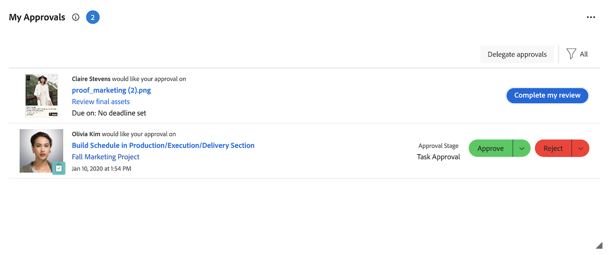

# Manage your approvals with the My Approvals widget

The My Approvals widget displays all of your pending, assigned, delegated, and submitted approvals in one place. Here, you can filter and organize your approvals, make decisions, and delegate approvals as needed.

The My Approvals widget supports approvals from the following Workfront objects:

* Tasks
* Issues
* Projects
* Documents
* Proofs
* Planning record requests
* Timesheets

## Access requirements

+++ Expand to view access requirements for the functionality in this article.

<table style="table-layout:auto"> 
 <col> 
 <col> 
 <tbody> 
  <tr> 
   <td role="rowheader">Adobe Workfront package</td> 
   <td> 
Any
 </td> 
  </tr> 
  <tr> 
   <td role="rowheader">Adobe Workfront license</td> 
   <td> 
   
Contributor or higher

   
Review or higher
 </td> 
  </tr> 
  <tr> 
   <td role="rowheader">Access level configurations</td> 
   <td> 
View or higher access to the objects associated with approvals
</td> 
  </tr> 
  <tr> 
   <td role="rowheader">Object permissions</td> 
   <td> 
View or higher permissions to the objects associated with approvals
</td> 
  </tr> 
 </tbody> 
</table>

For information, see [Access requirements in Workfront documentation](/help/quicksilver/administration-and-setup/add-users/access-levels-and-object-permissions/access-level-requirements-in-documentation.md). 

+++

## Approve work from the My Approvals widget

1. Click the **[!UICONTROL Main Menu]**  in the upper-right corner, then click **[!UICONTROL Home]**.
1. (Conditional) Click **Customize** to add the **My Approvals** widget.
1. (Conditional) Click the **Filter** drop-down menu, then select **All** to see approvals assigned and delegated to you.

   >[!NOTE]
   >
   >Approvals assigned to Job Roles or Groups don't display in Home. Approvals assigned to Teams display in the My Approvals widget for each team member.

1. Select the item where you want to make an approval decision.

   

1. Click one of the available options when making an approval decision in the right panel. The following options display in the upper-right corner of the page, depending on the type of item you are approving:

   <table>
   <tr>
      <td>
      
<strong>Access</strong>

      </td>
      <td>
      
<strong>Work items</strong>

      </td>
      <td>
      
<strong>Documents</strong>

      </td>
      <td>
      
<strong>Proofs</strong>

      </td>
   </tr>
   <tr>
      <td>
       <ul>
      <li>Grant</li>
      <li>Ignore</li>
      </ul>
      You can adjust the level of access in the <b>Change access</b> drop-down menu if desired.
      </td>
      <td>
         <ul>
         <li>Approve</li>
         <li>Reject</li>
         </ul>
      You can leave a comment with your decision by click ing the drop-down menu in the decision button.
      </td>
      <td>
   Assigned as an approver
         <ul>
         <li>Approve</li>
         <li>Approve with changes</li>
         <li>Needs work</li>
         </ul>
   Assigned as a reviewer
         <ul>
         <li>Complete my review</li>
         </ul>
      The options in this column apply only to Unified Approvals. Legacy document approvals appear the same as Work item approvals. 
      </td>
      <td>
         <ul>
         <li>Go to proof</li>
         </ul>
         You make your decision in the proof viewer. For information about reviewing a proof, see <a href="/help/quicksilver/review-and-approve-work/proofing/reviewing-proofs-within-workfront/review-proofs-in-wf.md">Review proofs within Adobe Workfront</a>.
      </td>
   </tr>
   </table>
      
After you make a decision, the approval is removed from the My Approval widget.   