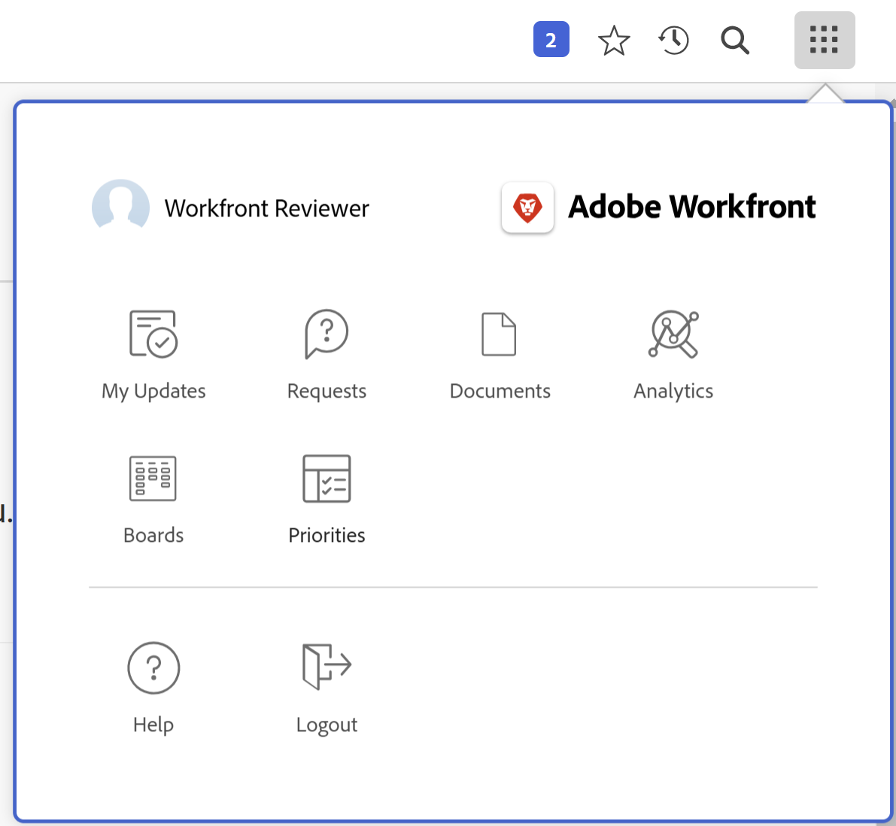
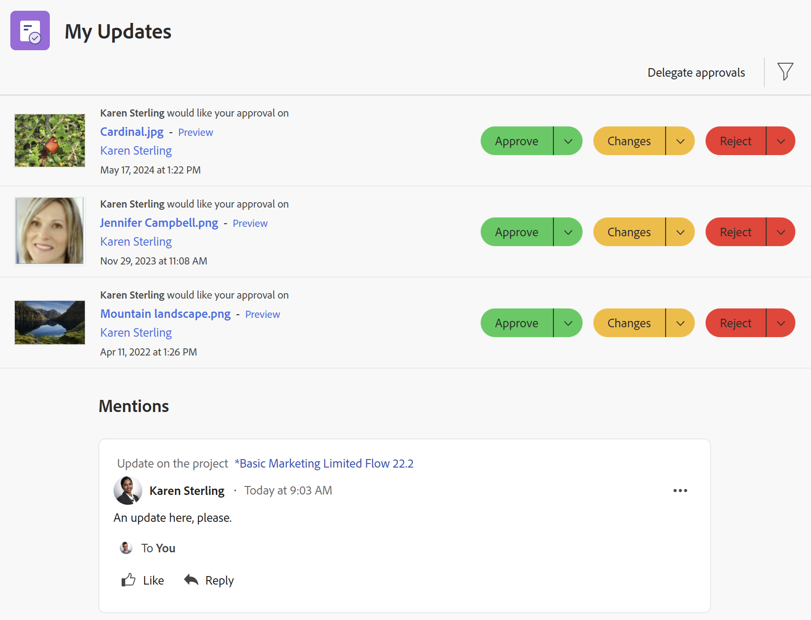
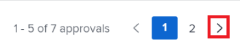
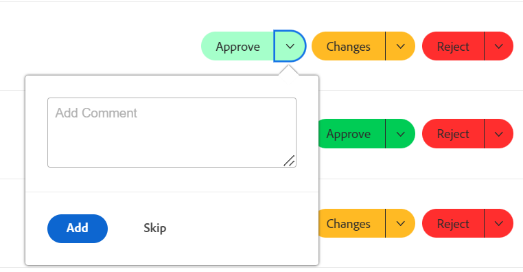
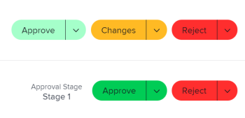
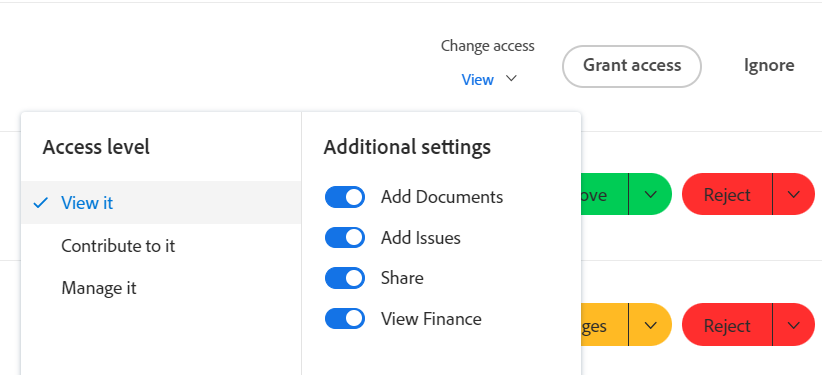
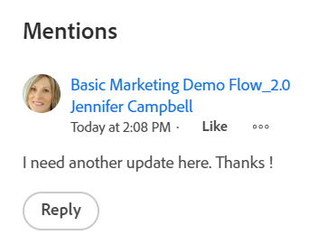

# Use the [!UICONTROL My Updates] area

<!--

(NOTE: there is a similar article like this in the "My Work" folder that is conditioned for Classic only)

-->

You can use the [!UICONTROL My Updates] area to quickly review the approvals waiting for your decision or the conversations you have been included in.

As a user with a [!UICONTROL Review] license, you can find the [!UICONTROL My Updates] area in the [!UICONTROL Main Menu] by default and the [!UICONTROL My Updates] area is the default landing page for you.

For information about [!DNL Adobe Workfront] licenses, see [[!DNL Adobe Workfront] licenses overview](../../../administration-and-setup/add-users/access-levels-and-object-permissions/wf-licenses.md).

If you have a license type different than Review, the [!DNL Workfront] or Group administrator must add the [!UICONTROL My Updates] area to your layout template to display it in the Main Menu. For information, see [Customize the [!UICONTROL Main Menu] using a layout template](../../../administration-and-setup/customize-workfront/use-layout-templates/customize-main-menu.md).

## Access requirements

You must have the following access to perform the steps in this article:

<table style="table-layout:auto"> 
 <col> 
 <col> 
 <tbody> 
  <tr> 
   <td role="rowheader"><strong>[!DNL Adobe Workfront plan]</strong></td> 
   <td> 
Any
 </td> 
  </tr> 
  <tr> 
   <td role="rowheader"><strong>[!DNL Adobe Workfront] license*</strong></td> 
   <td> 
New: Contributor or higher

   Or   
   
Current: [!UICONTROL Request] or higher
 </td> 
  </tr> 
  <tr> 
   <td role="rowheader"><strong>Access level configuration</strong></td> 
   <td> 
View access or higher to any objects for which you are tagged in a conversation or need to resolve an approval (Projects, Tasks, Issues, Documents)
 </td> 
  </tr> 
  <tr> 
   <td role="rowheader"><strong>Object permissions</strong></td> 
   <td> 
[!UICONTROL View] permissions or higher to projects, tasks, issues, documents where you are tagged in a conversation or need to resolve an approval
 </td> 
  </tr> 
 </tbody> 
</table>

*To find out what plan, license type, or access you have, contact your [!DNL Workfront] administrator. For more information, see [Access requirements in Workfront documentation](/help/quicksilver/administration-and-setup/add-users/access-levels-and-object-permissions/access-level-requirements-in-documentation.md). 

## Prerequisites

You must have the following before you begin:

* If you have a [!DNL Workfront] license other than [!UICONTROL Review], your [!DNL Workfront] or Group administrator must add the [!UICONTROL My Updates] area to the [!UICONTROL Main Menu] using a layout template and assign you to that template.

* Review-license users can view the [!UICONTROL My Updates] area in their [!UICONTROL Main Menu] by default.

## Access the [!UICONTROL My Updates] area

1. Click **[!UICONTROL My Updates]** in the **[!UICONTROL Main Menu]**.

   

   The [!UICONTROL My Updates] area opens.

   The approvals and requests for access that are assigned to you are listed in the first half of the page, under **My Updates**.

   

1. (Optional) Scroll to the bottom of the [!UICONTROL My Updates] area and click the right-pointing arrow to display more approvals that display on additional pages.

   >[!TIP]
   >
   >The first five approvals or requests for access display by default. The remaining approvals display on additional pages. You can display a maximum of 2000 approvals in the [!UICONTROL My Updates] area.

   

1. (Optional) Expand the **[!UICONTROL Filter]** drop-down menu  in the upper-right corner of the **[!UICONTROL My Updates]** section and select from the following:

   <table style="table-layout:auto"> 
    <col> 
    </col> 
    <col> 
    </col> 
    <tbody> 
     <tr> 
      <td role="rowheader"><strong>[!UICONTROL All]</strong></td> 
      <td>Approvals that are submitted to you or delegated to you by another user. For information about delegating approvals, see <a href="../../../review-and-approve-work/manage-approvals/delegate-approval-requests.md" class="MCXref xref">Delegate approval request</a>. </td> 
     </tr> 
     <tr> 
      <td role="rowheader"><strong>[!UICONTROL Delegated Approvals]</strong></td> 
      <td>Approvals delegated to you by another user. </td> 
     </tr> 
     <tr> 
      <td role="rowheader"><strong>[!UICONTROL My Approvals]</strong></td> 
      <td> 
Approvals submitted to you. 
 
For more information about approving items, see <a href="../../../review-and-approve-work/manage-approvals/approving-work.md" class="MCXref xref">Approving work </a>.
 </td> 
     </tr> 
    </tbody> 
   </table>

1. To approve or reject an item or suggest changes to a document before approving do the following:

   1. (Optional) Click the **drop-down** icon  next to your approval decision (**[!UICONTROL Approve]**, **[!UICONTROL Changes]**,**[!UICONTROL Reject]**) and add a comment, then click **[!UICONTROL Add]**.

      Or

      Click **[!UICONTROL Skip]** if you do not want to enter a comment.

      

      >[!NOTE]
      >
      >The [!UICONTROL Changes] option displays only for document approvals.

      Depending on which drop-down icon you selected, the item is approved, rejected, or, in the case of a document approval, approved with a request to make additional changes.

      >[!TIP]
      >
      >If you do not want to add a comment to your decision, you can click the **[!UICONTROL Approve]**, **[!UICONTROL Reject]**, or **[!UICONTROL Changes]** button and the approval decision is granted immediately.
      >
      >
      >      
      >
      >For more information about approving work, see [Approving work](../../../review-and-approve-work/manage-approvals/approving-work.md).

1. Click **[!UICONTROL Grant access]** to grant the access request submitted to you

   Or

   Expand the **[!UICONTROL Change access]** drop-down menu to modify the access requested before you grant it.

   

1. (Optional) Click **[!UICONTROL Ignore]** to clear the access request from your approval list without granting it.
1. Click **[!UICONTROL Delegate my approvals]** to delegate the approvals submitted to you if you are unavailable to make approval decisions for some time. For more information about delegating approvals, see [Delegate approval request](../../../review-and-approve-work/manage-approvals/delegate-approval-requests.md).
1. Scroll to the **[!UICONTROL Mentions]** area underneath your approvals. Here, you can view all items where you have been included in a conversation.

   

   >[!TIP]
   >
   >The first 50 mentions display by default.

1. (Optional) Click **[!UICONTROL Show More Updates]** to view more mentions.
1. (Optional) Click **[!UICONTROL Reply]** to respond to a comment, enter your response, then click **[!UICONTROL Reply]** again.

   For more information about updating items, see [Update work](../../../workfront-basics/updating-work-items-and-viewing-updates/update-work.md).

1. (Optional) Click **[!UICONTROL Pin current page]** to pin the [!UICONTROL My Updates] area to your top navigation.
