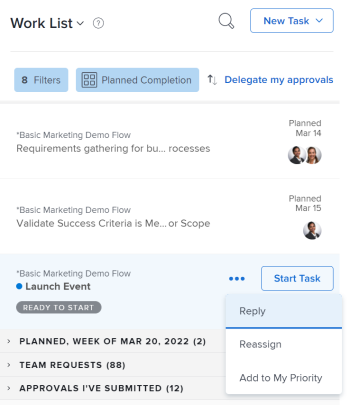
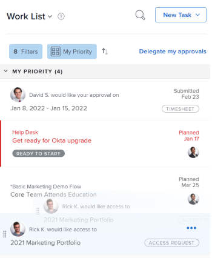

# Prioritize work in the [!UICONTROL Home] area

>[!IMPORTANT]
>
>This functionality was removed with the Legacy Home deprecation on 10/17/2014.

<!--You can prioritize your work in the new Priorities area. See .

You can prioritize items from your [!UICONTROL Work List] in [!UICONTROL Home]. Items you add to [!UICONTROL My Priority] are priorities for you only. They are not prioritized for anyone else, and no one can prioritize them for you. You can add up to 20 items under the [!UICONTROL My Priority] [!UICONTROL Sort By] option.

## Access requirements

You must have the following access to perform the steps in this article:

<table style="table-layout:auto"> 
 <col> 
 </col> 
 <col> 
 </col> 
 <tbody> 
  <tr> 
   <td role="rowheader"><strong>[!DNL Adobe Workfront plan*]</strong></td> 
   <td> 
Any
 </td> 
  </tr> 
  <tr> 
   <td role="rowheader"><strong>[!DNL Adobe Workfront] license*</strong></td> 
   <td> 
[!UICONTROL Work] or higher
 </td> 
  </tr> 
  <tr> 
   <td role="rowheader"><strong>Access level configurations*</strong></td> 
   <td> 
[!UICONTROL Edit] access to Tasks and Issues
 
Note: If you still don't have access, ask your [!DNL Workfront] administrator if they set additional restrictions in your access level. For information on how a [!DNL Workfront] administrator can modify your access level, see <a href="../../../administration-and-setup/add-users/configure-and-grant-access/create-modify-access-levels.md" class="MCXref xref">Create or modify custom access levels</a>.
 </td> 
  </tr> 
  <tr> 
   <td role="rowheader"><strong>Object permissions</strong></td> 
   <td> 
Contribute permissions or higher to the tasks and issues you want to prioritize
 
For information on requesting additional access, see <a href="../../../workfront-basics/grant-and-request-access-to-objects/request-access.md" class="MCXref xref">Request access to objects </a>.
 </td> 
  </tr> 
 </tbody> 
</table>

To find out what plan, license type, or access you have, contact your [!DNL Workfront] administrator.

## Add items to [!UICONTROL My Priority] 

You can add any item assigned to you in your [!UICONTROL Work List] to [!UICONTROL My Priority]. New items are added at the bottom of the list.

1. Click the **[!UICONTROL Main Menu]**  in the upper-right corner, then click **[!UICONTROL Home]**.
1. In the left panel, ensure the **[!UICONTROL Group by]** drop-down menu is sorting by one of the following options:

   * [!UICONTROL Planned Completion]
   * [!UICONTROL Planned Start]
   * [!UICONTROL Commit Date]
   * [!UICONTROL Project]

1. Hover over a work item, and click on the **[!UICONTROL More]** icon .

1. Select **[!UICONTROL Add to My Priority]**.

   

## Prioritize items using the [!UICONTROL My Priority] grouping

You can prioritize your work after you select [!UICONTROL My Priority] in your grouping drop-down menu, placing the most important items at the top of the list. Priorities you set are visible only to you. No one else can prioritize work for you.

You must add work items to [!UICONTROL My Priority] before you can begin prioritizing.

For more information, see the section [Add items to [!UICONTROL My Priority]](#add-items-to-my-priority) in this article.

1. Click the **[!UICONTROL Main Menu]**  in the upper-right corner, then click **[!UICONTROL Home]**.
1. In the left panel, click the **[!UICONTROL Group by]** drop-down menu, then select **[!UICONTROL My Priority]**.

1. Select a work item and drag and drop it in the right place to prioritize it in your list.

   

## Remove items from [!UICONTROL My Priority]

You can remove items from [!UICONTROL My Priority] by completing the work item or manually removing it using the [!UICONTROL More] icon. If you are unassigned from a work item, it is also removed from [!UICONTROL My Priority].

1. Click the **[!UICONTROL Main Menu]**  in the upper-right corner, then click **[!UICONTROL Home]**.
1. In the left panel, click the **[!UICONTROL More]** icon, then select **[!UICONTROL Remove from My Priority]**.

   ![[!UICONTROL Remove from [!UICONTROL My Priority]]](assets/getting-started-remove-from-priority-nwe-350x395.png)
-->