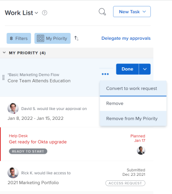

# Prioritize work in the Home area

You can prioritize items from your Work List in Home.&nbsp;Items you add to My Priority are priorities for you only. They are not prioritized for anyone else, and no one can prioritize them for you. You can add up to 20 items under the My Priority Sort By option.

## Access requirements

You must have the following access to perform the steps in this article:

<table cellspacing="0"> 
 <col> 
 </col> 
 <col> 
 </col> 
 <tbody> 
  <tr> 
   <td role="rowheader">Adobe Workfront plan*</td> 
   <td> 
Any
 </td> 
  </tr> 
  <tr> 
   <td role="rowheader">Adobe Workfront license*</td> 
   <td> 
Work or higher
 </td> 
  </tr> 
  <tr> 
   <td role="rowheader">Access level configurations*</td> 
   <td> 
Edit access to Tasks and Issues
 
Note: If you still don't have access, ask your Workfront administrator if they set additional restrictions in your access level. For information on how a Workfront administrator can modify your access level, see <a href="../../../administration-and-setup/add-users/configure-and-grant-access/create-modify-access-levels.md" class="MCXref xref">Create or modify custom access levels</a>.
 </td> 
  </tr> 
  <tr> 
   <td role="rowheader">Object permissions</td> 
   <td> 
Contribute permissions or higher to the tasks and issues you want to prioritize
 
For information on requesting additional access, see <a href="../../../workfront-basics/grant-and-request-access-to-objects/request-access.md" class="MCXref xref">Request access to objects </a>.
 </td> 
  </tr> 
 </tbody> 
</table>

&#42;To find out what plan, license type, or access you have, contact your Workfront administrator.

## Add items to My Priority {#add-items-to-my-priority}

You can add any item assigned to you in your Work List to&nbsp;My Priority. New items are added at the bottom of the list.

1. Click the **Main Menu**  in the upper-right corner, then click&nbsp;**Home**. 
1. In the left panel, ensure the **Group by**drop-down menu is sorting by one of the following options:

   * Planned Completion
   * Planned Start
   * Commit Date
   * Project

1. Hover over a work item, and click on the **More** icon .

1. Select**Add to My Priority**.

   &nbsp;

   

## Prioritize items using the My Priority grouping

You can prioritize your&nbsp;work after you select My Priority in your grouping drop-down menu, placing the most important items at the top of the list. Priorities you set are visible only to you. No one else can prioritize work for you.

You must add work items to My Priority before you can begin prioritizing.

For more information, see the section [Add items to My Priority](#add-items-to-my-priority) in this article.

1. Click the **Main Menu**  in the upper-right corner, then click&nbsp;**Home**. 
1. In the left panel, click the **Group by** drop-down menu, then select **My Priority**.

1. Select a work item and drag and drop it in the right place to prioritize&nbsp;it in your list.

   

## Remove items from My Priority

You can remove items from My Priority by completing the work item or manually removing it using the More icon. If you are unassigned from a work item, it is also removed from My Priority.

1. Click the **Main Menu**  in the upper-right corner, then click&nbsp;**Home**. 
1. In the left panel, click the **More** icon, then select **Remove from My Priority**.

   

