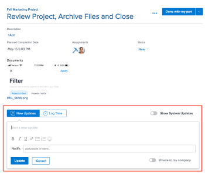

# Update or edit a work item in the Home area

You can view and add updates to a work item within the Home area in Adobe Workfront. You can also edit other data related to the work item if you have access to edit it.

## Access requirements

You must have the following access to perform the steps in this article:

<table cellspacing="0"> 
 <col> 
 </col> 
 <col> 
 </col> 
 <tbody> 
  <tr> 
   <td role="rowheader">Adobe Workfront plan*</td> 
   <td> 
Any
 </td> 
  </tr> 
  <tr> 
   <td role="rowheader">Adobe Workfront license*</td> 
   <td> 
Work or higher
 </td> 
  </tr> 
  <tr> 
   <td role="rowheader">Access level configurations*</td> 
   <td> 
Edit access to Tasks and Issues
 
Note: If you still don't have access, ask your Workfront administrator if they set additional restrictions in your access level. For information on how a Workfront administrator can modify your access level, see <a href="../../../administration-and-setup/add-users/configure-and-grant-access/create-modify-access-levels.md" class="MCXref xref">Create or modify custom access levels</a>.
 </td> 
  </tr> 
  <tr> 
   <td role="rowheader">Object permissions</td> 
   <td> 
Contribute permissions or higher to the tasks and issues you need to work on
 
For information on requesting additional access, see <a href="../../../workfront-basics/grant-and-request-access-to-objects/request-access.md" class="MCXref xref">Request access to objects in Adobe Workfront</a>.
 </td> 
  </tr> 
 </tbody> 
</table>

&#42;To find out what plan, license type, or access you have, contact your Workfront administrator.

## View updates on a work item

You can view updates on any work item in the Work List:

1. Click the **Main Menu**  in the upper-right corner, then click&nbsp;**Home**.  

1. In the **Work List** area, select the item where you want to view updates.  
   Updates are displayed in the right panel.

1. (Optional) To filter system updates so only user updates are displayed, toggle&nbsp;**Show System Updates**to Off.

## Provide updates on a work item

You can provide updates on any work item in the Work List:

1. Click the **Main Menu**  in the upper-right corner, then click&nbsp;**Home**.  

1. In the **Work List** area, select the item where you want to provide an update.
1. In the right panel, click **Update** to display a text field.

   <!--
   
   -->

      

1. In the provided field, specify your update.
1. (Optional) Specify any of the following information:  
   **Commit Date:** Select a date from the date picker when you commit to complete the work item.  
   **How's it going?:**&nbsp;Select a new condition for the task or issue. For more information about task and issue conditions, see [Update Condition for tasks and issues](../../../manage-work/projects/updating-work-in-a-project/update-condition-for-tasks-and-issues.md).  
   **Status:**&nbsp;Select a new status for the task or issue. For more information about task statuses, see [Update task status](../../../manage-work/projects/updating-work-in-a-project/update-task-status.md). For more information about issue statuses, see [Access the list of system issue statuses](../../../administration-and-setup/customize-workfront/creating-custom-status-and-priority-labels/issue-statuses.md).  
   **Completion Bar:**Indicate the percentage of work completed by sliding the progress bar to the desired percentage. You can also double-click the completion bar and enter the percent complete. 

1. Click **Update**.

## Edit a work item

You can edit any field on any work item that you have access to edit.

1. Click the **Main Menu**  in the upper-right corner, then click&nbsp;**Home**.  

1. In the **Work List** area, select the item you want to edit.  
   All fields you have access to view are displayed in the right panel.

1. In the right panel, hover over the field you want to edit.  
   If you have rights to edit the field, the field is highlighted as you hover over it.

1. Click the field you want to edit, then make your desired update.  
1. Click away from the field to save your changes.

