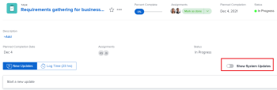
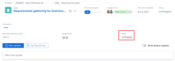

# Update or edit a work item in the [!UICONTROL Home] area

<!--Audited: April 2024-->

You can view and add updates to a work item within the [!UICONTROL Home] area in [!DNL Adobe Workfront]. You can also edit other data related to the work item if you have access to edit it.

## Access requirements

You must have the following access to perform the steps in this article:

<table style="table-layout:auto"> 
 <col> 
 </col> 
 <col> 
 </col> 
 <tbody> 
  <tr> 
   <td role="rowheader"><strong>[!DNL Adobe Workfront plan]</strong></td> 
   <td> 
Any
 </td> 
  </tr> 
  <tr> 
   <td role="rowheader"><strong>[!DNL Adobe Workfront] license*</strong></td> 
   <td> 
New: Standard

   Or
   
   
Current: [!UICONTROL Work] or higher
 </td> 
  </tr> 
  <tr> 
   <td role="rowheader"><strong>Access level configuration</strong></td> 
   <td> 
[!UICONTROL Edit] access to Tasks and Issues
 </td> 
  </tr> 
  <tr> 
   <td role="rowheader"><strong>Object permissions</strong></td> 
   <td> 
Contribute permissions or higher to the tasks and issues you need to work on
 </td> 
  </tr> 
 </tbody> 
</table>

*To find out what plan, license type, or access you have, contact your [!DNL Workfront] administrator. For more information, see [Access requirements in Workfront documentation](/help/quicksilver/administration-and-setup/add-users/access-levels-and-object-permissions/access-level-requirements-in-documentation.md). 

## View updates on a work item

You can view updates on any work item in the [!UICONTROL Work List]:

1. Click the **[!UICONTROL Main Menu]**  in the upper-right corner, or the **Main Menu**  in the upper-left corner, if available, then click **[!UICONTROL Home]**.
1. In the **[!UICONTROL Work List]** area, select the item where you want to view updates.\
   Updates are displayed in the right panel.

1. (Optional) To filter system updates so only user updates are displayed, toggle **[!UICONTROL Show System Updates]** to Off.

   

## Provide updates on a work item

You can provide updates on any work item in the [!UICONTROL Work] List:

1. Click the **[!UICONTROL Main Menu]**  in the upper-right corner, or the **Main Menu**  in the upper-left corner, if available, then click **[!UICONTROL Home]**.
1. In the **[!UICONTROL Work List]** area, select the item where you want to provide an update.
1. In the right panel, click **[!UICONTROL Update]** to display a text field.

   

1. In the provided field, specify your update.
1. (Optional) Specify any of the following information:\
   **[!UICONTROL Commit Date]:** Select a date from the date picker when you commit to complete the work item.\
   **[!UICONTROL How's it going?]:** Select a new condition for the task or issue. For more information about task and issue conditions, see [Update Condition for tasks and issues](../../../manage-work/projects/updating-work-in-a-project/update-condition-for-tasks-and-issues.md).\
   **[!UICONTROL Status]:** Select a new status for the task or issue. For more information about task statuses, see [Update task status](../../../manage-work/projects/updating-work-in-a-project/update-task-status.md). For more information about issue statuses, see [Access the list of system issue statuses](../../../administration-and-setup/customize-workfront/creating-custom-status-and-priority-labels/issue-statuses.md).\
   **[!UICONTROL Completion Bar]:** Indicate the percentage of work completed by sliding the progress bar to the desired percentage. You can also double-click the completion bar and enter the percent complete.

1. Click **[!UICONTROL Update]**.

## Edit a work item

You can edit any field on any work item that you have access to edit.

1. Click the **[!UICONTROL Main Menu]**  in the upper-right corner, or the **Main Menu**  in the upper-left corner, if available, then click **[!UICONTROL Home]**.
1. In the **[!UICONTROL Work List]** area, select the item you want to edit.\
   All fields you have access to view are displayed in the right panel.

1. In the right panel, hover over the field you want to edit.\
   If you have rights to edit the field, the field is highlighted as you hover over it.

   

1. Click the field you want to edit, then make your desired update.
1. Click away from the field to save your changes.
