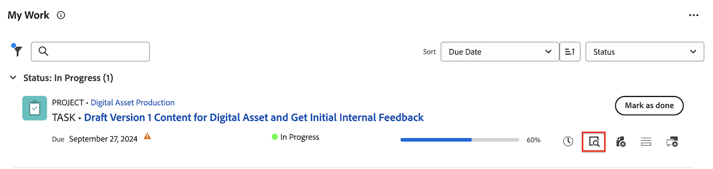

# Update or edit a work item in the [!UICONTROL Home] area

<!--Audited: 04/2024-->

<!--The highlighted information on this page refers to functionality not yet generally available. It is available only in the Preview environment for all customers. After the monthly releases to Production, the same features are also available in the Production environment for customers who enabled fast releases.    

For information about fast releases, see [Enable or disable fast releases for your organization](/help/quicksilver/administration-and-setup/set-up-workfront/configure-system-defaults/enable-fast-release-process.md). -->

You can view and add updates to a work item within the [!UICONTROL Home] area in [!DNL Adobe Workfront]. You can also edit other data related to the work item if you have access to edit it.

## Access requirements

+++ Expand to view access requirements for the functionality in this article.

You must have the following access to perform the steps in this article:

<table style="table-layout:auto"> 
 <col> 
 </col> 
 <col> 
 </col> 
 <tbody> 
  <tr> 
   <td role="rowheader"><strong>[!DNL Adobe Workfront plan]</strong></td> 
   <td> 
Any
 </td> 
  </tr> 
  <tr> 
   <td role="rowheader"><strong>[!DNL Adobe Workfront] license*</strong></td> 
   <td> 
New: Standard

   Or
   
   
Current: [!UICONTROL Work] or higher
 </td> 
  </tr> 
  <tr> 
   <td role="rowheader"><strong>Access level configuration</strong></td> 
   <td> 
[!UICONTROL Edit] access to Tasks and Issues
 </td> 
  </tr> 
  <tr> 
   <td role="rowheader"><strong>Object permissions</strong></td> 
   <td> 
Contribute permissions or higher to the tasks and issues that you need to work on
 </td> 
  </tr> 
 </tbody> 
</table>

*To find out what plan, license type, or access you have, contact your [!DNL Workfront] administrator. For more information, see [Access requirements in Workfront documentation](/help/quicksilver/administration-and-setup/add-users/access-levels-and-object-permissions/access-level-requirements-in-documentation.md). 

+++

<!--not sure if this  from the old UI: we don't have a Work List anymore - should this section come off? 

## View updates on a work item

You can view updates on any work item in the [!UICONTROL Work List]:

1. Click the **[!UICONTROL Main Menu]**  in the upper-right corner, or the **Main Menu**  in the upper-left corner, if available, then click **[!UICONTROL Home]**.
1. In the **[!UICONTROL Work List]** area, select the item where you want to view updates.\
   Updates are displayed in the right panel.

-->

## Overview of widgets where you can add comments or edit items in the Home area

You can add comments in the following widgets in the Home area:

| Widget         | Description                                                                                      |
|--------------|---------------------------------------------------------------------------------------------------|
| Boards       | Displays any boards that you have created or have been invited to use                                                               |
| My Work      | Displays tasks and issues assigned to you                                                                      |
| My Projects  | Displays projects that you own or projects you are on                                                     |
| My Tasks     | Displays tasks assigned to you                                                                    |
| My Issues    | Displays issues assigned to you                                                                   |
| My Requests  | Displays all requests that you have submitted                                                                 |
| My Approvals | Displays all of your pending, assigned, delegated, and submitted approvals    |
| Mentions | Displays recent comment threads across Workfront, similar to the My Updates page, as well as a reply button that allows you to compose a reply within the widget.    |

You can edit work items in the following widgets in the Home area: 

| Widget         | Description                                                                                      |
|--------------|---------------------------------------------------------------------------------------------------|
| Boards       | Displays any boards that you have created or have been invited to use                                                               |
| My Work      | Displays tasks and issues assigned to you                                                                      |
| My Projects  | Displays projects that you own or projects you are on                                                     |
| My Tasks     | Displays tasks assigned to you                                                                    |
| My Issues    | Displays issues assigned to you                                                                   |
| My Requests  | Displays all requests that you have submitted                                                                 |
| My Approvals | Displays all of your pending, assigned, delegated, and submitted approvals    |

## Add a comment to a work item in the My Work widget

You can provide updates on any work item in the [!UICONTROL My Work] widget:

1. Click the **[!UICONTROL Main Menu]**  in the upper-right corner, or the **Main Menu**  in the upper-left corner, if available, then click **[!UICONTROL Home]**.
1. (Conditional) Click **Customize** to add the [!UICONTROL **My Work**] widget.  

1. Locate the work item that you want to update in the [!UICONTROL **My Work**] widget. 
1. Hover over the name, then click the **Add new update** icon.
    
    

1. Begin typing your comment.
1. (Optional) In the **Tag people or teams** box, start typing the name or the email of a user, or a team that you would like to include in this comment, then select it when it displays in the list.
1. (Optional) Use the options in the Rich Text toolbar to format your text, add emojis, links, or images to your comment, to enhance your content.
1. Click **Submit** to add the comment to the work item.

    >[!IMPORTANT]
    >
    >You can edit your comment only within 15 minutes from submitting it. To edit a comment, click the **More** menu in the upper-right corner of the comment, then click **Edit**.

   For more detailed information about adding updates, see [Update work](/help/quicksilver/workfront-basics/updating-work-items-and-viewing-updates/update-work.md).

## Add a comment to an item in the Mentions widget

1. Add the **Mentions** widget to your Home area.

1. Locate the item that you were included in an update for and which you want to reply to.

1. Click **Reply**.

   

1. Begin typing your comment.
1. (Optional) In the **Tag people** box, start typing the name of a user or a team that you would like to include in this comment, then select it when it displays in the list.
1. (Optional) Use the options in the Rich Text toolbar to format your text, add emojis, links, or images to your comment, to enhance your content.
1. Click **Submit** to add the comment to the work item.

    >[!IMPORTANT]
    >
    >You can edit your comment only within 15 minutes from submitting it. To edit a comment, click the **More** menu in the upper-right corner of the comment, then click **Edit**.

   For more detailed information about adding updates, see [Update work](/help/quicksilver/workfront-basics/updating-work-items-and-viewing-updates/update-work.md).

## Edit a work item

You can edit any field on any work item that you have access to edit.

1. Click the **[!UICONTROL Main Menu]**  in the upper-right corner, or the **Main Menu**  in the upper-left corner, if available, then click **[!UICONTROL Home]**.
1. (Conditional) Click **Customize** to add the **My Work** widget.  

1. Hover over the work item, then click the **Summary** icon.
   

1. In the Summary panel, hover over the field you want to edit.
   If you have rights to edit the field, the field is highlighted as you hover over it.
1. Click the field that you want to edit, then make your desired update.
1. Click away from the field to save your changes.
