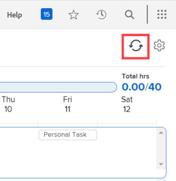
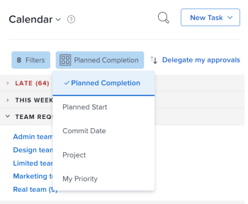
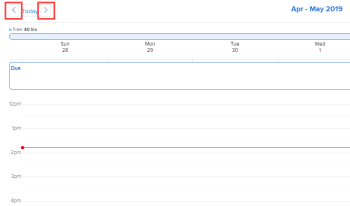

# Use the [!UICONTROL Home Calendar] view

>[!IMPORTANT]
>
>This functionality was removed with the Legacy Home deprecation on 10/17/2014.

<!--

You can use the Calendar view in the [!UICONTROL Home] area to manage your work day and work assignments. Only you can view and manage your [!UICONTROL Home Calendar].

>[!NOTE]
>
>The [!UICONTROL Calendar] view in the [!UICONTROL Home] area is different from a [!DNL Adobe Workfront] [!UICONTROL Calendar] report, which is a dynamic report that provides a visual representation of your work. For information about the [!DNL Workfront] [!UICONTROL Calendar] report, see [Calendar reports overview](../../../reports-and-dashboards/reports/calendars/calendar-reports-overview.md).
>
>  <!--
>  <li data-mc-conditions="QuicksilverOrClassic.Draft mode">Due to a temporary problem, your Workfront Calendar data might not display as described in this article. This problem will be fixed in the near future. (NOTE: From Alina: Spoke with Lisa and Court and they agreed to draft or delete this. Court could not remember what this was referring to and Lisa did not add this note. Lisa might update this if she hears from the team that this is still accurate.)</li>>
>  

## Access requirements

You must have the following access to perform the steps in this article:

<table style="table-layout:auto"> 
 <col> 
 </col> 
 <col> 
 </col> 
 <tbody> 
  <tr> 
   <td role="rowheader"><strong>[!DNL Adobe Workfront plan*]</strong></td> 
   <td> 
Any
 </td> 
  </tr> 
  <tr> 
   <td role="rowheader"><strong>[!DNL Adobe Workfront] license*</strong></td> 
   <td> 
[!UICONTROL Work] or higher
 </td> 
  </tr> 
  <tr> 
   <td role="rowheader"><strong>Access level configurations*</strong></td> 
   <td> 
[!UICONTROL Edit] access to Tasks and Issues
 
Note: If you still don't have access, ask your [!DNL Workfront] administrator if they set additional restrictions in your access level. For information on how a [!DNL Workfront] administrator can modify your access level, see <a href="../../../administration-and-setup/add-users/configure-and-grant-access/create-modify-access-levels.md" class="MCXref xref">Create or modify custom access levels</a>.
 </td> 
  </tr> 
  <tr> 
   <td role="rowheader"><strong>Object permissions</strong></td> 
   <td> 
[!UICONTROL Contribute] permissions or higher to the tasks and issues you want to add to the calendar
 
For information on requesting additional access, see <a href="../../../workfront-basics/grant-and-request-access-to-objects/request-access.md" class="MCXref xref">Request access to objects </a>.
 </td> 
  </tr> 
 </tbody> 
</table>

&#42;To find out what plan, license type, or access you have, contact your [!DNL Workfront] administrator.

## Schedule work items in your [!UICONTROL Home Calendar]

You can use the [!UICONTROL Home Calendar] to schedule work items for your week.

>[!NOTE]
>
>Placing a work item on your [!UICONTROL Home Calendar] does not change the existing dates associated with the work item.

To add a [!DNL Workfront] work item to your calendar:

1. Go to the [!UICONTROL Home Calendar] view, as explained in [View the [!UICONTROL Home Calendar]](../../../workfront-basics/using-home/using-the-home-area/view-home-calendar.md).

   All the work items assigned to you or your groups, teams, or job roles display in the left panel. You can sort the list and filter it to display only certain items.

   For more information, see [Filter and sort work items](#filter-and-sort-work-items) later in this article.

1. From the left panel, drag the work item to the day and time when you want to work on it.

   If you schedule yourself to work on an item after its planned completion date or for more time than the number of hours it's planned for, the work item displays in red and a warning appears.

   To learn about work item due dates and how they affect allocated time in the [!UICONTROL Home Calendar], see  [[!UICONTROL Home Calendar] view](../../../workfront-basics/using-home/using-the-home-area/home-calendar-view.md).

1. Do any of the following:

   * **To schedule a work item for multiple days:** Repeat step 2 to add the item to each day and time when you want to work on it.
   * **To modify the duration of a calendar item:** Hover over the bottom edge of the item until the cursor becomes a double arrow, then drag the bottom edge to the ending time you want.
   * **To delete a calendar item:** Hover over the item, then click the [!UICONTROL trashcan] icon that is displayed.

## Update a work item on your [!UICONTROL Home Calendar]

You can make updates to work items that display in [!UICONTROL Home Calendar] view. Your updates also appear on the [!UICONTROL Updates] tab of the actual work item.

1. Go to the [!UICONTROL Home Calendar] view, as explained in [View the [!UICONTROL Home Calendar]](../../../workfront-basics/using-home/using-the-home-area/view-home-calendar.md).

1. Open the [!UICONTROL Details] panel for the work item you want to update:

   * From the left panel: Select the work item, then click **[!UICONTROL Details]**.
   * From the calendar: Click the scheduled calendar event.

   Details for the work item display in a panel that appears on the right of the window.

   

1. Do any of the following to update the work item:

   * In the **[!UICONTROL Start a new update]** box, type your update, specify any of the following information, then click **[!UICONTROL Update]**.

      <table style="table-layout:auto">
      <col>
      <col>
      <tbody>
       <tr>
        <td role="rowheader"><strong>[!UICONTROL Notify]</strong></td>
        <td>
 Tag users you want to notify about your update. For more information, see <a href="../../../workfront-basics/updating-work-items-and-viewing-updates/tag-others-on-updates.md" class="MCXref xref">Tag others on updates</a>.

 
</td>
       </tr>
       <tr data-mc-conditions="">
        <td role="rowheader"><strong>[!UICONTROL Commit Date]</strong></td>
        <td>In the drop-down calendar, select the date when you are committing to complete the work item. For information about setting the [!UICONTROL Commit Date], see <a href="../../../manage-work/projects/updating-work-in-a-project/overview-of-commit-dates.md" class="MCXref xref">[!UICONTROL Commit Date] overview</a>.</td>
       </tr>
       <tr data-mc-conditions="">
        <td role="rowheader"><strong>[!UICONTROL How's this going?]</strong></td>
        <td>Select a new condition for the task or issue. For information about task and issue conditions, see <a href="../../../manage-work/projects/updating-work-in-a-project/update-condition-for-tasks-and-issues.md" class="MCXref xref">Update Condition for tasks and issues</a>.</td>
       </tr>
       <tr>
        <td role="rowheader"><strong>[!UICONTROL Private to] my company</strong></td>
        <td>Disable to prevent users outside your company from being able to view this update.</td>
       </tr>
      </tbody>
     </table>

   * Click the current **[!UICONTROL Status]** for the item, then click a new status in the list that appears. For more information, see [Approval process overview](../../../review-and-approve-work/manage-approvals/approval-process-in-workfront.md).

      >[!NOTE]
      >
      >If you mark a work item assigned to you as [!UICONTROL Complete - Pending Approval], you may notice that it no longer appears on your calendar. This is because no further action is expected of you until the user who is set to approve the item marks it as [!UICONTROL Approved]. When this occurs, you will be able to see the item on your calendar as an [!UICONTROL Approved] item.

   * (Optional) To reply to an existing comment or update, click **[!UICONTROL Reply]**, specify any recipients in the **[!UICONTROL Notify]** box, type your reply, then click **[!UICONTROL Reply]**.\

      If you need information about specifying recipients, see [Tag others on updates](../../../workfront-basics/updating-work-items-and-viewing-updates/tag-others-on-updates.md).

1. (Optional) To close the **[!UICONTROL Details]** panel, click anywhere outside it.

## Update events from integrated calendars

To update the integrated calendar events in your [!UICONTROL Home Calendar]:

1. Go to the [!UICONTROL Home Calendar] view, as explained in [View the [!UICONTROL Home Calendar]](../../../workfront-basics/using-home/using-the-home-area/view-home-calendar.md).
1. Click **[!UICONTROL Refresh calendars]** in the upper right corner of the [!UICONTROL Home Calendar].

   

   Integrated calendar events update automatically when you open your [!UICONTROL Home Calendar] view or when you refresh your [!UICONTROL Home Calendar].

## Filter and sort work items

1. Go to the [!UICONTROL Home Calendar] view, as explained in [View the [!UICONTROL Home Calendar]](../../../workfront-basics/using-home/using-the-home-area/view-home-calendar.md).
1. Click the **[!UICONTROL Filter]** drop-down menu.

   >[!NOTE]
   >
   >Some filter options are based on objects (Tasks, Requests, Issues, Approvals, Proofs, and Personal), and others are based on state ([!UICONTROL Working On], [!UICONTROL Ready to Start], [!UICONTROL Not Ready], and [!UICONTROL Completed]). If no state is selected, the [!UICONTROL Home Calendar] displays all selected objects of any state. Similarly, if no object is selected, it displays all objects of any selected state.

1. Select from the following filter options to specify the types of items you want to display::

   <table style="table-layout:auto"> 
    <col> 
    <col> 
    <tbody> 
     <tr> 
      <td role="rowheader"><strong>[!UICONTROL All]</strong></td> 
      <td>Displays and selects all items. This includes tasks, issues, approvals, personal tasks and completed tasks and issues.</td> 
     </tr> 
     <tr> 
      <td role="rowheader"><strong>[!UICONTROL Tasks Working On]</strong></td> 
      <td> 
Displays only tasks that you are actively working on. These are tasks assigned to you for which you have clicked the [!UICONTROL Work On It] button. 
 </td> 
     </tr> 
     <tr> 
      <td role="rowheader"><strong>[!UICONTROL Tasks Ready to Start]</strong></td> 
      <td> 
       
 
        
Displays only tasks that are ready for you to start. Both of the following statements must be true:
 
        <ul style="list-style-type: square;"> 
         <li> 
The tasks and their parents have no predecessors or task constraints preventing them from being worked on.
 </li> 
         <li> 
The [!UICONTROL Planned Start Date] of the tasks is in the past or up to two weeks in the future.
 </li> 
        </ul> 
       
 </td> 
     </tr> 
     <tr> 
      <td role="rowheader"><strong>[!UICONTROL Tasks Not Ready]</strong></td> 
      <td> 
       
 
        
Displays only tasks that are not yet ready to start. Either one of the following statements must be true:
 
        <ul> 
         <li> 
The tasks and their parents might have predecessors or task constraints that prevent them from being worked on.
 </li> 
         <li> 
The tasks have a [!UICONTROL Planned Start Date] that is more than two weeks in the future.
 </li> 
        </ul> 
       
 </td> 
     </tr> 
     <tr> 
      <td role="rowheader"><strong>[!UICONTROL Issues Working On]</strong></td> 
      <td> 
Displays only issues that you are actively working on. These are issues assigned to you for which you have clicked the [!UICONTROL Work On It] button.
 </td> 
     </tr> 
     <tr> 
      <td role="rowheader"><strong>[!UICONTROL Issues Requested]</strong></td> 
      <td>Displays only issues that you are assigned to but for which you have not clicked the [!UICONTROL Work On It] button. </td> 
     </tr> 
     <tr> 
      <td role="rowheader"><strong>[!UICONTROL Personal]</strong></td> 
      <td>Displays only personal tasks. These are tasks that you create as a [!UICONTROL To Do] task, as described in the section <a href="../../../workfront-basics/using-home/using-the-home-area/create-work-items-in-home.md#creating-a-personal-task">[!UICONTROL Create a personal task]</a> in the article <a href="../../../workfront-basics/using-home/using-the-home-area/create-work-items-in-home.md">Create work items from the [!UICONTROL Home] area</a>.</td> 
     </tr> 
     <tr> 
      <td role="rowheader"><strong>[!UICONTROL Approvals]</strong></td> 
      <td> 
       
 
        
Displays only approvals assigned or delegated to you and approvals you have submitted. Approvals include approvals on work items (projects, tasks, and issues), and approvals for documents, proofs, requests for access, and timesheets. For more information about approvals, see the following articles:
 
        <ul> 
         <li><a href="../../../review-and-approve-work/manage-approvals/view-approvals.md" class="MCXref xref">View approvals </a> </li> 
        </ul> 
        <ul> 
         <li> 
<a href="../../../review-and-approve-work/manage-approvals/manage-approvals.md" class="MCXref xref">Manage approvals</a> 
 </li> 
        </ul> 
        
Note: Approvals that you submitted and where you are also one of the approvers are counted twice. 
 
       
 </td> 
     </tr> 
     <tr> 
      <td role="rowheader"><strong>[!UICONTROL Completed]</strong></td> 
      <td>Displays only completed tasks, issues, and personal tasks. Completed work displays for the previous two weeks, and is grouped in the Work List according to week. Approvals are not included. </td> 
     </tr> 
    </tbody> 
   </table>

   

1. To group and sort your list of work, click the **[!UICONTROL Group by]** drop-down menu, then select the criteria you want to use.

   The items are listed on the left side of the calendar according to the criteria and in the order that you specify.

   

   Choose from the following options:

   <table style="table-layout:auto">
    <tr>
        <td><strong>[!UICONTROL Planned Completion]</strong></td>
        <td>Tasks and issues sort in order of the [!UICONTROL Planned Completion dates]. To learn more about [!UICONTROL Planned Completion dates], see <a href="../../../manage-work/tasks/task-information/planned-hours.md">Planned Hours overview</a>.</td>
        <td></td>
    </tr>
    <tr>
        <td><strong>[!UICONTROL Planned Start]</strong></td>
        <td>Tasks and issues sort in order of the [!UICONTROL Planned Start dates]. For more information about task [!UICONTROL Planned Start Dates], see <a href="../../../manage-work/tasks/task-information/task-planned-start-date.md">Overview of the task [!UICONTROL Planned Start Date]</a>.</td>
    </tr>
    <tr>
        <td><strong>[!UICONTROL Commit Date]</strong></td>
        <td>Tasks and issues sort in order of the [!UICONTROL Commit dates]. To learn more about [!UICONTROL Commit dates], see <a href="../../../manage-work/projects/updating-work-in-a-project/overview-of-commit-dates.md">[!UICONTROL Commit Date] overview</a>.</td>
    </tr>
    <tr>
        <td><strong>[!UICONTROL Project]</strong></td>
        <td>Work items sort by project.</td>
    </tr>
    <tr>
        <td><strong>[!UICONTROL My Priority]</strong></td>
        <td>Items display in an order you choose. For more information, see <a href="../../../workfront-basics/using-home/using-the-home-area/prioritize-work-in-home.md">Prioritize work in the [!UICONTROL Home] area</a>.</td>
    </tr>
   </table>

## Navigate to a different week

1. Go to your [!UICONTROL Home Calendar] view, as explained in [View the [!UICONTROL Home Calendar]](../../../workfront-basics/using-home/using-the-home-area/view-home-calendar.md).
1. On the **[!UICONTROL Calendar toolbar]**, click the left arrow of the date indicator to move the calendar view back one week or the right arrow to move forward one week.

   

   You can click **[!UICONTROL Today]** to return to the current week.

## Specify which calendars you view

You can specify which integrated calendars, such as your PTO, Birthdays, or Holidays calendar, you want to view on your [!UICONTROL Home Calendar]. For instructions, see [Configure your [!UICONTROL Home Calendar] view settings](../../../workfront-basics/using-home/using-the-home-area/configure-home-calendar-view.md).

-->