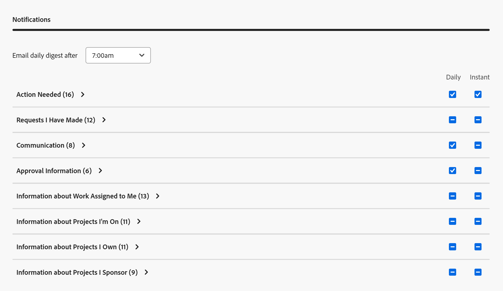
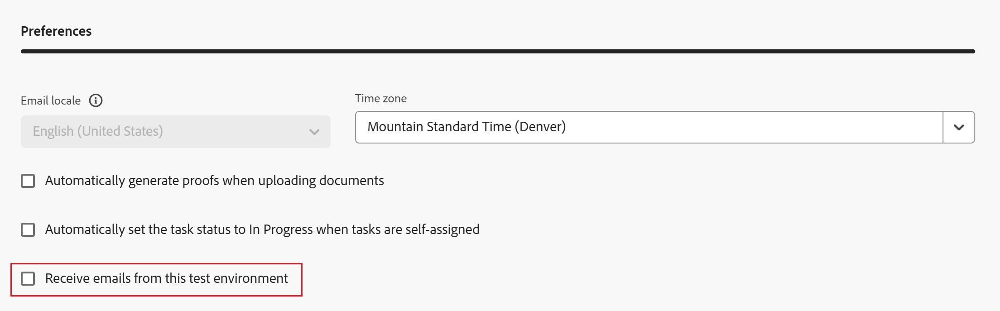

# Modify your own email notifications

<!-- Audited: 1/2024 -->

Your Adobe [!DNL Workfront] administrator configures which email notifications users receive when events occur in Workfront (as described in [[!UICONTROL Configure event] notifications for everyone in the system](../../administration-and-setup/manage-workfront/emails/configure-event-notifications-for-everyone-in-the-system.md)).

Your group administrator can also configure which notifications are activated for you and the users in your [!UICONTROL Home Group]. If your [!UICONTROL Home Group] is a subgroup, you receive the notifications activated for the top-level group above your group.

You can customize this further by configuring which notifications you receive. You can also choose whether you want to receive notifications as events happen or in one daily digest email.

For more information about email notifications, see [[!DNL Adobe Workfront] notifications](../../workfront-basics/using-notifications/wf-notifications.md).

>[!NOTE]
>
>* If you activate a notification type and then find that you are not receiving notifications of that type, it may be because that type does not apply for your role.
>* The [!DNL Workfront] administrator or a group administrator cannot configure notifications for [!DNL Workfront Goals]. For more information about what notifications the [!DNL Workfront] administrator can configure, see [Configure event notifications for everyone in the system](../../administration-and-setup/manage-workfront/emails/configure-event-notifications-for-everyone-in-the-system.md). For information about configuring individual notifications for [!DNL Workfront Goals] continue to read this article.
>* Approval notifications apply to legacy document approvals only. Notification controls for unified document approvals are not currently available.

## Access requirements

+++ Expand to view access requirements for the functionality in this article.

<table style="table-layout:auto"> 
 <col> 
 </col> 
 <col> 
 </col> 
 <tbody> 
  <tr> 
   <td role="rowheader"><strong>[!DNL Adobe Workfront package]</strong></td> 
   <td> 
Any
 </td> 
  </tr> 
  <tr> 
   <td role="rowheader"><strong>[!DNL Adobe Workfront] license</strong></td> 
   <td> 
Contributor or Higher

   
Request or Higher

   </td> 
  </tr> 
 </tbody> 
</table>

For information, see [Access requirements in Workfront documentation](/help/quicksilver/administration-and-setup/add-users/access-levels-and-object-permissions/access-level-requirements-in-documentation.md). 

+++

## View and modify your email notification settings

{{step1-click-profile-pic}}

1. Click the **[!UICONTROL More]** icon  next to your name, then click **[!UICONTROL Edit User]**.

1. In the **[!UICONTROL Edit User]** box that displays, go to the **[!UICONTROL Notifications]** section.

1. Click a category to view the notification settings related to that category.

   

1. Select or deselect the check boxes on the right to specify whether you want to receive or not receive notifications daily, instantly, or both.

   You can also use the check boxes for a category to activate or deactivate all notifications in that category.

   >[!NOTE]
   >
   >If you are a team member for a project, you continue to receive email notifications for it until you are removed from the team, even if you no longer have access to the project. For instructions on removing users from a team, see [Remove users from projects](../../manage-work/projects/manage-projects/remove-users-from-projects.md).

   For the **[!UICONTROL Communication]** category, you can select individual notifications for instant delivery only. To have notifications delivered in a daily digest, you must select all of them.

   If all email notifications for a given category are activated, the box in the category title appears as selected. If all email notifications in a given category are deactivated, the box is unselected. If some notifications are activated and others are deactivated, the category checkbox appears as a straight line.

   When you modify a notification setting, the label **[!UICONTROL Edited]** appears for that notification setting, to let you know that that notification setting has been modified.

1. If you selected any notifications to be sent as a daily digest, select the time of the day you want to receive it at the top of the **[!UICONTROL Notifications]** section in the **[!UICONTROL Email daily digest after]** menu.

   

   The daily digest includes events that meet the criteria of the notifications 24 hours prior to the selected time. You receive one daily digest email for each type of notification.\
   The daily digest may arrive after the time you select, depending on how many emails are queued for delivery in the system. The time listed is your local time as specified in your browser settings.

1. (Conditional and optional) When modifying email notifications settings in the Preview environment, enable the **[!UICONTROL Receive emails from this test environment]** setting to receive emails. Emails are not automatically generated from the Preview environment.

   

1. Click **[!UICONTROL Save]**.
