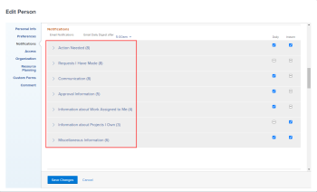

# Activate or deactivate your own event notifications

Your Adobe Workfront administrator configures which event notifications users receive when events occur in Workfront (as described in [Configure event notifications for everyone in the system](../../administration-and-setup/manage-workfront/emails/configure-event-notifications-for-everyone-in-the-system.md)).

Your group administrator can also configure which event notifications are activated for you and the users in your Home Group. If your Home Group is a subgroup, you receive the event notifications activated for the top-level group above your group.

You can customize this further by configuring which notifications you receive. You can also choose whether you want to receive notifications as events happen or in one daily digest email.

For information about email notifications, see [Adobe Workfront notifications](../../workfront-basics/using-notifications/wf-notifications.md).

>[!NOTE]
>
>* If you activate a notification type and then find that you are not receiving notifications of that type, it may be because that type does not apply for your role.
>* The Workfront administrator or a group administrator cannot configure notifications for Workfront Goals. For more information about what notifications the Workfront administrator can configure, see [Configure event notifications for everyone in the system](../../administration-and-setup/manage-workfront/emails/configure-event-notifications-for-everyone-in-the-system.md). For information about configuring individual notifications for Workfront Goals continue to read this article. 
>

## Access requirements

You must have the following access to perform the steps in this article:

<table cellspacing="0"> 
 <col> 
 </col> 
 <col> 
 </col> 
 <tbody> 
  <tr> 
   <td role="rowheader">Adobe Workfront plan*</td> 
   <td> 
Any
 </td> 
  </tr> 
  <tr> 
   <td role="rowheader">Adobe Workfront license*</td> 
   <td> 
Request or higher
 </td> 
  </tr> 
 </tbody> 
</table>

&#42;To find out what plan or license type you have, contact your Workfront administrator.

## View and modify your email notification settings

1. Click a category to view the notification settings related to that category.

   

1. Select or deselect the check boxes on the right to specify whether you want to receive or not receive notifications daily, instantly, or both.

   You can also use the check boxes for a category to activate or deactivate all notifications in that category.

   >[!NOTE]
   >
   >If you are a team member for a project, you continue to receive email notifications for it until you are removed from the team, even if you no longer have access to the project. For instructions on removing users from a team, see [Remove users from projects](../../manage-work/projects/manage-projects/remove-users-from-projects.md).

   For the `Communication` category, you can select individual notifications for instant delivery only. You must select all of the notifications to be delivered in a daily digest.

   If all email notifications for a given category are activated, the box in the category title appears as selected. If all email notifications in a given category are deactivated, the box is unselected. If some notifications are activated and others are deactivated, the category checkbox appears as a straight line.  
   When you modify a notification setting, the label `Edited` appears for that notification setting, to let you know that that notification setting has been modified.

1. If you selected any notifications to be sent as a daily digest, select the time of the day you want to receive it at the top of the `Notifications` section in the `Email Daily Digest after` menu.

   

   The daily digest includes events that meet the criteria of the notifications 24 hours prior to the selected time. You receive one daily digest email for each type of notification.  
   The daily digest may arrive after the time you select, depending on how many emails are queued for delivery in the system. The time listed is your local time as specified in your browser settings.

1. Click `Save Changes`.

