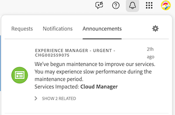

# Experience Cloud Notifications overview

Adobe Workfront is unifying all digital experiences (DX) products under a single, consistent notification system called Experience Cloud Notifications. Starting in or around February 2026, your legacy Workfront Notification services will be migrated to Adobe's centralized notification system, which our team will inform you of before it occurs. 

After this transition, you can access all notifications across Adobe Workfront and other Adobe DX applications in one place, simplifying how you stay informed and manage your preferences. 

## Why we're making this change

Workfront is part of Adobe's suite of digital experience products. Moving to Experience Cloud brings several benefits, including the following: 

* Unified notifications experience: You can now experience one interface that works across all Adobe DX solutions.
* Staying informed: Unifying notifications in one place lowers the risk of missing notifications.
* Less cluttered interface: Having one Notifications icon reduces confusion and removes the need to switch back and forth between notification sections. 
* Future-ready platform: This readies your organization for both current and future innovation across Adobe tools.

## What's changing

* A single Notifications icon has replaced the Workfront notification icon in the top header.    
* Your personal notification settings are now accessed through the new Experience Cloud Notifications panel and All notifications page. Previously, these were accessed in your user profile. 
* There are new filtering and delivery options available.  
* Customizing email notification subject lines will no longer be available. 

## What's staying the same

* You'll receive in-app notifications during the first phase of the transition and email notifications later on.

* Workfront will continue to trigger notifications based on your work items.

* Workfront data and permissions will remain unchanged.

## View new notifications in Experience Cloud

1. In the top-right corner of Workfront, click the **Notifications** icon .

1. In the **Experience Cloud Notifications** panel that opens, select **Notifications**. A list of your notifications appears, with the most recent notification appearing at the top of the list. 

1. Click a notification to mark it as *Read* and remove it from the recent notifications list. 

1. (Optional) To mark all notifications as read, click **Mark all as read** at the bottom of the panel.

1. (Optional) To view all notifications for your account, click **View all** at the bottom of the panel, which opens the **All notifications** page. 

1. Click outside the panel to close it. 

## Edit your Workfront notification settings

>[!NOTE]
>
>If you can't access your personal notification settings, please reach out to your Administrator. 

1. In the upper-right corner of Workfront, click the **Notifications** icon .

1. In the upper-right corner of the **Experience Cloud** panel, click the **Settings** icon.

1. In the **Notifications** section, click the arrow icon   on the **Workfront** tile. 

1. In the **Notify me about the following categories** section, select the type of notification you want to receive for both **Mentions** and **Requests**:
    * **Mentions**: Receive a notification when someone tags you in a comment. 
    * **Requests**: Receive a notification when you've been sent a request to approve or grant access to an object. 

1. (Optional) To stop receiving certain types of notifications, deselect the box for each type that's currently selected. Your changes save automatically. 

## FAQ

+++Will my existing notifications be lost?

No. Your historical notifications will remain accessible in Workfront, but new notifications will be sent via Experience Cloud once the transition is completed.
+++

+++ Will my users need to do anything?

Not initially. Workfront administrators will first verify setup, and then users will notice the new Notifications icon after the transition to Experience Cloud occurs. From there, they will need to learn how to access their personal notifications. 
+++

+++What if my organization isn't ready to transition over to Experience Cloud?

If you need to reschedule the transition, please coordinate with your account team or Customer Support. However, all customers are required to move to the new notifications experience, so earlier adoption is recommended. 
+++

+++Will this affect Workfront integrations or automations?

No. All existing integrations and automations will continue to function as usual.  
+++

